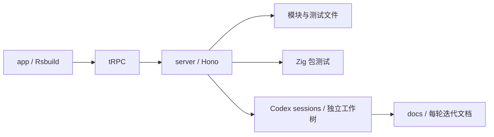
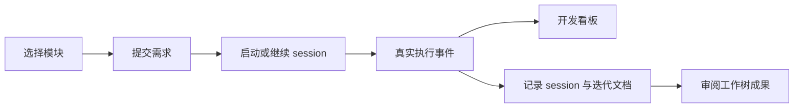

# zray 执行计划

## Intent：最终目标

在用户指定的 `packages/zray` 新增 zxc 开发控制台，覆盖模块与测试预览、Zig 包测试、Codex session 并行开发和 docs 迭代记录。

最终组织：`app` 和 `server` 为独立 workspace 包，各自拥有 package.json、tsconfig.json。`app` 使用 React + Rsbuild，`server` 使用 Hono，通过 tRPC 交互。启动命令统一添加在仓库根。shadcn 配置放 app，其他 Git / Prettier 忽略规则由仓库根控制。

## Data：可用证据

- 已阅读仓库规则，参考 polywise 前后端组织与 tRPC 接入。
- 已安装 sidebar-08 和 b1VlJBCq 预设，复制用户指定的 Google Sans / Geist Mono 字体。
- 动态读取 6 个包、92 个模块源文件、74 个测试文件。
- 用户确认首版执行现有 Zig 包测试，RX Runtime 尚未接入。
- 用户追加要求均已纳入：Codex sessions、并行可视化、逐轮 docs、Hono、tRPC、Rsbuild、配置文件归位。

## Edges：边界与限制

- 源码遵从本次明确要求放入 packages/zray，本目录保存执行计划，docs 保存正式实施记录。
- 不生成测试用例，不使用浏览器做 UI 确认，不修改任务范围外的 Zig 实现和测试。
- 模型会话链路已实现但未实际发起模型调用；测试执行链路使用真实 Zig 进程。
- Git worktree 保留成果供审阅，不自动合入。

## Answer：完成状态与成功标准

- [x] 预设、模板和本地字体。
- [x] app / server 分离，Rsbuild + Hono + tRPC。
- [x] 模块与测试源码预览、按包执行。
- [x] 模块 session 创建、继续、停止、并行看板和 docs 记录实现。
- [x] 安装 Zig 0.16.0，SHA-256 校验与命令确认。
- [x] 类型检查、Rsbuild 构建、真实 tRPC 接口验证。
- [x] RX 测试通过；Compiler 既有输入的格式校验失败被如实展示。
- [x] 根 Git / Prettier 忽略管理，components.json 放 app，移除包内独立 Git 和 ESLint。
- [x] Codex CLI 自动探测，移除 .env.local；app/server 独立包和 TS 配置。
- [x] 文档按 IDEA 组织并包含自我审查。

具体实现、验收证据和限制见 [实施记录](../../../docs/2026-10-03/zray开发控制台实施记录.md)。
