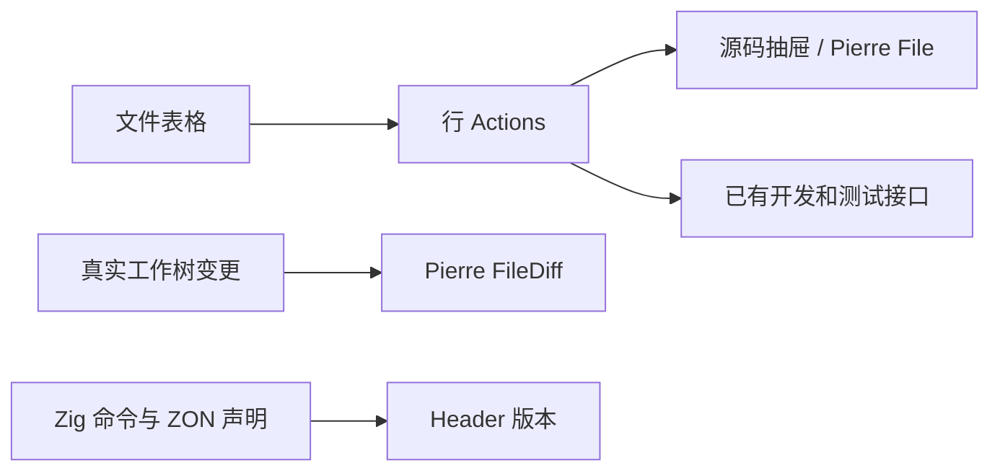

# zray 表格与代码预览执行计划

## Intent：最终目标

模块和测试页改为 shadcn Table，通过行 Actions 打开源码预览或触发开发、执行；代码使用 diffs.com，标题简化为单行，header 显示真实版本。

## Data：可用证据

已有文件索引、tRPC 执行接口、shadcn Sheet，以及 polywise 的 @pierre/diffs 使用方式。

## Edges：边界与限制

保留按包执行语义，不新增测试用例，不做浏览器 UI 确认，不触发 Codex 开发任务。

## Answer：执行结果

已安装 shadcn Table 与 @pierre/diffs，完成共享文件表格、源码抽屉、结构化变更视图、标题和版本读取。类型检查、生产构建、格式检查、真实仓库 diff 解析均通过。

