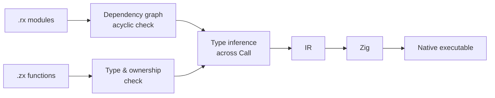

#  zxc

**A programming language for AI-written business systems.** Write logic in **ZX** (TypeScript-like), wire it together in **RX** (XML), and compile to a native executable.

[](LICENSE)


[CLI](packages/cli/README.md) · [RX Reference](packages/compiler/src/rx/README.md) · [Compiler](packages/compiler/README.md) · [Design](docs/zxc_deisgn_doc.md)

## Example

A checkout flow. **RX** is the map — every step, and what flows between them, in one file:

```xml
<!-- checkout.rx -->
<Module>
  <Call fn="subtotal" in="$in.items" out="ctx.subtotal" />
  <Call fn="discount" in="{subtotal:ctx.subtotal,coupon:$in.coupon}" out="ctx.discounted" />
  <Call fn="shipping" in="{amount:ctx.discounted,region:$in.region}" out="ctx.shipping" />
  <Call fn="total" in="{amount:ctx.discounted,shipping:ctx.shipping}" out="ctx.total" />

  <Return value="ctx.total" />
</Module>
```

**ZX** holds the logic — each step is one typed function in its own file:

```typescript
// shipping.zx
export type Input = {
  amount: u64
  region: string
}

export type Output = u64

export default function (in: Input): Output {
  return match {
    in.amount >= 10000 => 0,
    in.region == "remote" => 1500,
    _ => 600
  }
}
```

Build it into a native executable and run it:

```sh
zxc build checkout.rx --out build/checkout

./build/checkout '{"items":[{"price":4500,"quantity":2},{"price":3000,"quantity":1}],"coupon":"SAVE10","region":"remote"}'
# {"payable":10800,"shipping":0}
```

To change the shipping rule, an AI only needs `shipping.zx` — `checkout.rx` already tells it what goes in and what comes out. The compiler infers types across every `Call`, so a mismatched edit fails at build time, not in production.

## Why zxc

- **Structure you can read** — RX files are the call graph and data flow. No digging through function bodies.
- **Boundaries the compiler enforces** — typed `Input` / `Output` per unit, ownership checks, and a dependency graph that must be acyclic.
- **Small, local changes** — change a rule in one `.zx` file; the RX wiring stays untouched.
- **Native output** — ZX compiles to Zig, and `zxc build` ships with an embedded Zig toolchain.

## How It Works



Every `.rx` and `.zx` file in the entry's closure is loaded, checked and type-inferred together, then lowered to Zig. `zxc` embeds the official Zig toolchain, so building needs nothing else installed.

## Compose Modules

A module is just another unit. Call it with `service` and branch on its result:

```xml
<!-- order.rx -->
<Module>
  <Call service="checkout" in="$in" out="ctx.checkout" />

  <Switch on="ctx.checkout.shipping">
    <Case value="0">
      <Return value="{payable:ctx.checkout.payable,free_shipping:true}" />
    </Case>
  </Switch>

  <Return value="{payable:ctx.checkout.payable,free_shipping:false}" />
</Module>
```

Functions form modules, modules form larger modules, and every level follows the same rules. Cycles are rejected anywhere in the graph.

## Contracts

Add `requires` / `ensures` to a ZX function and prove it with an SMT solver:

```typescript
// discount.zx
export type Input = {
  price: u64
  discount: u64
}

export type Output = u64

export default function (in: Input): Output
  requires (in.discount <= in.price)
  ensures (out <= in.price)
{
  return in.price - in.discount
}
```

```sh
zxc verify discount.zx --solver z3 --out discount.smt2
# verified: entry paths satisfy supported safety obligations and reached contracts
```

Remove the `requires` and verification fails with a concrete counterexample: the subtraction can underflow. Verification covers fixed-width integers, booleans, static objects and branches.

## RX Tags

| Tag          | Purpose                                                          |
| ------------ | ---------------------------------------------------------------- |
| `<Module>`   | Root of an `.rx` file; the module is identified by its file path |
| `<Call>`     | Call a ZX function (`fn`) or another RX module (`service`)       |
| `<Return>`   | Return a value from the module                                   |
| `<Task>`     | Group steps into a named, scoped block                           |
| `<Switch>`   | Branch on a value                                                |
| `<Case>`     | A branch of `Switch` matching one value                          |
| `<Default>`  | The fallback branch of `Switch`                                  |
| `<Import>`   | Declare a module dependency without calling it                   |
| `<Parallel>` | Run steps concurrently                                           |
| `<Emit>`     | Send an event                                                    |
| `<Store>`    | Define persistent state in `*.store.rx`                          |
| `<Object>`   | A state object inside `Store`                                    |
| `<Field>`    | A typed field with an initial value inside `Object`              |
| `<Gateway>`  | Expose modules over HTTP, gRPC and more in `*.gateway.rx`        |
| `<Group>`    | A route prefix inside `Gateway`                                  |
| `<Route>`    | Map a path and method to a module                                |

See the [RX Reference](packages/compiler/src/rx/README.md) for attributes and nesting rules.

## ZX Language

| Area         | What ZX offers                                                                                     |
| ------------ | -------------------------------------------------------------------------------------------------- |
| Units        | One default-exported function per file, with typed `Input` and `Output`                            |
| Types        | `u8`–`u64`, `i32`, `i64`, `f32`, `f64`, `bool`, `string`, objects, enums, optionals, lists, tuples |
| Bindings     | `const` only, destructuring and spread; no semicolons                                              |
| Control flow | `if`, `switch` and `match` expressions                                                             |
| Collections  | Capture-free `map`, `filter`, `reduce`                                                             |
| Ownership    | No pointers and no `clone`; the compiler decides how values move                                   |
| Imports      | Relative paths, `@/` project paths and packages; imports must be acyclic                           |
| Standard lib | `std:encoding`, `std:crypto`, `std:path`, `std:querystring`, `std:zlib`, `std:os`                  |
| Native code  | Explicitly declared `zig:` and `c:` interfaces                                                     |
| Contracts    | `requires` / `ensures`, proven with an SMT solver                                                  |

## CLI

| Command                                   | Description                                             |
| ----------------------------------------- | ------------------------------------------------------- |
| `zxc build <entry> --out <path>`          | Build a native executable from an `.rx` or `.zx` entry  |
| `zxc build <entry> --watch`               | Rebuild whenever sources or dependencies change         |
| `zxc build <entry> --watch --run`         | Restart the native app after successful rebuilds        |
| `zxc build <file.zx> --mode lib`          | Export a Zig module that other Zig projects can consume |
| `zxc build ... --target --cpu --optimize` | Cross-compile and tune the output                       |
| `zxc build ... --asm <file>`              | Also write the generated assembly                       |
| `zxc <file.zx> --out <file.zig>`          | Emit Zig source only                                    |
| `zxc fmt <file.zx>`                       | Format ZX source                                        |
| `zxc verify <file.zx> --solver <z3>`      | Prove contracts and safety obligations                  |
| `zxc fpga <file.zx> --out <file.sv>`      | Generate a SystemVerilog kernel                         |
| `zxc check-rx --entry <file.rx>`          | Check RX structure and call targets                     |
| `zxc pkg install`                         | Resolve and install dependencies from `pkg.yaml`        |

See the [CLI docs](packages/cli/README.md) for every option.

## License

[MIT](LICENSE)
