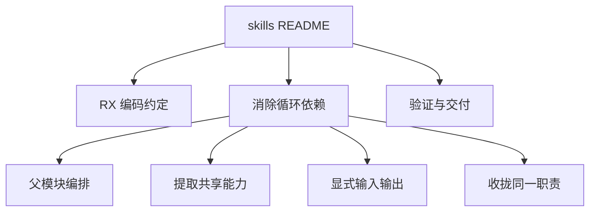
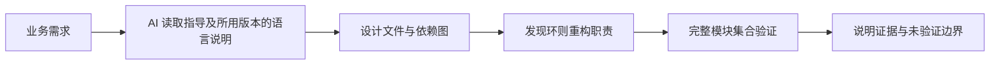

# AI 编码指导包设计

## Intent：最终目标

新增 packages/skills，供任何使用 zxc 编写应用的 AI 直接阅读。在禁止循环依赖的前提下，解释如何重构看似需要双向协作的业务，并给出应用验证与交付要求。zxc 自身的开发规则独立放在 rules，并由 AGENTS.md 索引。

## Data：可用证据

- 当前 RX 以规范化文件路径注册模块，Call.service 可省略 .rx 和同目录 ./。
- Module 无 name，无 Pipeline，无模块别名；Import 与 Call.service 都属于静态依赖边。
- validateModules 对完整模块集合强制检查 DAG，单文件 validate 仅做语法检查。
- 现有解析入口接收 AST，尚未实现 XML 解析、Runtime 或事件订阅调度。
- 当前所有 RX 测试位于 packages/rx/tests；39 个测试包括 512 个三节点图的有限穷举。

## Edges：边界与限制

- 仅新增 Markdown 指导，不修改 RX 语法、图算法或 Runtime。
- 不把事件总线描述为循环依赖的通用绕过方案，不虚构当前不存在的标签与执行能力。
- 文档不是已安装的 Codex 插件或自动加载技能；调用方需明确把入口交给 AI 阅读。
- skills 为纯文档目录，不包含 build.zig、build.zig.zon，也不构建或打包。
- skills 不包含内部源码组织、Zig 构建、AST 接口或仓库测试要求，阅读不依赖 zxc 源码仓库。
- 不新增测试用例；检查文档链接、Markdown 格式及交付目录。

## Answer：交付与成功标准

- README.md：AI 阅读入口、触发场景和使用方式。
- rx/编码约定.md：当前合法语法、身份规则、分层边界与禁止事项。
- rx/消除循环依赖.md：问题诊断、决策表、重构示例、迭代及事件边界。
- rx/验证与交付.md：应用文件与依赖检查、业务行为验证和 Markdown 交付说明。
- rules/文档分工.md、rules/RX开发约定.md：维护者文档职责与内部 RX 开发要求，AGENTS.md 提供索引。
- 使用方可以把 Markdown 直接交给任意 AI，无需获得 zxc 源码或安装产物。
- 根 README 与 RX README 链接到指导入口，根构建无需增加 Markdown 运行时依赖。

## 执行与自我复核

- 已新增入口 README 和三份中文指导文档，并从根 README、RX README 建立阅读入口。
- 按用户最新要求移除构建文件、构建缓存和安装产物，只保留 Markdown。
- 指导文档采用 GitHub README 风格，以简介、规则、方案、示例和检查清单组织；不要求读者按 IDEA 框架阅读或交付。
- 面向使用者与维护者的内容已分离；内部源码引用、构建命令、AST 示例和图算法测试说明已迁入 rules/RX开发约定.md，并建立 AGENTS.md 索引。
- 已检查文档相对链接和 XML 示例的良构性。
- Markdown 格式与 diff 空白检查通过；未新增测试用例，也未改动 RX 生产逻辑。
- 自我复核：方案区分依赖关系与业务时序；父模块编排不自动承诺事务或补偿；事件与迭代方案没有假称当前语言和 Runtime 已支持。
- 验证边界：本次检查不包括 XML 到 AST 的端到端解析，未运行生产代码回归。有限图穷举与一般规模形式化证明的区别保留在内部开发规则，应用指导只解释业务验证与无环保证的范围。
