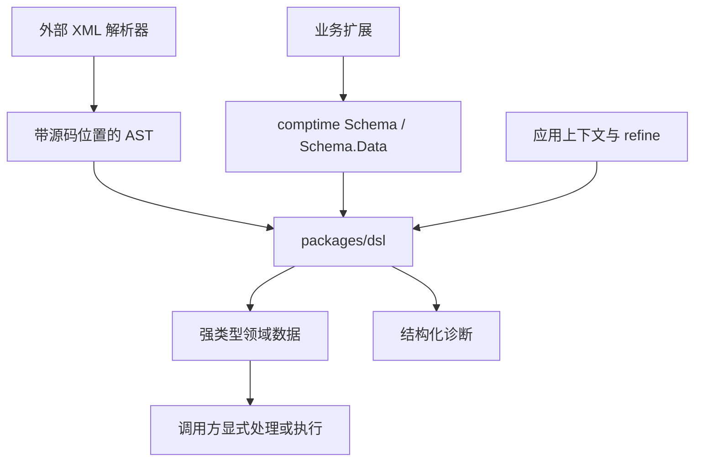
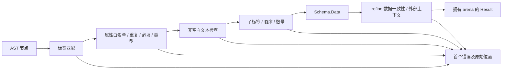

# DSL 包设计与实施

## Intent：最终目标

在 `packages/dsl` 提供独立的 Zig 0.16.0 包。使用编译期 Schema 定义 RX 风格的 XML DSL，将带位置的 XML AST 校验、转换为强类型数据，支持应用注入上下文规则。

库不内置 RuleEngine、Pipeline 等业务标签。应用定义自己的 Schema，即可扩展语法与语义。

## Data：可用证据

- 当前仓库由根 `build.zig` 构建 ZX 编译器，尚无 packages。
- 根 manifest 和本机 Zig 均为 0.16.0。
- 编译器已有 `Location`、单错误 Reporter 和 arena 分配模式。
- `docs/rx_design_doc.md` 将 RX 定义为 XML 配置，执行副作用归 Runtime。
- 工作区已有未提交改动；本次只新增包及必要的构建、文档入口。
- ast-outline 和 ast-grep 的当前安装版本均不支持 Zig，采用定位文件后直接阅读的降级方式。
- Zig 官方参考：https://ziglang.org/documentation/0.16.0/ 。编译期类型函数用于 Schema，显式 allocator 用于结果所有权。
- 参考 [Mach 模块接入方式](https://machengine.org/docs/stdlib/) 和 [Zig Build System](https://ziglang.org/learn/build-system/)，根 manifest 声明本地依赖，根 build 通过 `b.dependency` 和 `dependency.module` 接入，不跨包引用源文件。

## Edges：边界与限制

1. 本包从 XML AST 开始，不实现 XML 词法解析器。上游必须验证 XML 良构性、解码实体并保留节点、属性名及属性值位置；不能通过解析后搜索字符串来猜位置。
2. AST 标签名按大小写敏感的完整名称匹配，不解释 XML namespace URI。内容模型为元素和空白文本；其他文本报错。
3. 不执行业务、不生成 TypeScript 绑定、不重构 ZX 编译器、不新增测试用例、不打开浏览器。
4. 首个错误即停止；诊断为错误码、位置、标签、属性、期望和消息，方便调用者展示及 AI 纠错。
5. 字符串和诊断中的 AST 引用借用输入，结果 arena 只拥有类型化列表；先销毁结果，再销毁 AST。
6. 自定义 refine 回调必须把业务失败交给 Reporter；回调本身的业务状态管理由应用负责。
7. Schema 的编译期声明适用于静态扩展；不包括运行时加载未知 Schema 或递归 Schema。

## Answer：交付格式与成功标准

- `packages/dsl/build.zig`、`build.zig.zon`：独立 Zig 包，模块名 `dsl`。
- `src/ast.zig`：解析器适配契约与源码位置。
- `src/diagnostic.zig`：结构化错误和 Reporter。
- `src/attributes.zig`：由 Zig struct 推导属性规则与转换。
- `src/element.zig`：标签、文本、属性与 children 的组合校验。
- `src/children.zig`：空、列表、固定顺序和标签选择。
- `src/root.zig`：统一入口、结果所有权和 refine。
- `examples/rules.zig`：可执行的自定义 DSL 示例与上下文约束。
- 根构建提供 `dsl-example`，默认构建编译该示例以实例化泛型 API。
- 执行 Zig 格式检查、根构建、包构建、示例及现有集成检查。结果写在本文末尾。

### 架构图



### 数据流图



### API 设计

```zig
const Action = dsl.element("Action", struct {
    type: []const u8,
    enabled: bool = true,
}, dsl.empty);

const Rule = dsl.element("Rule", struct {
    id: []const u8,
    priority: ?f64 = null,
}, dsl.list(Action, .{ .min = 1 }));

const RuleData = Rule.Data;
```

Zig struct 同时定义属性类型和结果形状，避免另造 String/Number/Boolean 类型系统。支持字符串、整数、有限浮点、布尔、枚举、可选值和默认值；不支持的类型在编译期报错。缺失的 optional 属性为 null；显式默认值优先。

## 实施记录

### 构建接入

每个子包有自己的 `build.zig` 和 `build.zig.zon`；`dsl` 的包名为 `zxc_dsl`，导出模块名为 `dsl`。根 manifest 把 `packages` 纳入发布路径。

根 `build.zig` 的实际接入为：

```zig
const dsl_dependency = b.dependency("dsl", .{
    .target = target,
    .optimize = optimize,
});

compiler_module.addImport("dsl", dsl_dependency.module("dsl"));
```

这为 ZLS 提供显式模块依赖图。本次通过 Zig 构建验证模块解析，没有启动编辑器会话验证 ZLS 实时行为。

### 实现细节

- element 通过 Zig struct 反射生成属性规则，输出保留原始属性类型。
- sequence 返回 tuple，list 返回只读切片，choice 使用当前安装 Zig 支持的 `@Union` 生成带标签 union。
- choice 的重复标签在编译期拒绝，避免按声明先后静默选择某个分支。
- refine 在结构校验后运行，既可检查单节点属性关系，也可在父节点检查整个子树。
- 属性类型错误使用 value_location，未知/重复属性使用属性名位置，缺失属性使用开始标签位置。
- 子节点数量错误附带 min/max/actual；多余节点定位到首个超限节点。
- 所有列表使用结果 arena 分配，失败结果也必须释放；输入字符串仍借用 AST。
- 包内示例使用合成 AST，演示 RuleEngine、Condition、Action 和上下文约束。业务名称只存在于示例，不在库核心中。

### 验证结果

| 命令                                  | 结果                                                                  |
| ------------------------------------- | --------------------------------------------------------------------- |
| 根目录 `zig build`                    | 通过，包含 DSL 泛型 API 的示例实例化                                  |
| 根目录 `zig build dsl-example`        | 通过，输出 `Rule discount: between 10,20, action=discount, retries=2` |
| 子包目录 `zig build`                  | 通过，独立构建成立                                                    |
| 子包目录 `zig build example`          | 通过，调试分配器未报告泄漏                                            |
| 根目录 `zig build test`               | 原有 3/3 ZX 集成测试通过                                              |
| 对本次 Zig 文件运行 `zig fmt --check` | 通过                                                                  |
| `git diff --check`                    | 通过                                                                  |

按要求未生成新测试用例，未调用浏览器做 UI 确认。示例覆盖主要类型与组合 API 的编译和正常运行；没有对全部非法 AST 分支进行自动化测试，不能把构建通过理解为完整错误分支覆盖。

### 自我复核

1. **目标对齐**：交付可定义自有标签及上下文规则的通用 Zig 库，未把示例业务规则写进库核心。
2. **范围控制**：未重构既有 ZX 实现，未引入 XML 解析依赖或 Runtime；保留工作区中已有及并行产生的其他改动。
3. **类型与内存**：Schema.Data 由编译器推导；列表有明确释放入口；字符串借用的生命周期已经写入包文档。
4. **定位可信度**：库保留适配器输入位置，未实现从 XML 字符串提取位置。因此端到端定位质量仍依赖未来 XML 适配器，不应宣称已完成 XML 解析链。
5. **已知限制**：首错停止、仅元素和空白文本、静态非递归 Schema、未提供 TS 绑定。后续接入真实 RX 编译流程时需要独立选择解析器，并验证其实体解码、UTF-8 和换行位置语义。
