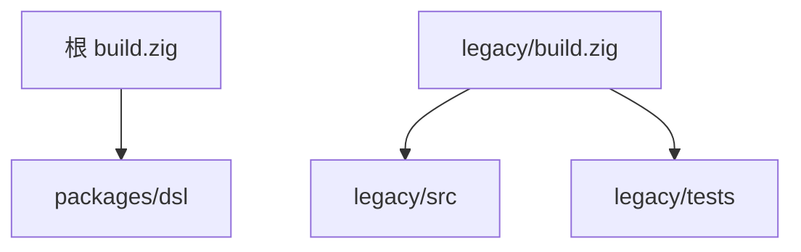

# MVP 归档迁移

## Intent：最终目标

将原 `src`、`tests` 原样迁入 `legacy/src`、`legacy/tests`，作为正式版本开发的参考。根构建统筹 `packages`，MVP 独立构建。

## Data：可用证据

- 原根构建包含 MVP 编译器、CLI、fixture 编译和 3 个集成测试。
- fixture 路径和生成路径相对于构建目录，整体迁移构建入口可以保留源码与测试内容。
- 格式化脚本仍扫描根 `src`、`tests`，需要同步修改。
- 工作区存在未提交改动，移动时保留文件当前内容。

## Edges：边界与限制

- 不修改 MVP 业务代码与测试用例，不清理已有缓存及产物。
- `legacy` 有独立 `build.zig`、`build.zig.zon`；根默认构建不再构建 MVP。
- 历史设计文档保留当时记录，当前 README 更新到新入口。
- 不新增测试，不做浏览器 UI 检查。

## Answer：交付与成功标准

1. 移动目录并逐文件核对哈希。
2. 将 MVP 构建置于 legacy，移除其未使用的 dsl 依赖；根保留 DSL 构建入口。
3. 更新根 manifest、当前 README、DSL 接入说明及格式化扫描路径。
4. 验证根构建和 DSL 示例、legacy 独立构建和现有测试、格式与 diff 检查。

## 执行与自我复核

- 已移动 10 个源码、测试和 fixture 文件；移动后逐文件 SHA-256 与移动前一致，保留原有未提交修改。
- `legacy` 已具备独立构建与 manifest；其 MVP 不依赖 dsl。
- 根默认构建仅包含正式 DSL 包的示例实例化，保留原有 ReleaseSafe 默认优化模式及显式 dependency 图。
- 格式化扫描已覆盖 legacy 与 packages 中的构建、源码、示例和测试目录，不扫描生成缓存。
- 根目录 `zig build`、`zig build dsl-example` 通过。
- legacy 目录 `zig build`、`zig build test` 通过，原有集成测试 3/3 成功。
- 修改的构建文件通过 `zig fmt --check`，格式化脚本通过 `node --check`；修改的 JS 和 Markdown 已按仓库 Prettier 配置格式化。
- 自我复核：只迁移参考实现及调整其入口，不更改业务逻辑；未新增测试。旧缓存和根目录中已有的历史二进制保留，它们不代表正式版本产物，应使用文档中的新命令。
