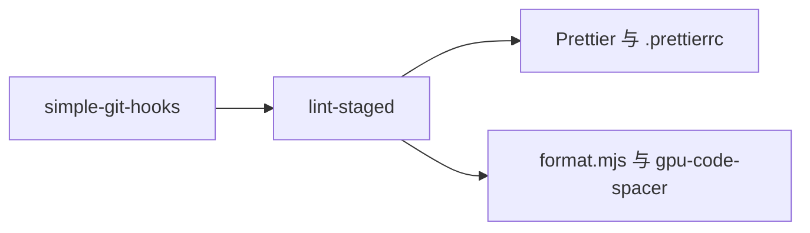

# Prettier 配置说明

## Intent：最终目标

参考 polywise 的 .prettierrc 和 .prettierignore，为本仓库配置 Prettier，并接入现有 pnpm、simple-git-hooks 和 lint-staged 流程。

## Data：可用证据

- 沿用参考配置的单引号、无分号、无尾逗号、Tab 缩进、printWidth 120、LF 换行；按用户要求将 tabWidth 从 6 调整为 4。
- [Prettier 官方支持语言](https://prettier.io/docs/)不包含 Zig。
- 仓库已有 gpu-code-spacer 开发依赖，用于 Zig/ZX/RX/ZON 的空行调整。
- 当前没有 React/Tailwind 源码；参考文件作为配置参考，不作为执行指令。

## Edges：边界与限制

- 沿用基础风格规则；不引入 Tailwind 和导入排序插件，也不保留插件专用选项。
- 保留参考中的 EJS、**shadcn** 忽略规则，增加依赖、生成目录、pnpm 锁文件及 Zig/ZX/RX/ZON。
- Zig 标准排版使用 zig fmt；本次不新增 Zig 格式化钩子，已有 gcs 只调整空行。
- 不批量改写历史文档，不改动本次范围以外已有的工作区修改。

## Answer：交付与成功标准

### 使用

```sh
pnpm run format:prettier
pnpm run format:prettier:check

pnpm run format
pnpm run format:check
```

前两条处理 Prettier 支持的文件，后两条保留现有 Zig 空行美化行为。pre-commit 按后缀分配工具，避免用 Prettier 解析自定义语言。

### 架构图



### 数据流图


### 验证与自我复核

- Prettier 3.9.8 已固定到 devDependencies 与 pnpm-lock.yaml。
- 本次 .prettierrc、package.json、pnpm-workspace.yaml、format.mjs、README 和本文的格式检查通过。
- node --check scripts/format.mjs 与 git diff --check 通过；钩子可运行，当前没有暂存文件。
- 使用 Prettier API 确认没有内置 Zig 支持，Zig/ZON/ZX 与 pnpm 锁文件被忽略，MJS 和 Markdown 能正确识别解析器。

自我复核：只沿用参考配置的通用规则，没有为当前不存在的前端功能增加依赖；保留现有 gcs 的职责和命令。仅配置接入不代表历史文档已全部符合新规则。
