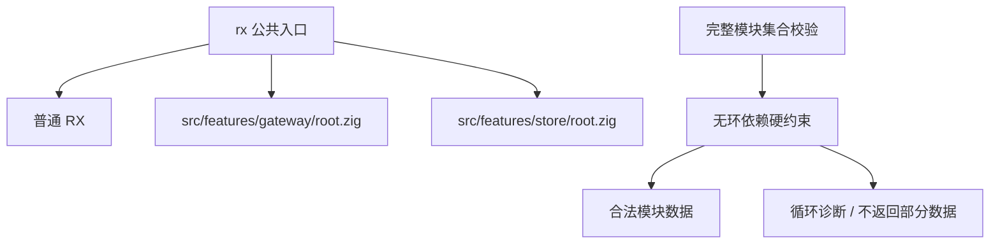
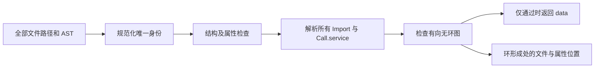

# RX 无环约束与功能分层

## Intent：最终目标

将无环依赖明确为完整 RX 模块集合的硬约束，并把 Gateway、Store 的专用 AST 解析和校验实现归入 packages/rx/src/features 对应目录。

## Data：可用证据

- 当前 module_graph.zig 使用三状态 DFS，检查 Import 和所有嵌套节点中的 Call.service。
- modules.zig 只有在所有模块结构校验、目标解析和图校验通过后才返回 data。
- 现有实现没有允许循环或忽略循环的配置，无需再添加重复的生产算法。
- Gateway、Store 当前位于 src/gateway.zig、src/store.zig，公共入口通过 root.zig 导出。
- 现有 37 个测试全部位于 packages/rx/tests。

## Edges：边界与限制

- 保留 rx.gateway、rx.store、rx.Gateway、rx.Store 的公共导出契约。
- 不添加 XML 词法解析器，feature 目录继续处理 dsl AST。
- 单文件 validate 只检查语法，完整项目必须通过 validateModules 才能被判定为依赖合法。当前没有 Runtime，不虚构执行入口已被接入。
- 无环约束针对 Import 与 Call.service 的静态模块图，包含条件分支和未调用的 Import；事件反馈与 ZX 函数内部行为不在此证明范围。
- 测试全部保留在与 src 同级的 tests，不在实现文件内写 test。

## Answer：交付与成功标准

1. 移动为 features/gateway/root.zig 和 features/store/root.zig，仅调整相对导入和公共入口路径。
2. 保持原有无环拒绝逻辑，增加基于拓扑消除的独立测试 oracle，枚举三个模块的全部 512 个有向图，对照验证接收集合恰为 DAG。
3. 添加混合 Import/条件分支 Call 的环测试，确保不以运行条件为由放行环。
4. 根与子包构建、测试、格式检查通过；README 明确不可关闭的无环契约和 feature 文件边界。

### 架构图

### 数据流图

### 可验证性质

令 G=(V,E)，V 是规范化模块路径集合，E 包括 Import 和所有嵌套结构中的 Call.service。合法项目要求不存在 v，使 v 能沿一条或多条依赖边回到自身。

等价地，存在拓扑序，使每一条依赖边严格沿该序前进。若单次调用只遵循这些静态边，则跨模块调用栈最多经过 |V| 个不同模块；这不表示总调用次数最多为 |V|，也不证明每个 ZX 函数终止。

测试中的有限穷举是对实现的加强验证，不是对所有图规模的机器检查形式化证明。

## 执行记录与自我复核

- 已迁移 features/gateway/root.zig 与 features/store/root.zig，业务实现保持原样，仅更新相对导入；公共导出通过原有测试验证。
- 生产图算法无需修改：原来就直接拒绝环，本次将其明确写为不可关闭的项目合法性约束。
- 新增 tests/dependency_graph_test.zig，测试均位于 tests 目录。
- 根目录 ReleaseSafe 与子包 Debug 下均为 39/39 测试通过；其中一个测试遍历全部 512 个三节点有向图。
- 混合 Import 和条件分支 Call 的环测试通过，错误保留源文件索引和属性位置。
- Zig 格式、Markdown 格式及 diff 空白检查通过。

自我复核：本次没有为已经存在的约束重复设计第二套生产逻辑；测试 oracle 使用不同算法以降低同源错误风险。穷举只覆盖三节点图，不能描述为完成一般规模的形式化证明。当前仍需调用方在项目检查入口使用完整集合校验；没有虚构尚未实现的 Runtime 执行门禁。
