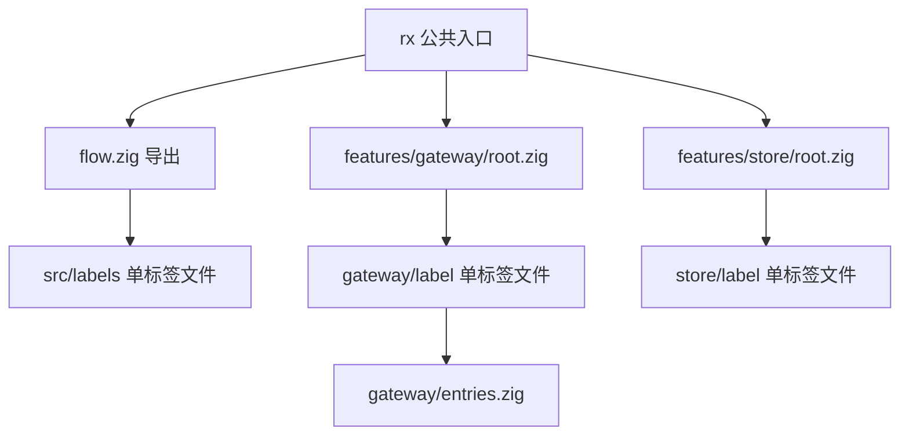
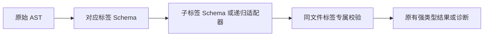

# RX 标签文件拆分

## Intent：最终目标

按用户确认保留 Zig 实现，将公共标签拆到 packages/rx/src/labels，每个标签一个 PascalCase.zig 文件；Gateway、Store 专用标签拆到对应 feature 的 label 目录。

## Data：可用证据

- flow.zig 集中了普通 RX Schema 和局部校验；Call 已是独立实现。
- features/gateway/root.zig 集中了 Gateway、Group、Route，以及递归子元素适配器。
- features/store/root.zig 集中了 Store、Object、Field。
- 现有公共导出和 39 个测试可作为重构回归依据。
- 用户确认仅拆分 Zig 文件，不引入 RX 元语法。

## Edges：边界与限制

- 不改变标签属性、嵌套关系、递归类型、诊断和无环约束。
- 保留 flow 与各 feature root 的公共导出，避免修改使用方。
- 每个标签专属 refine 留在同一个标签文件；跨标签适配器保留独立职责。
- 公共 Store.zig 表示引用，feature 内 Store.zig 表示定义，两者靠目录区分。
- 不新增测试；现有测试仍在 src 同级的 tests 目录。

## Answer：交付与成功标准

- labels 下 11 个公共标签文件：Module、Import、Call、Return、Task、Parallel、Switch、Case、Default、Emit、Store。
- features/gateway/label 下 Gateway、Group、Route；features/store/label 下 Store、Object、Field。
- flow.zig、feature root.zig 只聚合导出；Gateway 递归适配器单独放在 entries.zig。
- 根和子包的构建、原有 39 个测试与格式检查通过。

## 执行与自我复核

- 已生成 17 个单标签实现文件，公共 Store 引用与 feature Store 定义分别保存。
- Call 原实现已迁移到 labels/Call.zig，未遗留旧路径的副本。
- 标签专属 refine 原样迁入标签文件，Gateway 的递归 Entry 独立为 entries.zig。
- 原有公共导出保留；根目录 ReleaseSafe 与子包 Debug 测试均为 39/39 通过，包含 512 个三节点有向图的对照检查。
- 未新增或迁入任何内嵌测试；测试继续统一位于 packages/rx/tests。
- 自我复核：本次仅改变源码归属与导入关系，没有增加元语法、业务规则或新抽象；现有递归类型与依赖图检查均由回归测试验证。
