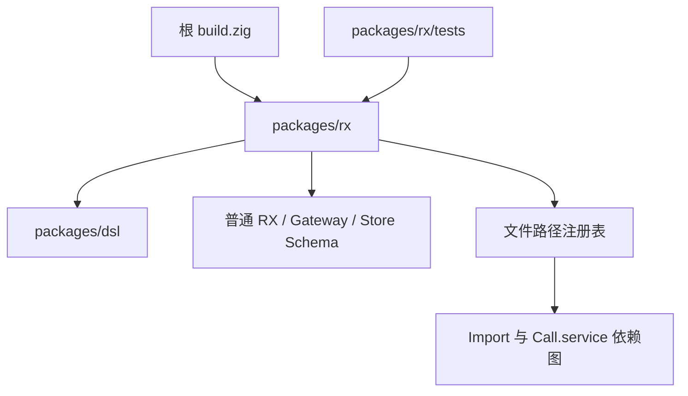
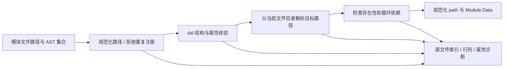

# RX 语法包实施

## Intent：最终目标

新增独立 packages/rx，用 dsl 定义 .rx 文件语法，提供单文件与完整模块集合校验，以及位于 tests 目录的单元测试。模块可按文件路径直接调用或组成新模块，禁止循环依赖。

## Data：可用证据

- 原 RX 文档给出了控制流、Gateway、Store 的基础标签和嵌套规则。
- 用户后续明确覆盖原模块设计：取消 Pipeline、取消模块自定义名称、无需模块别名；Call.service 引用模块文件路径。
- 引用可省略 .rx，同目录可省略 ./；注册身份是完整文件路径与文件名称。
- 用户要求所有测试放在子包 src 同级的 tests 目录，不在实现文件内写 test。
- dsl 已有带位置 AST、element/list/choice/refine、类型化结果及 arena 所有权。本次不修改 dsl 或 legacy。

## Edges：边界与限制

- XML 解析不在本次范围；位置来自上游 AST。
- 普通 Module 自身承载流程，可选 in/out 类型声明；旧 Pipeline 与 Module.name 明确拒绝。
- Import.from 与 Call.service 都按调用文件所在目录解析，引用扩展名默认补 .rx；保留显式扩展名写法。直接 Call 不要求重复 Import。
- 注册路径为项目相对路径，采用 / 分隔且区分大小写；规范化不进行实际文件 I/O 或符号链接解析。
- 每个引用必须落在注册集合内；Import 与 Call.service 都构成依赖边，整个图必须无环。Emit 不构成同步依赖边。
- app.rx 尚无 Schema；不自行发明 App 标签。
- Store/Gateway 的 name 是领域定义名称，不是模块注册身份；Store.as 沿用原有数据命名空间规则，不是模块别名。
- 不实现 Runtime、跨文件 Gateway/Store 合并、表达式解释、ZX 类型联结、Store 初值解析或自动返回路径分析。

## Answer：交付与成功标准

- packages/rx 独立 build.zig / build.zig.zon，依赖 ../dsl。
- 根 build.zig 通过 b.dependency 接入 rx 模块及测试，不恢复 legacy 到默认构建。
- flow/call/steps 定义普通 RX，gateway/store 定义特殊 RX；paths 负责规范化，modules/module_graph 负责模块注册与无环校验。
- validate(allocator, file_name, node) 做单文件语法校验；validateModules(allocator, sources) 做完整模块集合校验。
- 支持列表与属性表写入 packages/rx/README.md；共 16 个不同标签名，Store 有两种上下文。
- 测试全部放在 packages/rx/tests，包括独立 helpers 和 root 入口。

### 架构图



### 数据流图



### 模块组合示例

checkout.rx：

```xml
<Module in="CheckoutInput" out="CheckoutOutput">
  <Call service="users" in="$in.user" out="ctx.user" />
  <Call service="orders" in="{user:ctx.user,items:$in.items}" out="ctx.order" />
</Module>
```

父模块再通过 Call.service="checkout" 调用组合模块。若 users 或 orders 反向依赖 checkout，完整模块集合校验拒绝这个循环。共享子模块和菱形依赖不会被误判为环。

### API 示例

```zig
const sources = [_]rx.ModuleSource{
    .{ .path = "users.rx", .node = users_ast },
    .{ .path = "orders.rx", .node = orders_ast },
    .{ .path = "checkout.rx", .node = checkout_ast },
};

var result = try rx.validateModules(allocator, &sources);

defer result.deinit();
```

## 执行记录与自我复核

| 验证                                          | 结果                                        |
| --------------------------------------------- | ------------------------------------------- |
| 根目录 `zig build test --summary all`         | ReleaseSafe，37/37 通过                     |
| packages/rx 内 `zig build test --summary all` | Debug，37/37 通过                           |
| 单文件分配失败检查                            | std.testing.checkAllAllocationFailures 通过 |
| 模块图分配失败检查                            | std.testing.checkAllAllocationFailures 通过 |
| 测试分配器                                    | 未发现泄漏                                  |
| Zig 格式与 diff 空白检查                      | 通过                                        |

测试覆盖全部支持标签、非法嵌套、属性和枚举、重复字段、递归结构、诊断位置、无别名且无 Pipeline 的模块组合，以及路径规范化、缺失目标、环和合法菱形依赖。测试文件全部位于 tests，src 不包含 test 声明。

自我复核：

1. 用户最新指令优先于旧 RX 设计：身份来源为文件路径，未保留模块名或 Pipeline 的兼容分支。
2. 引用解析只有当前文件目录加目标路径这一条规则，省略后缀时补 .rx；未加入目录 index 或全局名称搜索等隐式规则。
3. 直接调用可组合为父模块，Call 不需要再重复 Import；同步依赖的无环检查与事件名分离。
4. 单文件语法通过不代表项目无环，必须将完整集合交给 validateModules；文档已明确两个入口的职责。
5. 当前只返回强类型描述，不执行模块或事件；XML 源码位置依赖上游 AST。符号链接与物理文件身份需要由未来加载器统一，不能宣称本库完成了文件发现和真实路径解析。
6. 未修改 dsl 与 legacy，新增的业务规则仅属于 RX 包；保留工作区已有改动。
