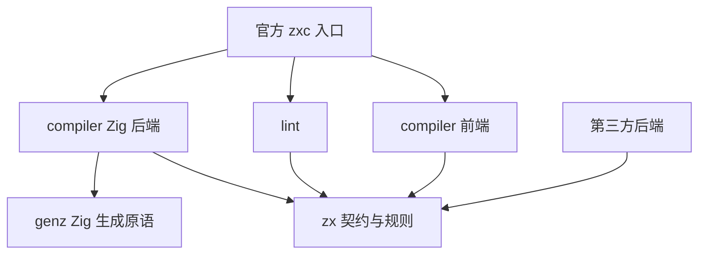
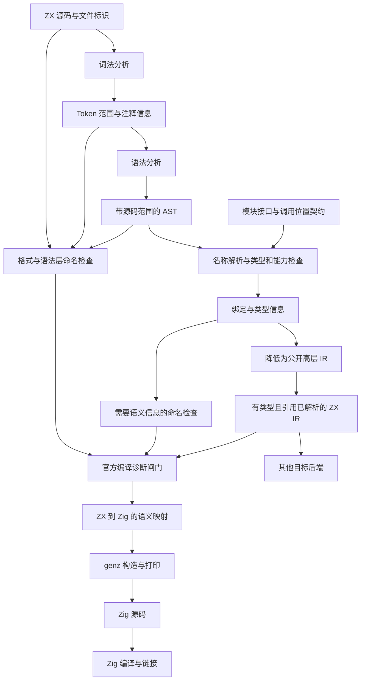

# ZX 到 Zig 编译流程与包边界设计

实施后的实际能力、最终数值选择与 AST 空行策略见 [ZX 四包实施](ZX四包实施.md)；本文保留设计阶段的决策依据。

## Intent：最终目标

以 genz、zx、compiler、lint 四个包建立可维护的 ZX → Zig 编译链，并允许第三方消费标准 ZX IR 实现其他目标语言后端。代码风格由官方编译入口强制检查，同时保留解析与诊断能力供编辑器使用。

本文是设计提案，不是已实现能力。此次只新增本文，不修改源码、构建、现有语言规范或用户已有改动。

## Data：可用证据

- `docs/zx_design_doc.md`：ZX 是受限的类 TypeScript 语言；入口函数匿名；类型、输入输出、不可变计算、Store setter 和数据库 effect 有明确边界。
- 现有规范的命名规则混合了“推荐”和强制要求。升级为统一编译错误属于语言规则变更，不能当作现有实现事实。
- `docs/zx_mvp_compiler.md`：旧 MVP 的部分表达式类型检查委托 Zig。这只能作为 Zig 单后端的阶段性方案，不能直接视为目标无关 IR 的完整语义检查。
- `docs/2026-09-22/MVP归档迁移.md`、根 `build.zig`：旧编译器已迁入 legacy，当前根构建组织 dsl 与 rx；新四包尚未建立。
- `packages/dsl/src/ast.zig`：现有 AST 表达 XML 风格节点、属性和子节点，不适合作为 ZX 表达式 AST。
- `packages/dsl/src/root.zig`：现有实现使用显式 allocator、结果 arena 与结构化诊断，可作为资源所有权设计参考。
- [zitron README](https://github.com/mnemnion/zitron)：它基于 Lemon，是输出 Zig 解析器代码的 LALR(1) parser generator，需要另外提供 tokenizer。
- [Rust HIR 文档](https://rustc-dev-guide.rust-lang.org/hir.html)：高层 IR 可以保留接近源语言的结构，并消除部分语法糖。IR 并不一定是 SSA 或机器指令形式。
- [Clang 内部设计](https://clang.llvm.org/docs/InternalsManual.html)：源码位置、诊断与 Token 等基础设施分别服务编译过程，诊断包含标识、级别和位置。

## Edges：边界与限制

1. 保留四包方案；Zig 后端先作为 compiler 内部模块，不为每个阶段建包。
2. 首版不引入 SSA、通用优化框架、插件注册器或完整 CST。只在明确需求出现时增加结构。
3. 本文的接口代码是契约草案，不是完整可编译实现；未运行构建，不新增测试，不进行浏览器 UI 检查。
4. 单独解析 ZX 不要求 RX 上下文；包含 Store 能力的完整语义验证必须获得调用位置契约。
5. `zig:` 与指向 Zig 库的 `lib:` 导入是可移植性边界。第三方后端必须提供适配，或明确拒绝不支持的能力。
6. 数值溢出、除法、浮点、越界、求值顺序及资源生命周期必须形成规范，不能自动继承目标语言的默认行为。
7. 空行数量、缩写大小写、数字位置、枚举成员与外部字段命名等细则尚需明确；本文给出方向，不代替用户批准全部语言细则。

## Answer：交付格式与成功标准

交付包边界、架构图、数据流图、最小接口草案、实施顺序与复核记录。

成功标准：第三方后端无须重做 ZX 名称解析与类型推导；genz 不认识 ZX；lint 能定位原始空白；官方构建拒绝规定的风格错误；公开 IR 的语义不依赖 Zig 编译器补全。

### 一、四包职责

| 包       | 拥有的职责                                                                    | 边界                                                 |
| -------- | ----------------------------------------------------------------------------- | ---------------------------------------------------- |
| zx       | Token、AST、源码范围、诊断、语言规则、公开 IR 数据契约及其版本                | 不导入 compiler、lint、genz；不承担文件 I/O          |
| compiler | Lexer、Parser、名称解析、类型检查、语义校验、AST → IR、Zig 后端与官方编译流程 | 产生和消费 zx 定义的契约；规则算法不在 zx 重复实现   |
| lint     | 基于源码、Token、AST 及必要的绑定结果检查格式和命名                           | 依赖 zx，不导入 compiler；不生成代码、不执行类型推导 |
| genz     | Zig 标识符、字面量、表达式、语句和声明的结构化生成与打印                      | 不依赖 zx，不决定 ZX 的类型、能力、运行时或语义映射  |

公开 IR 的定义建议放在 zx，并允许 compiler 重新导出，方便第三方从编译 API 使用。这样 lint 与后端能够依赖数据契约，而不必反向依赖整个编译器。

如果 IR 定义放在 compiler，且 compiler 又调用依赖其 IR 的 lint，就容易形成依赖环。共享契约下沉到 zx 可以直接避免这个问题，不需要立即新增第五个包。

zx 中的语法规则可以由正式文法、节点定义、关键字与运算符信息表达。不要为“规则包”先创造一套通用语法元编程框架；手写 Parser 也是有效实现，保持规范与实现一致即可。

架构图：箭头表示模块依赖。



前端、Zig 后端与流程入口可由 compiler 包分别暴露模块。第三方只需要前端和 zx，构建接入应避免强制编译 Zig 后端。只有出现独立发布、维护或依赖隔离需求时，才拆出后端包。

### 二、数据流与各表示的用途



- Token Stream：类型与原始字节范围。无需让 Parser 消费所有空白，但不能丢失源文件和定位依据。
- AST：表达 ZX 源码结构；标识符可能尚未绑定，类型可能未确定。源码括号等细节可以另由 Token 保存。
- 符号表：语义分析使用的索引，不是所有程序必须依次经过的独立“文件格式”。记录声明身份、作用域、类别和类型；此处通常不需要机器内存偏移。
- ZX IR：后端消费的高层语义表示。保留结构化 if、switch、集合变换和能力操作，完成引用解析和类型确定。
- CFG：描述基本块及控制流关系的分析表示，可以由 AST 或 IR 构建，也可以成为低层 IR 的组织形式；不是固定排在 IR 之后的第五个阶段。

AST 从广义上也是一种 IR，但公开接口必须分别命名 `Ast` 与 `Ir`，明确各自保证。IR 不必完全独立于源语言，ZX IR 服务 ZX 语义即可，关键是让可移植部分独立于目标语言。

首版通过结构化遍历完成返回覆盖等检查；当复杂数据流分析需要它时再构建 CFG。寄存器分配与机器级优化交给 Zig 工具链。不要把公开 IR 预先降为跳转图，使其他高层语言后端被迫还原 if 和循环。

### 三、开放 IR 的真正契约

独立发布包不等于完成开放标准。最少需要明确以下内容：

1. 节点与类型集合：每个表达式具有可用类型；可空值、枚举、列表及结构类型含义确定。
2. 绑定：引用使用稳定于当前 IR 工件内部的 SymbolId、TypeId 等标识；不要求跨编译运行保持编号一致。
3. 运算语义：整数宽度、溢出、除法取整、浮点规则、短路和从左到右等求值顺序必须明确规定。
4. 效果语义：纯计算、Store 暂存写入、数据库命令构造必须可区分，不能用目标代码字符串隐藏。
5. Runtime 契约：输出生命周期、字符串与列表的可观察行为、提交原子性及失败通道；具体 allocator 与 ABI 由后端实现。
6. 位置映射：保留源码来源标识和范围，生成临时节点可追溯到来源；没有源码文本也能消费 IR，但不能执行空白检查。
7. 版本：语言版本、IR 版本以及所需能力；遇到未知版本或能力明确拒绝，不静默忽略。
8. IR 校验：外部反序列化或第三方构建的 IR 检查引用有效性、节点结构与类型一致性，再进入后端。

Zig 内存中的 struct/union 定义可以作为首版同语言 API，但不等于跨语言线协议。真正开放跨语言消费时，需要另行发布序列化格式，规定标签、编号作用域与精确数字编码；u64 不能随意通过可能丢失精度的 JSON number 传输。首版可先完成文档化的数据与语义契约，不立即实现所有格式。

Store 校验分两层：函数记录所需路径、类型和效果；官方程序编译对每个 RX Call 检查实际授权与输入兼容性。同一个函数可复用，但不能凭一次成功检查就让其他调用者跳过授权。无上下文时允许 parse，涉及未解决能力时应返回明确的分析诊断，不宣称得到完整的可执行程序。

现有 `zig:std` 和 Zig 第三方库导入意味着并非每个合法 ZX 程序都能自动移植。公开 IR 可以携带目标扩展要求，其他后端提供对应实现或报不支持；不要承诺所有后端天然等价。

### 四、genz 的原语与后端映射

建议原语包括 identifier、stringLiteral、integerLiteral、binary、call、field、block、constDecl、returnStmt、ifExpr、structType、functionDecl。

这些原语组合结构化 Zig 节点，最后统一打印。首版仅覆盖实际后端需要的 Zig 子集，不实现完整 Zig 编译器 AST，不把原始字符串拼接开放为默认表达式接口。

genz 负责转义、字面量编码、运算符优先级和括号、缩进与换行。Zig 编译器仍负责目标代码的最终合法性检查。

compiler 的 Zig 后端负责：

- ZX `&&` → Zig `and`，ZX 可选值回退 → Zig `orelse` 等语义映射。
- ZX 集合变换 → 循环及分配操作，遵循规定的求值顺序和生命周期。
- ZX 类型 → Zig 类型，Runtime 能力 → 约定调用。
- 使用 SymbolId 维护生成名称，避免用户名称与生成的临时名称冲突。

例如，genz 可以表达 `[]const u8`，但由 ZX 后端决定 ZX string 使用这个表示。genz 可以表达函数调用，但不决定 Store 写入应何时提交。

### 五、风格能否作为编译错误

可以。官方 `compile` 调用 lint，任何强制风格错误均阻止代码生成；lint 独立成包不意味着它是可关闭的插件。

同时保留低层 parse/analyze 接口：编辑器需要读取尚未格式化的文件并提供诊断。直接消费 IR 的其他工具不应声称已检查原始源码的空白。

| 规则                                   | 所需证据                              | 建议归属          |
| -------------------------------------- | ------------------------------------- | ----------------- |
| 缩进、换行、空行、尾随空格             | 源码、Token、注释和 AST 范围          | lint              |
| 局部绑定 snake_case                    | AST 声明类别与名称                    | lint              |
| 可调用名称 camelCase                   | 导入/绑定类别，必要时使用解析后的符号 | lint              |
| 类型 PascalCase                        | 类型声明与导入类别                    | lint              |
| 一文件一匿名入口、固定 Input/Output/in | AST 与文件角色                        | compiler 语言检查 |
| const 不可变、类型合法、Store 权限     | 名称解析、类型与调用上下文            | compiler 语义检查 |

把“局部变量都 snake_case”精确化为普通值绑定；可调用绑定按 callable 规则处理。当前 ZX 入口匿名，所以函数 camelCase 主要检查 `import normalizePrice from "./normalize_price"` 一类可调用名称，文件名仍可使用 snake_case。

不要用全局正则判断角色。例如 `Db` 是类型，而 `db` 是值；外部对象字段和外部模块成员也不能因为内部命名规则被静默重命名。字段、枚举成员、缩写和数字另行定义规则。

“不同语义块之间空一行”无法仅凭作者意图机械验证。需要定义可判定的节点关系，例如声明段与后续 return 之间的空行；这是待选规则示例，不是本次批准的规则。对注释归属、连续声明、多行表达式及块开头结尾也必须明确处理。

最小信息保存方案：源码缓冲区 + 每个 Token 的起止偏移 + 注释范围 + AST 节点范围。Token 间的源码片段可以恢复空白，暂不需要完整 CST。

格式器可以随后放在 lint 内，与检查共享规则，避免两套规则漂移。未来若采用规范化输出比较，应满足幂等性、保持注释和语义；不必现在新增 fmt 包。

### 六、接口草案

以下 Zig 片段仅展示契约的组织方式，省略完整节点集合、诊断类型及具体函数实现。

```zig
pub const SourceId = enum(u32) { _ };
pub const SymbolId = enum(u32) { _ };
pub const TypeId = enum(u32) { _ };

pub const Span = struct {
    source: SourceId,
    start: u32,
    end: u32,
};

pub const SymbolKind = enum {
    value,
    function,
    type_decl,
    module,
};

pub const Symbol = struct {
    name: []const u8,
    kind: SymbolKind,
    span: Span,
    type_id: TypeId,
};
```

Span 使用 UTF-8 字节偏移与左闭右开区间；u32 的文件大小上限必须显式检查。行列由源码索引计算，不在每个节点重复保存。SymbolKind 服务语义类别与 lint，不将命名风格编码进标识符词法类别。

预期调用形态如下，其中类型与函数仍需在实施阶段定义：

```zig
var parsed = try compiler.parse(allocator, source);
defer parsed.deinit();

try lint.checkSyntax(parsed.view(), diagnostics);

var analyzed = try compiler.analyze(allocator, parsed.view(), context);
defer analyzed.deinit();

try lint.checkNames(analyzed.symbols(), diagnostics);

if (diagnostics.hasErrors()) return error.CompilationFailed;

var lowered = try compiler.lower(allocator, analyzed.view());
defer lowered.deinit();

try compiler.zig.emit(allocator, lowered.view(), writer);
```

此片段展示阶段顺序，不代表最终错误模型。实际 API 在 parse/analyze 失败时必须先处理阶段结果，不能读取无效树；语言诊断作为结果数据，内存与 I/O 失败作为宿主错误。先沿用现有明确的 Result 所有权方式，避免同时存在相互矛盾的约定。

建议 parsed 拥有源码与语法分配；analyzed 在其生命周期内借用 parsed；独立导出的 IR 拥有后端所需名称、类型与节点，不借用已经释放的解析内存。源码全文不必复制进 IR，只保留来源映射。通过 deinit 顺序或独立 IR 所有权写清边界。

### 七、实施计划

1. 先确认语义与格式契约：数值行为、能力边界、强制命名的适用对象，以及可判定的空行规则。
2. 建立 zx 包：先定义源码范围、Token、AST、诊断和最小有类型 IR；按纯计算子集落实，不一次设计所有节点。
3. 建立 compiler 前端：Lexer、Parser、作用域解析、类型检查与 lowering。旧 MVP 只作参考，不整体搬迁为正式实现。
4. 建立 lint：从变量、类型、可调用导入命名及明确的空白规则开始，接入官方编译闸门。
5. 建立 genz 与 compiler 内部 Zig 后端：以最小纯计算链验证边界，再按现有语言规范逐步扩展。
6. 完成公开 IR 文档及校验入口；确有跨语言消费者时落实序列化协议，再实现其他后端。

包目录先保持 `src/root.zig` 入口；compiler 内按 frontend、analysis、ir、backends/zig 的实际职责组织；zx 的 AST 与 IR 节点在出现独立职责时再拆分。此处不预建空目录和空模块。

未来实施的验收项目：格式不合规时官方构建失败且位置正确；合法输入产生有类型 IR；后端不重做名称解析；genz 可脱离 ZX 使用；带 Zig 专属导入的 IR 在不支持的后端明确失败。这些是成功标准，不是本次新增测试用例。

### 八、执行细节与自我复核

- 已阅读根规则、文档分工、ZX 语言与旧 MVP 设计、归档记录、现有包入口及根构建。
- 已定位 Zig 文件并尝试 ast-outline；当前工具不支持 Zig，降级为直接读取已定位文件，未使用文本替换或正则重构代码。
- 已核对 zitron 官方 README 及手册入口：其位置在 Parser 生成阶段，不承担 ZX IR → Zig 业务代码的生成。尚未验证其与本仓库 Zig 版本的兼容性，不建议据此直接引入依赖。
- 自我批判：新增带类型 IR 会把旧 MVP 交给 Zig 的部分检查提前实现，开发成本确实增加；这是多后端语义一致性的成本，并非仅靠拆包可以解决。
- 自我批判：保留结构化高层 IR 适合当前源码转译目标，但不能保证未来所有优化只需这一层；需要低层表示时可在后端内部增加，不提前污染公开契约。
- 自我批判：风格规则能强制统一外观，但“语义块”不能完全由语法判定；未将自然语言偏好伪装成已确定算法。
- 未修改语言规范或源码，未构建、运行测试或打开浏览器做 UI 验证。本文片段是接口讨论材料，不宣称经过编译验证。
