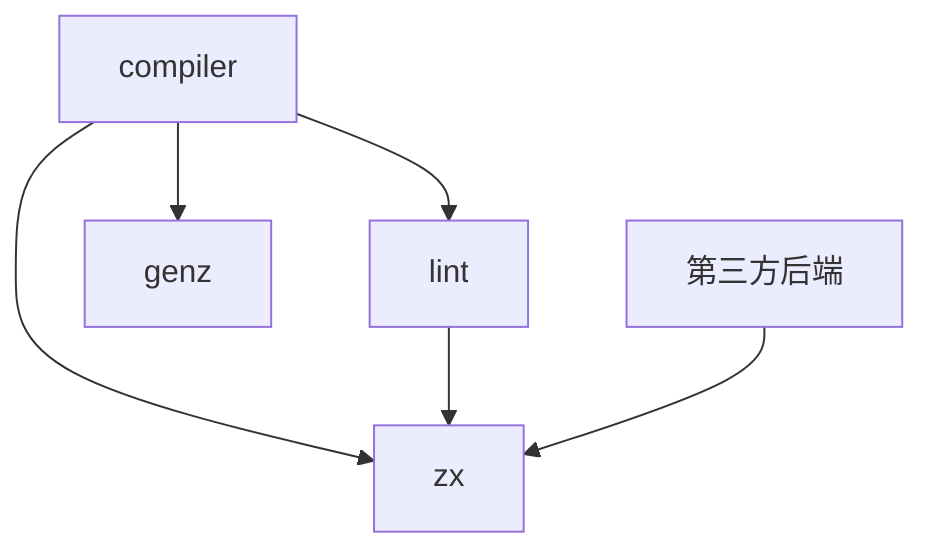
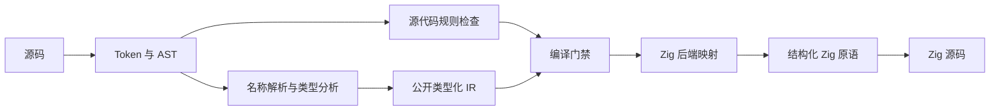

# ZX 四包实施

## Intent：最终目标

落实 zx、compiler、lint、genz 的独立包边界，交付能够从真实 ZX 源码生成 Zig 的正式纯计算编译闭环，并公开带类型、绑定已解析的 IR。分阶段扩展完整 ZX 语言，首批不伪造尚不存在的 Runtime。

## Data：可用证据

- 依据《ZX到Zig编译流程与包边界设计》与现有 ZX 语言规范。
- 当前 Zig 为 0.16.0，正式构建已有 dsl 与 rx；legacy 编译器仍独立保存。
- 当前工作区的 RX 文件存在用户改动，本任务不修改这些文件。
- AST 与 IR、源码检查与语义检查、ZX 后端与 Zig 生成原语需要分别实现。

## Edges：边界与限制

- 不新增测试用例，不进行浏览器 UI 验证；运行已有回归、构建与编译示例。
- 首批实现单文件、匿名默认函数、显式 Input/Output、标量与对象类型、const、if/else、return 及纯表达式；其他语法明确诊断，不静默跳过。
- Store、数据库、跨文件导入、集合操作与其他尚未实现能力不标记为可用。
- 数值按用户最终决定对齐 Zig 原生类型；不增加 Python 大整数运行时。整数除法映射 divTrunc，余数映射 rem，生成函数显式开启安全检查。
- 空行按用户要求参考 gcs，并改用 AST 分组实现。gcs 是预测模型，不存在可直接搬迁的确定性规则；当前规则见 lint 包文档，不承诺与 gcs 输出完全一致。
- 不复制旧 MVP 的未解析 AST 直接生成 Zig 路径，不修改 legacy。

## Answer：交付格式与成功标准

1. 建立四个独立包、构建与公共入口。
2. 实现源码范围、Token/注释、AST 与独立拥有数据的有类型 IR。
3. 实现前端、命名检查和独立 Zig 后端，编译门禁拒绝错误输入。
4. 提供可运行示例，生成代码通过 Zig 编译；完成既有仓库回归。
5. 文档准确记录支持范围、所有权、规则和未完成边界。

## 执行记录

- 已核对根规则、RX 规则和构建布局。
- 已安排一个只读分析子代理检查 legacy 可借鉴部分；代码由主代理实现。
- 已建立 zx、compiler、lint、genz 四个包与构建入口，旧 MVP 未改动。
- compiler 同时提供只依赖 zx 的 frontend 模块和完整 compiler 模块；完整模块复用同一 frontend，避免重复模块身份。
- parse 拥有源码与 AST，analyze 单独拥有 IR 数据；IR 不借用解析 arena。
- 公开 validateIr 校验版本、类型拓扑、索引、运算类型、符号作用域、返回覆盖与可达节点，Zig 后端生成前必须通过它。
- 名称规则在官方编译入口强制执行；空行检查与格式化共用 AST 编辑规划，支持保留注释和 CRLF。
- 数值位宽与浮点精度明确，f32 直接按 f32 解析，浮点打印使用位模式保留负零与精度。
- 已跑通真实 quote.zx → IR → Zig → 可执行程序，示例输出 amount=80、factor=0.75。后续记录最终构建与格式检查结果。

## 自我复核

- 文件命名纠正：只有 labels 下的标签实现文件允许大写开头。本次新增的 Builder、Printer、Parser、Analyzer、Types、Lower 六个实现文件已改为小写文件名，并同步修改 import；类型符号名称保留。之前套用了 Zig 类型文件的大写命名习惯，没有遵循本仓库的要求。

- 本次交付的是四包纯计算闭环，不是完整 ZX 语言。enum、switch、可选值、列表、import 和 Runtime 能力未实现，文档与诊断均明确边界。
- 没有把旧 AST 重命名为 IR；名称和类型在 ZX 阶段解析，生成器从 IR 读取类型。
- 独立包与版本字段尚不构成跨语言稳定标准，当前仍是实验性 Zig 内存契约，序列化没有提前实现。
- AST 空行规则是参考 gcs 效果的确定性规则，不是对模型输出的精确复刻；没有运行模型作为编译条件。
- 固定位宽有利于对齐 Zig，但不提供十进制精确小数或 Python 大整数能力；未来高性能计算的具体数值模型仍需按应用场景设计。
- 当前无完整常量求值器；Zig 编译期发现的非法常量运算尚不能全部转换成 ZX 源码诊断。这项限制没有被描述为完整的语义验证。
- 未新增测试用例，遵循用户约束；构建、既有回归和示例验证不能替代未来全面的前端/后端一致性验证。

## 验证结果

- 根 `zig build`、既有 `zig build test` 通过。
- 根 `zig build zx-example` 通过，真实 ZX 文件经 CLI 生成 Zig 后编译执行，输出 `amount=80, factor=0.75`；f64 与改为 f32 的示例版本均实际编译运行。
- `zig build zx-example -Doptimize=ReleaseFast` 通过，输出相同。
- zx、genz、lint 各自目录的 `zig build` 通过；compiler 目录的 `zig build example` 通过。
- CLI 的示例 `fmt --check` 通过；对该现有示例连续两次格式化结果相同，逐行核对非空行内容不变。此验证只覆盖该示例，不声称证明全部注释布局与换行组合。
- 本次 Zig 文件同时通过 `zig fmt --check` 与 gcs 格式检查；修复了 gcs 对两处多行 if 表达式插入空行而与 zig fmt 不一致的问题，改用相同语义的 switch 表达式。
- 本次 Markdown 通过 Prettier；本次 diff 未发现空白错误。
- 未新增测试文件或用例，未打开浏览器做 UI 验证，未提交 Git。
