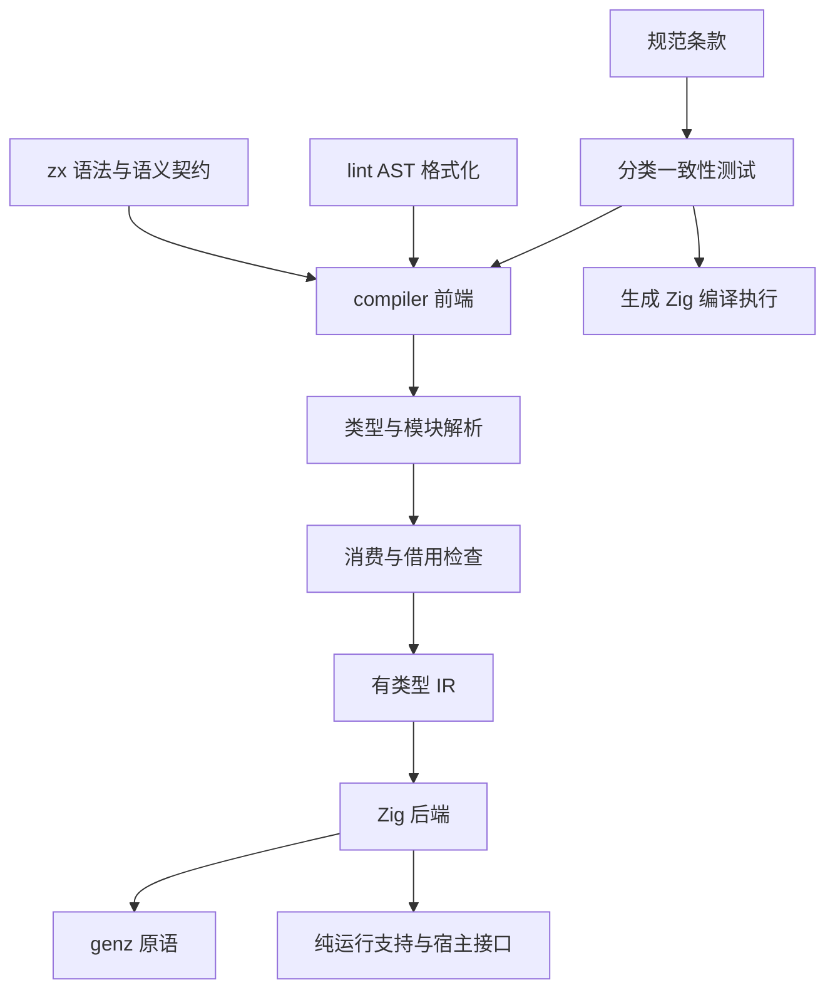
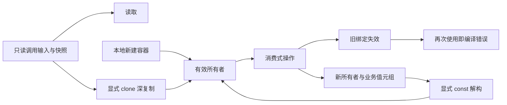

# ZX 完整语法与所有权实施计划

## Intent：最终目标

更新 ZX 语言设计，落实附件最终收敛的 const 消费式所有权和统一元组返回，补齐设计文档中尚未实现的编译器功能，并建立以规范条款为依据的完整测试体系。本次不把“跑通一个例子”或“拒绝未实现语法”当作功能完成。

## Data：可用证据

- 用户附件后半部分要求：更新操作消费旧所有者，旧绑定不可再用，新所有者与业务值一起返回；检查发生在编译期。
- 用户已确认统一元组、显式解构，不加入普通 const 绑定自动提取第一个返回项的隐式语法糖。
- 用户明确 ZX 没有闭包：集合回调不捕获外层局部变量，包括不可变 const、in、store 和外层回调参数；无需闭包环境或捕获生命周期分析。
- 用户要求声明式框架：语法通过类型化组合子声明，保留 Token 和源码位置；类型检查与所有权分析使用独立算法。
- 用户随后明确数据库暂不实现：Db、DbEffect、SQL、数据库事务和数据库 Runtime 不属于本次验收范围，保留为设计中的未来能力。
- 输入与 Store 快照采用只读视图，消费时显式 clone；用户确认由 Call 直接注入命名句柄。
- 实施前四包只支持单文件标量/对象纯计算；本计划记录的语言缺口已完成接通，数据库仍排除。
- 当前 RX 提供 Schema 与静态校验，不存在可直接接入的生产 Store/数据库 Runtime。
- 参考 [Test262](https://github.com/tc39/test262)、[贡献指南](https://github.com/tc39/test262/blob/main/CONTRIBUTING.md) 与 [运行解释](https://github.com/tc39/test262/blob/main/INTERPRETING.md)。采用按特性分组、规范标识、独立正例、按阶段分类负例和可观察行为断言；不把 ECMAScript 语义直接移植到 ZX。

## Edges：边界与限制

- 保持 zx、compiler、lint、genz 四包边界。编译产物需要的纯运行支持放在 compiler 内；外部 I/O 通过明确的宿主契约注入。
- 用户已明确要求完善测试，本次可新增测试；全部放在各子包 tests，与 src 同级。
- 除 labels 标签实现外，源码文件名全部小写，多词使用 snake_case。
- 保留已有用户改动；不重写 legacy，不触碰与本任务无关的 RX 标签重组。
- 不能保证所有更新都原地、所有元组都零分配。独占存储允许复用，扩容和显式复制仍可能分配；性能保证必须有可验证依据。
- 不通过删除设计功能、无提示降级、跳过失败用例或生产代码中的案例特判完成验收。
- 测试检查实际源码解析和实际生成 Zig 的执行结果，不能仅用手写 IR 或生成字符串快照代替端到端验证。

## Answer：交付与成功标准

### 工作清单

| 范围     | 必须完成的内容                                              | 验证要求                                                 |
| -------- | ----------------------------------------------------------- | -------------------------------------------------------- |
| 设计     | const/Move/借用/元组、列表更新语义、调用与 Runtime 边界     | 规范无自相矛盾，区分语言保证与优化                       |
| 类型     | enum、optional、list、tuple、纯类型文件、显式局部标注       | 类型正例、冲突与循环负例                                 |
| 表达式   | null、??、列表/元组、索引/length、字符串比较/模板、对象展开 | 求值次数、顺序、边界与输出生命周期                       |
| 语句     | switch、元组解构、丢弃模式                                  | 覆盖、重复、作用域与返回路径                             |
| 集合     | map/filter/reduce、无捕获 lambda、clone、消费式更新         | 值结果、捕获拒绝、参数遮蔽、旧绑定失效、分支与嵌套所有权 |
| 模块     | 类型/函数/枚举导入、相对路径/@/、循环检查、函数调用         | 多文件真实编译与错误文件定位                             |
| 外部接口 | zig:/lib: 受限接口的类型与纯度契约                          | 未授权调用拒绝、授权调用真实生成执行                     |
| 能力     | Store setter、调用位置类型与授权；数据库按用户要求暂不实现  | 编译检查、宿主契约及集成测试，不伪造生产 I/O             |
| IR/genz  | 对应完整节点、版本、校验和 Zig 生成原语                     | 校验负例、跨阶段数据所有权                               |
| lint     | 新语法的命名/AST 分组/注释保留                              | 幂等性、非空白内容保持、新语法覆盖                       |
| 测试     | language/builtins/ownership/modules/runtime 分类            | parse/analyze/style/runtime 阶段明确，失败可定位         |

### 架构图

### 所有权数据流图

## 执行记录

- 已读取附件最终所有权方案、当前源码与仓库规则。
- 两个子代理仅承担附件要求和源码缺口分析，不修改文件。
- 实施与实际测试结果将持续更新，不提前标记尚未完成项。
- 早期 37 项前端测试仅验证前端，当时完整构建尚有缺口。现已接通 AST/IR、所有权、lint、genz、模块、原生接口与 Store 宿主契约，完整构建通过。
- 最终实现范围、测试结果与自查见[编译器实施验收](编译器实施验收.md)，逐项语法见[语法逐项验收](语法逐项验收.md)。
