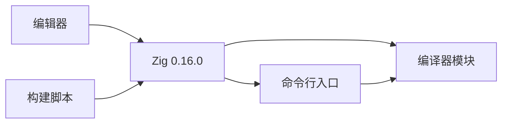

# Zig 0.16 适配

## Intent：最终目标

将项目从 Zig 0.17 nightly 适配到本机 Zig 0.16.0，保留现有编译行为和默认安全优化模式。

## Data：可用证据

- 本机 Homebrew Zig 版本为 0.16.0。
- 构建脚本使用 `std.builtin.Optimize` 和 `.safe`，0.16 对应 `std.builtin.OptimizeMode` 和 `.ReleaseSafe`。
- 包清单要求 0.17 nightly，编辑器指向已不存在的 nightly 安装路径。
- 工作区已有未提交变更，适配必须保留这些内容。

## Edges：边界与限制

仅修改版本配置及实际构建暴露的 API 差异，不重构业务逻辑，不新增测试用例，不进行浏览器验证。ast-outline 不支持 Zig 文件，按需直接阅读具体文件。

## Answer：交付格式与成功标准

交付最小代码变更、环境配置和验证记录。Zig 0.16.0 下构建及现有集成测试通过。

## 执行计划

1. 调整优化模式类型、最低版本和编辑器路径。
2. 通过实际构建定位并修复剩余标准库 API 差异。
3. 运行现有测试，复核本次变更并记录限制。

## 架构图

## 数据流图

## 执行记录

- 已调整构建优化类型和默认值、最低版本、README 与本地编辑器工具链路径。
- 首次构建发现 `Run.addPassthruArgs()` 在 0.16 中不存在，改为通过 `b.args` 获取参数并调用 `run_command.addArgs(args)`，保持 `zig build run -- ...` 参数透传。
- `zig build`：通过，业务源码无需修改。
- `zig build test --summary all`：6/6 构建步骤成功，3/3 现有集成测试通过，使用 ReleaseSafe。
- `zig build run -- --help`：正确输出帮助，参数透传正常。
- `zig fmt --check build.zig build.zig.zon` 与 `git diff --check`：通过。

## 自我复核

修改范围限于构建 API、版本声明、编辑器路径和文档，保留工作区原有修改。现有集成测试覆盖当前编译链，但不能代表所有潜在输入；本次没有新增用例，也没有宣称完整语言覆盖。

本机编辑器路径沿用原有绝对路径配置方式，改为当前 Homebrew 安装位置；其他机器需按实际安装位置设置。未直接验证编辑器内 ZLS 会话，重启语言服务后才能确认旧诊断已刷新。
