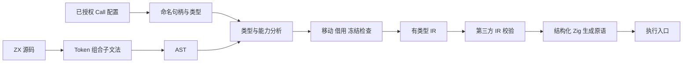
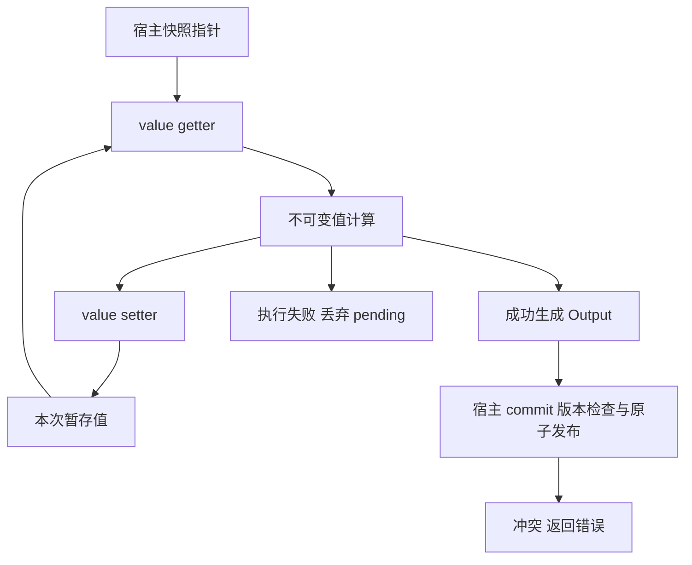

# 不可变值与存储句柄契约

## Intent：最终目标

实现基于 const 的不可变值和消费式所有权，避免为了只读访问深拷贝数据；按照用户确认，由 Call 直接注入命名 Store 句柄。数据库不在本次范围。

## Data：已确认约束

- 数值对齐 Zig 原生固定宽度类型，不引入 Python 任意精度整数。
- 消费式操作统一返回二元元组，显式解构，不隐式提取第一个元素。
- ZX 无闭包。集合 lambda 不能捕获外层 const、in、外层 lambda 参数或 Store 句柄。
- Store 使用 `$store_v.value` getter 和 `$store_v.value = next_value` setter；句柄由 Call 注入，不在 ZX 中绑定。
- 测试采用 Test262 的特性分类、阶段区分与可观察结果思想，不移植 JavaScript 的隐式转换规则。

## Edges：语义与性能边界

### 值与所有权

const 限制绑定和普通字段修改，不要求每个读取动作复制内存。标量与不含列表的对象按值处理；列表使用只读切片。字符串不可变，属于可共享值。

本地列表字面量、深 clone 和产生独立元素的列表变换可以形成所有者。所有者赋给新绑定或被消费时，旧绑定失效；包含列表的嵌套字段移动会保守地移动整个根对象。

输入、Store 快照、可能共享输入的函数返回值和嵌套集合视图属于借用。显式 clone 深复制需要独立消费的值。map/filter 产生引用原容器内容的嵌套视图时，原本的所有者也被冻结，防止随后通过另一条路径修改共享数据。

分支检查只合并会继续执行的路径。已经返回的分支消费旧值，不影响其他继续路径的合法使用。短路表达式同时考虑执行和跳过右侧的状态。

Store setter 发布本地所有者时将其冻结为借用，允许后续读取，但不允许消费修改。普通对象仍禁止字段赋值。

### 实际成本

- getter、切片传递和读取不调用 clone；列表数据不复制。
- `{ ...snapshot, count: next_count }` 重建对象字段描述，未修改列表继续保留原指针。
- pop/reverse/sort 对独占列表复用存储；push/concat/splice 当前分配结果列表。当前切片表示没有额外 capacity 字段，不承诺 push 零分配。
- clone 是显式深复制，成本与数据量相关；不会宣称任意大对象 clone 是零成本。
- 不为所有值强制引入指针。标量按值通常更直接；Store 快照由宿主指针提供，切片本身包含指针和长度。

### Store 调用边界

Call 向编译器传入 `handle / path / type_name / readable / writable`。句柄和 Object 路径均要求唯一，对象类型必须是完整结构类型。名称解析把句柄映射为静态 slot。

ZX 执行生成的 `zx_pending` 暂存结构。getter 读取 pending 中已有值，否则读取宿主快照。执行成功后统一调用宿主 commit；执行失败不提交。commit 的版本检查、多 slot 原子性和持久化由宿主负责，不能通过逐项写入伪装成原子提交。

生成入口为 `execute(arena, input, context)`；纯函数省略 context。arena 的类型为 `*std.heap.ArenaAllocator`，避免普通 allocator 下遗留不可逐项回收的中间结果。宿主必须维持输入与 Arena 生命周期，并在持久保存输出前移交到长期存储。

## Answer：架构、数据流与验收

测试覆盖实际 ZX 解析、IR 校验、Zig 编译与执行。Store 用例验证 getter 能看到本次 setter 的结果、成功只提交一次、失败不提交、冲突传播，以及零分配标量更新保持未修改列表的原指针。

自查重点：没有闭包不能替代所有权检查；只读切片不能自动证明底层缓冲区独占；类型正确不能替代 Store 权限或宿主提交原子性。对这些边界分别设置检查和测试，不通过硬编码案例返回值实现功能。
