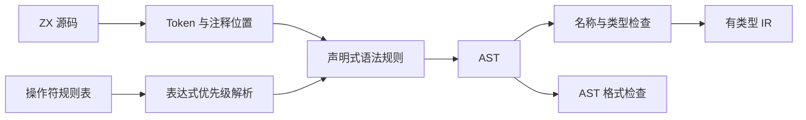
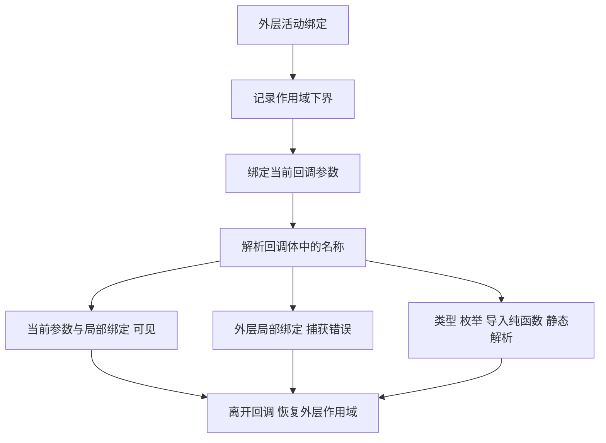

# 声明式前端与无捕获回调

## Intent：最终目标

用类型化解析器组合子表达 ZX 文法，降低增加语法时修改分支代码的成本。ZX 没有闭包；集合回调不能隐式携带外层绑定，不引入闭包环境、捕获逃逸分析或捕获对象的生命周期管理。

## Data：可用证据

- 用户最新附件建议使用 Zig comptime 的 sequence、choice 等解析器组合子。
- 用户明确“ZX 没有闭包”。旧设计允许回调读取 in 和外部 const，与这项约束冲突，已修正。
- Token 保留源码位置，格式检查和诊断仍需使用这些位置，不能在声明式改造中删除词法层。
- 现有 AST 将集合 lambda 表示为参数和表达式体；没有捕获列表或闭包环境。

## Edges：边界与限制

- 声明式组合子负责语法组合，不承担类型推导、模块解析或所有权证明。
- 组合子的 miss 表示本规则不匹配，可以回溯；InvalidSource 和 OutOfMemory 必须传播，不能转成 miss。
- sequence 在 miss 时恢复 Token 游标；choice 仅在 miss 时尝试下一项。required 用于提交已识别前缀之后的语法错误。
- AST 分配由单次解析 Arena 持有。回溯恢复游标，不逐节点回收 Arena；最终成功、诊断和内存失败都释放所属 Arena。
- many 和 separated 检查每次成功必须消耗 Token，防止空匹配无限循环。
- 关键字匹配整颗 Token，不把 constellation 识别为 const。
- ZX 无捕获，但容器别名、函数输入输出、消费后的旧绑定和分支合流仍然需要所有权检查。没有闭包不代表完全不需要所有权分析。
- 输入与 Store 快照使用只读视图；消费前显式 clone。Call 直接注入命名 Store 句柄，使用 .value 读取与写入。

## Answer：实现与验证

### 语法组织

`compiler/src/frontend/combinators.zig` 提供 token、peek、reference、required、sequence、choice、optional、many、separated、map 和 run。

语句与类型规则已采用组合子。表达式使用优先级解析算法，操作符拼写和优先级集中于 zx 的规则表，并在编译期检查遗漏和重复。顶层文件、导入、声明、类型和语句均已使用组合子；表达式 primary/postfix 与 Pratt 优先级解析保留专用算法，不为声明式形式增加重复抽象。



### 无捕获规则

进入集合回调时，记录当前活动绑定长度作为作用域下界，再绑定回调参数。值查找只能访问下界之后的绑定。若名称存在于被隔离的外层范围，报告捕获错误；不存在则报告未定义名称。

退出回调时，无论成功还是失败，都恢复活动绑定长度、作用域下界和回调深度。嵌套回调重复同一机制，不额外生成环境对象。



合法示例：

```ts
return in.items.map((item) => item + 1);
```

非法示例：即使 offset 是不可变标量，也不能隐式捕获。

```ts
const offset = 1;

return in.items.map((item) => item + offset);
```

reduce 的初始值在回调之外求值，可以来自外层变量；该变量不会因此在回调体内变得可见。

```ts
const initial = 10;

return in.items.reduce((sum, item) => sum + item, initial);
```

### 当前证据与自查

- 前端测试已扩展到 76 项，覆盖组合子、类型、模块、所有权、无捕获回调与外部 IR 校验。
- 无捕获检查覆盖外层 const、in、Store 句柄、嵌套参数、同名遮蔽、退出后的作用域恢复、reduce 初始值、枚举静态名称和相邻回调隔离。
- 解析、语义分析和完整编译经过逐分配失败注入。
- 根测试入口已连接 compiler 测试，包含真正生成 Zig 后编译执行的用例；不能再将旧版本仅覆盖 RX 的结果当作当前状态。
- AST、IR 校验、所有权、lint 和 Zig 后端已接通，完整构建通过。最终测试矩阵与限制见[编译器实施验收](编译器实施验收.md)。
- 自查：声明式解析降低文法组合成本，但不会自动解决类型、所有权或宿主 Store 原子提交；这些职责独立实现和验证。
