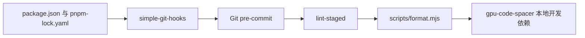

# 提交前空行美化

## Intent：最终目标

使用 gpu-code-spacer 调整待提交代码的空行，通过 simple-git-hooks 安装 pre-commit；美化现有 Zig 源码。开发工具统一使用 pnpm，gcs 安装到 devDependencies。

## Data：可用证据

- 本次查询包注册表，pnpm 最新稳定版为 12.5.1；packageManager 固定该版本。
- gpu-code-spacer 0.1.6 的 npm 包提供 createSpacer API，不包含原生 gcs CLI。
- 新增 scripts/format.mjs 复用一个模型实例，供全量命令与 lint-staged 共用。
- 仓库有 10 个 .zig 文件及 build.zig.zon。
- 本机 Zig 为 0.16.0，仓库要求 0.17.0-dev.1884+841dd0eb8。

## Edges：边界与限制

- 提交时仅处理已暂存的 .zig、.zon、.zx、.rx 文件；lint-staged 管理暂存区及部分暂存改动。
- 全量命令覆盖 build.zig、build.zig.zon、src 和 tests 下的 Zig 文件，不处理生成目录。
- gpu-code-spacer 仅调整空行，不负责缩进、换行宽度或导入排序。
- Node.js 依赖固定到 pnpm-lock.yaml；无需依赖 PATH 中的全局 gcs。
- pnpm-workspace.yaml 允许 webgpu 的安装脚本；simple-git-hooks 的依赖安装脚本关闭，钩子由项目 prepare 显式安装。
- 不新增测试用例，不修改编译器逻辑，不升级本机 Zig。

## Answer：交付与成功标准

### 配置与使用

使用 Node.js 22.22.1+、pnpm 12.5.1：

```sh
pnpm install --frozen-lockfile
pnpm run prepare

pnpm run format
pnpm run format:check
```

更新钩子配置后运行 pnpm run prepare。pre-commit 执行 pnpm run format:staged，由 lint-staged 向本地脚本传入文件路径。脚本调用 gpu-code-spacer API，并将结果写回对应文件；检查模式只报告待美化文件，以非零退出码表示需要调整。

### 架构图



### 数据流图


### 验收与自我复核

- 初次全量美化使用原生 gcs v0.1.6，处理 11 个文件，其中 9 个 .zig 文件发生空行变化；非空行内容与 HEAD 完全一致。
- 使用 pnpm 12.5.1 成功完成 pnpm install --frozen-lockfile，gpu-code-spacer 固定为 0.1.6。
- 本地依赖的后端信息为 webgpu；pnpm run format:check 通过，与已有美化结果一致，无需再次修改 Zig 文件。
- pnpm run prepare 与 pre-commit 运行成功；钩子调用 pnpm run format:staged，当前没有暂存文件，未创建提交。
- node --check scripts/format.mjs 与 git diff --check 通过。
- 未执行编译或集成测试，本机 Zig 与仓库要求不匹配；不把空行检查表述为编译验证。

自我复核：保留 lint-staged 承担暂存区管理，不自写 Git 暂存逻辑。新增脚本仅适配 gpu-code-spacer API；包管理器与模型版本均固定，避免其他开发环境依赖全局 CLI。模型美化不等于人工风格审阅。
