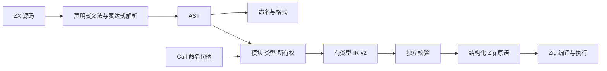
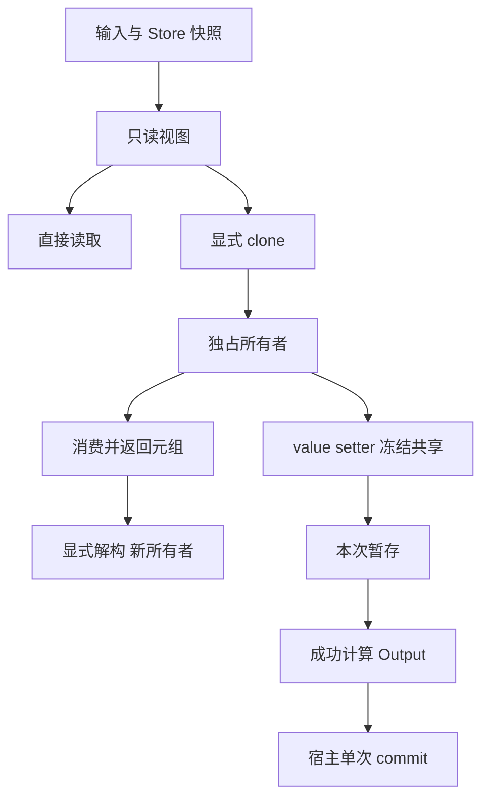

# 编译器实施验收

## Intent：最终目标

落实 ZX 白名单语法、const 不可变值、消费式所有权、声明式前端及 Call 注入的 Store 命名句柄。交付真实的 ZX → AST → 有类型 IR → Zig → 执行链路，并以实际输出和错误验证语言契约。

后续已按用户要求补充语法测试，最新四模式结果为 386/386；见[语法测试组合与边界扩展](语法测试组合与边界扩展.md)。下方 138 项保留为首次实施验收记录。

## Data：实现与证据

环境：macOS aarch64，Zig 0.16.0。验收日期：2026-09-22。

| 范围          | 已交付                                                                                |
| ------------- | ------------------------------------------------------------------------------------- |
| zx            | AST、IR v2、类型与节点契约、语法规则表、带来源的诊断                                  |
| compiler 前端 | 文件、导入、声明、类型与语句组合子；表达式 Pratt 解析；源码位置保留                   |
| 类型与语法    | 标量、对象、枚举、optional、列表、元组、显式类型、switch、模板、展开、解构            |
| 所有权        | 移动后使用拒绝、只读借用、深 clone、消费式集合方法、分支合流、共享视图冻结            |
| 无闭包        | map/filter/reduce 参数作用域隔离，拒绝捕获外层局部值、输入、嵌套回调参数和 Store 句柄 |
| 模块          | 相对路径与 @/ 根目录、多文件类型/枚举/函数导入、纯类型文件、循环与未授权导入诊断      |
| 原生接口      | 显式注册 zig:/lib: 接口；固定参数、零参数、元组展开与结构类型适配                     |
| Store         | Call 注入命名句柄、getter/setter、权限检查、暂存、成功后单次宿主提交                  |
| genz          | 结构化 Zig 表达式、类型与语句生成原语，无源码模板拼接接口                             |
| lint          | 基于 AST 的命名与分组空行规则、注释和非空白内容保留、格式化幂等                       |
| 外部 IR       | 版本、节点引用、类型、作用域、无捕获、权限、返回覆盖与所有权校验                      |

具体语法及示例逐项列于[语法逐项验收](语法逐项验收.md)，性能与宿主边界见[不可变值与存储句柄契约](不可变值与存储句柄契约.md)。

### 测试矩阵

以下命令均在仓库根目录执行。默认优化模式为 ReleaseSafe，Debug 必须显式指定。

| 命令                                                                                  | 实测结果                            |
| ------------------------------------------------------------------------------------- | ----------------------------------- |
| `zig build`                                                                           | 5/5 构建步骤成功                    |
| `zig build test -Doptimize=Debug --summary all`                                       | 138/138 通过                        |
| `zig build test -Doptimize=ReleaseSafe --summary all`                                 | 138/138 通过                        |
| `zig build test -Doptimize=ReleaseFast --summary all`                                 | 138/138 通过                        |
| `zig build test -Doptimize=ReleaseSmall --summary all`                                | 138/138 通过                        |
| `zig build zx-example --summary all`                                                  | 成功，输出 `amount=80, factor=0.75` |
| `zig fmt --check packages/compiler packages/zx packages/genz packages/lint build.zig` | 通过                                |
| `git diff --check`                                                                    | 通过                                |

每种模式的 138 项包含：RX 39 项、前端及 IR 76 项、生成 Zig 执行 12 项、排序运行支持 2 项、Store 4 项、完整编译与格式集成 5 项。这是同一组测试在四种模式下执行，不是 552 个独立用例。

测试按 Test262 的特性分类和阶段诊断思想组织，并非运行或兼容 ECMAScript Test262 全集。包括逐分配失败注入、短路求值、调用者输入不变、消费后的旧引用拒绝、模块真实执行和 Store 提交结果。

Store 用例验证本次写入后读取暂存值、成功仅提交一次、计算失败不提交、宿主冲突传播，以及零分配的标量更新保留列表原指针。

### ReleaseSmall 排序差异

原生成执行用例在 ReleaseSmall 中发现错误：`[2,8,1]` 经 clone、push、pop、sort、reverse 后得到 `[8,1,2]`。独立缩小复现发现 `std.mem.sort` 的 block 排序路径得到 `[2,1,8]`；增加其他测试会掩盖现象，显式 LLVM 后端仍可复现。尚未定位具体优化 pass，因此不宣称已证明工具链根因。

实现改用通用 `std.mem.sortUnstable`。ZX 只保证升序与 NaN 在末尾，不保证稳定排序；无需块排序的稳定性。没有添加长度或输入特判，也没有禁用 ReleaseSmall。原失败的生成执行用例保持不变，并独立验证了原两项最小复现。

新增排序测试独立编译，覆盖长度 0–513 的顺序、逆序、重复和确定性随机输入，与插入排序结果逐项比较；另覆盖有符号整数极值、字符串、无穷、NaN 和正负零。验证原地存储指针不变。

## Edges：边界与自我审查

- 数据库按用户要求排除；Db、DbEffect、SQL、数据库事务与 Runtime 未实现。
- Store 的编译器接口和宿主集成测试已实现；RX XML 到生产 Call 调度、并发版本锁、多对象原子提交和持久化仍属于宿主 Runtime，不能把测试宿主称为生产实现。
- 输入和 Store 列表通过只读切片共享数据，getter 不深复制。对象更新仍可能复制结构字段；显式 clone 深复制，push/concat/splice 当前分配新列表，不承诺所有更新零分配。
- sort/reverse 的复用依赖编译器已经证明独占所有权。宿主不得绕过边界把共享只读内存当作独占缓冲区直接传给这些运行支持函数。
- Arena、输入和快照必须活到输出使用完成。宿主持久保存结果前负责长期存储转移。
- 原生外部接口必须显式注册并审查纯度与 ABI；不是任意 Zig API 自动接入。第三方生成 IR 仍须经过校验，IR v2 不等于稳定的序列化协议。
- CLI 的 @/ 使用当前工作目录；库调用通过 root_dir 指定根。Store 句柄由 Call 配置提供，普通文件不能自行声明权限。
- 数值对齐 Zig 原生类型及安全模式；不承诺四种优化模式下所有非法算术都以同一种可恢复错误返回。列表索引和 splice 则有显式边界错误。
- 所有权检查对嵌套移动和共享容器返回采用保守规则，可能要求额外 clone；当前没有用性能数字证明所有工作负载都高效。
- 本次新增实现文件名为小写或 snake_case；保留仓库既有文档入口和未涉及的 RX 重组改动，没有提交 Git commit。

自查结论：测试已经覆盖跨包真实执行，不能再以“仅前端可解析”描述当前状态；同样不能从 138 项测试推导出语言无缺陷、生产 Store 已完成或高性能计算已经达标。

## Answer：交付路径与成功标准

语言规范以 `docs/zx_design_doc.md` 为准；逐项可审阅示例在语法验收清单；公共后端接口见 `packages/zx/IR契约.md`。验收标准是语义检查、真实生成执行及四种优化模式回归共同通过。

