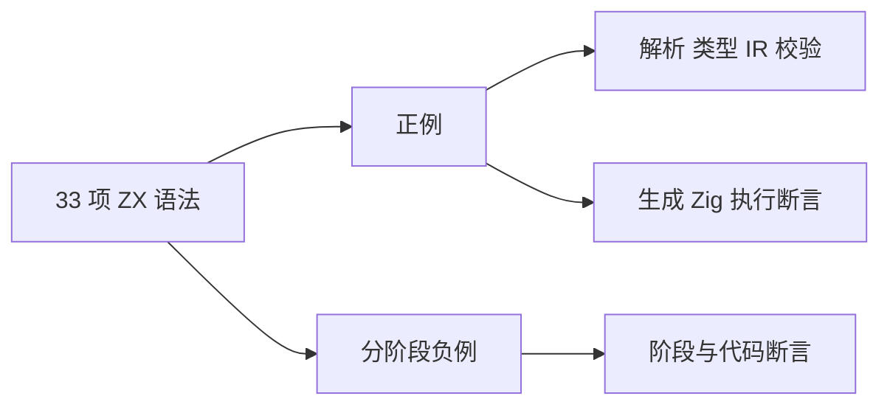

# 语法一致性测试覆盖

## Intent：最终目标

按 ZX 33 项语法清单建立可追溯测试，补齐词法边界、运算符、控制流、对象与集合的正反例。参考 TC39 Test262 的规范关联、独立案例和负例阶段，不移植 JavaScript 语义。

## Data：可用证据

- 基线为 138 项测试，已有模块、所有权、Store、IR 及真实 Zig 执行覆盖。
- 缺口主要是词法负例、全部运算符的结果、if/else if 分支、void return、对象简写、方法参数错误和禁用语法。
- 参考 https://github.com/tc39/test262/blob/main/CONTRIBUTING.md 。

## Edges：边界

语法覆盖表示每项有对应证据，不等于所有输入组合或代码分支达到 100%。数据库、闭包和未列入 ZX 白名单的语法保持拒绝。负例区分 lexical、syntax、analyze 及精确诊断代码；运行例必须真正生成并执行 Zig。

## Answer：执行计划

1. 补齐独立的词法、解析及语义案例，新增语义 helper 强制验证解析成功后才进入分析。
2. 补充运算符、控制流、对象/元组、字符串及集合边界的生成执行案例。
3. 建立 33 项到测试文件的覆盖表；完成四种优化模式回归并记录发现。

## 33 项语法覆盖映射

下列路径均相对于 `packages/compiler/tests/`。P 为解析/语义正例，N 为分阶段负例，R 为生成 Zig 后执行。纯类型与风格规则没有独立运行语义，用相应阶段断言验收；不强行填充运行覆盖。

| 编号 | 语法                   | 正例及执行证据                                                                     | 负例或边界证据                                                                                     |
| ---- | ---------------------- | ---------------------------------------------------------------------------------- | -------------------------------------------------------------------------------------------------- |
| 1    | 匿名入口、Input/Output | P language/parser_test.zig；R runtime/syntax_test.zig                              | language/negative_parse_test.zig：入口之后的语句；negative_semantics_test.zig：返回契约            |
| 2    | 纯类型文件与别名       | P language/parser_test.zig；modules/project_test.zig                               | language/declarations_test.zig：未知/重复类型；types_test.zig：递归别名                            |
| 3    | 标量                   | P language/types_test.zig、lexical_test.zig；R runtime/generated_test.zig          | types_test.zig：各整数边界和浮点精度                                                               |
| 4    | 结构对象               | P language/types_test.zig；R runtime/syntax_test.zig                               | declarations_test.zig：重复字段/void；negative_semantics_test.zig：缺失与未知字段                  |
| 5    | 枚举                   | P language/parser_test.zig；R runtime/generated_test.zig                           | declarations_test.zig：空枚举、重复成员、不同枚举不能混用                                          |
| 6    | optional 类型与字段    | P language/types_test.zig；R runtime/generated_test.zig、syntax_test.zig           | types_test.zig：嵌套类型差异；negative_semantics_test.zig：非 optional 的 null                     |
| 7    | 列表与嵌套类型         | P language/parser_test.zig、positive_semantics_test.zig；R runtime/syntax_test.zig | declarations_test.zig：void 列表；negative_semantics_test.zig：混合元素                            |
| 8    | 显式元组               | P language/types_test.zig、positive_semantics_test.zig；R runtime/syntax_test.zig  | types_test.zig：元组不能隐式变为列表                                                               |
| 9    | const、局部标注        | P language/positive_semantics_test.zig；R runtime/syntax_test.zig                  | negative_parse_test.zig：无初始化/let/var；negative_semantics_test.zig：重名/标注错误              |
| 10   | 解构与丢弃             | P language/parser_test.zig；R runtime/generated_test.zig、syntax_test.zig          | types_test.zig：槽数；negative_semantics_test.zig：void 槽必须丢弃                                 |
| 11   | if/else/else if        | P language/positive_semantics_test.zig；R runtime/syntax_test.zig 的五条控制路径   | negative_semantics_test.zig：非 bool 条件、局部变量逃出分支、缺少返回路径                          |
| 12   | switch                 | P language/parser_test.zig；R runtime/generated_test.zig、syntax_test.zig          | types_test.zig：重复值/不穷尽；negative_semantics_test.zig：标签类型                               |
| 13   | return                 | P language/positive_semantics_test.zig；R runtime/syntax_test.zig：显式/隐式 void  | negative_semantics_test.zig：void 返回值、缺值、不可达语句                                         |
| 14   | 对象字面量、简写、展开 | R runtime/generated_test.zig：覆盖 spread；syntax_test.zig：简写                   | negative_semantics_test.zig：展开标量、未知/缺失字段                                               |
| 15   | 列表字面量             | P language/positive_semantics_test.zig；R runtime/syntax_test.zig                  | negative_parse_test.zig：分隔符；types_test.zig：空列表推导；negative_semantics_test.zig：混合类型 |
| 16   | 成员、索引、length     | R runtime/generated_test.zig、syntax_test.zig                                      | negative_semantics_test.zig：未知成员/索引类型/标量 length；generated_test.zig：越界               |
| 17   | 算术                   | R runtime/syntax_test.zig：+ - * / %、一元负号、优先级和左结合                     | language/types_test.zig：范围与精度；runtime/generated_test.zig：负零                              |
| 18   | 比较与逻辑             | R runtime/syntax_test.zig：== != < <= > >= &&                                      |                                                                                                    | !，小于/等于/大于 | runtime/generated_test.zig：右侧不执行的短路路径 |
| 19   | 条件表达式、??         | R runtime/generated_test.zig：两条选择路径                                         | negative_parse_test.zig：缺冒号；negative_semantics_test.zig：分支类型及非 optional 回退           |
| 20   | 字符串、模板           | P language/lexical_test.zig、parser_test.zig；R runtime/syntax_test.zig            | lexical_test.zig：坏 UTF8/转义/裸换行；parser_test.zig：未闭合插值及绝对位置                       |
| 21   | map                    | R runtime/generated_test.zig、syntax_test.zig：空/非空及嵌套                       | negative_semantics_test.zig：参数数目/非 lambda；callback_scope_test.zig：捕获                     |
| 22   | filter                 | R runtime/generated_test.zig、syntax_test.zig：空/非空                             | negative_semantics_test.zig：非 bool 谓词；ownership/consumption_test.zig：共享视图冻结            |
| 23   | reduce                 | R runtime/generated_test.zig、syntax_test.zig：空集返回初值                        | negative_semantics_test.zig：缺初值；callback_scope_test.zig：初值外部求值及捕获                   |
| 24   | clone                  | R runtime/generated_test.zig：调用者内容不变                                       | negative_semantics_test.zig：参数数目；ownership/consumption_test.zig：新所有者                    |
| 25   | push/pop               | R runtime/generated_test.zig：结果元组和空 pop                                     | negative_semantics_test.zig：元素/参数；ownership/consumption_test.zig：旧绑定失效                 |
| 26   | sort/reverse           | R runtime/generated_test.zig、sort_test.zig                                        | sort_test.zig：空/顺序/逆序/重复/随机、数值极值及字符串                                            |
| 27   | concat/splice          | R runtime/generated_test.zig：列表及删除部分                                       | negative_semantics_test.zig：类型/参数数目；generated_test.zig：splice 越界                        |
| 28   | 类型/枚举/函数导入     | P language/parser_test.zig、modules/project_test.zig；R runtime/generated_test.zig | negative_parse_test.zig：导入结构；project_test.zig：环/依赖诊断                                   |
| 29   | 项目函数调用           | P modules/project_test.zig；R runtime/generated_test.zig                           | project_test.zig：依赖错误；ir/validate_test.zig：递归绕过拒绝                                     |
| 30   | 注册原生纯接口         | R runtime/generated_test.zig 与 generate_external.zig                              | modules/project_test.zig：未注册能力；运行覆盖固定/零参数和结构适配                                |
| 31   | Call 注入 getter       | P language/store_test.zig；R runtime/store_test.zig                                | store_test.zig：未注入、权限、捕获、只读消费                                                       |
| 32   | setter 与暂存读取      | R runtime/store_test.zig：单次 commit、读取本次更新                                | language/store_test.zig：嵌套写与发布冻结；runtime/store_test.zig：失败/冲突                       |
| 33   | 命名与 AST 格式        | style/format_test.zig                                                              | 同文件：回调/解构命名、幂等、注释和非空白内容保持                                                  |

## 新增用例与自查

- 新增 77 个具名词法/语法/语义案例：20 个解析阶段负例、31 个分析阶段负例、11 个分析正例、7 个词法案例、8 个声明负例。
- 新增 6 个具名生成执行案例及 6 份 ZX fixture。测试入口另增加 1 个导入注册 test，因此 Zig 汇总数量从 138 增至 222；不能把注册项当成独立行为案例。
- 语义 helper 强制解析先成功，再断言诊断代码；成功例还运行独立 IR 校验。
- 两处初稿诊断预期经既有契约核对修正：入口后的顶层语句属于 contract，未知对象字段属于 name。没有放宽成“任意失败即可”，没有为过测试更改编译器语义。
- 本轮只修改测试、测试构建接线与文档，没有改动生产编译器实现。未复制上游 JavaScript 测试，也未引入面向特定输入的编译器分支。
- 覆盖表按特性追踪，不是插桩行覆盖率或所有组合的完整证明。后续增加语法必须同时补充此表对应正例、负例与执行边界。

## 后续扩展

用户要求继续增加用例后，补充了 164 个具名案例，详见[语法测试组合与边界扩展](语法测试组合与边界扩展.md)。以下保留上轮 222 项记录。

## 实测结果

环境为 macOS aarch64 / Zig 0.16.0，均从仓库根目录执行：

| 命令                                                                  | 结果                        |
| --------------------------------------------------------------------- | --------------------------- |
| `zig build test -Doptimize=Debug --summary all`                       | 222/222，35/35 构建步骤成功 |
| `zig build test -Doptimize=ReleaseSafe --summary all`                 | 222/222，35/35 构建步骤成功 |
| `zig build test -Doptimize=ReleaseFast --summary all`                 | 222/222，35/35 构建步骤成功 |
| `zig build test -Doptimize=ReleaseSmall --summary all`                | 222/222，35/35 构建步骤成功 |
| `zig fmt --check packages/compiler/build.zig packages/compiler/tests` | 通过                        |
| `git diff --check`                                                    | 通过                        |

每种模式汇总：RX 39、前端/IR 153、生成执行 19、排序支持 2、Store 4、编译/格式集成 5。四种模式重复同一测试集，不将模式次数计作新案例。结果包含 Zig 的导入注册 test，不等于 222 个独立语义特性。
