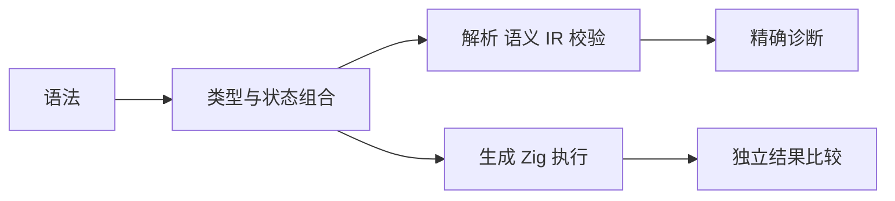

# 语法测试组合与边界扩展

## Intent：最终目标

扩展单项语法之外的类型组合、所有权状态、模块错误和真实运行边界。提高发现跨阶段缺陷的能力，不能用注册测试数量替代行为覆盖。

## Data：可用证据

上一轮 222 项主要验证每项语法已有入口；数值类型与操作符组合、每种消费操作的借用约束、多文件错误、集合区间边界仍偏少。

## Edges：边界

不改变数值语义，不实现数据库或闭包。每个静态案例断言成功 IR 或具体诊断；运行区间枚举用独立参考结果验证。测试只放在 compiler/tests，保留其他工作区改动。

## Answer：执行计划

1. 建立所有数值类型与算术/比较运算符的交叉案例，并验证不允许的类型组合。
2. 检查每种消费操作的借用、旧绑定、嵌套别名和 clone 边界。
3. 补齐模块解析及调用契约负例。
4. 用真实生成代码验证 splice 区间、深 clone 和被覆盖表达式仍求值。
5. 运行四模式回归，记录实际发现和案例数量。

## 新增覆盖

| 范围                           | 独立具名案例 | 证据路径（相对于 packages/compiler/tests）                   |
| ------------------------------ | -----------: | ------------------------------------------------------------ |
| 数值类型 × 运算符              |           88 | language/operators/{u8,u16,u32,u64,i32,i64,f32,f64}_test.zig |
| 禁止的操作数及隐式混合数值类型 |           27 | language/operators/invalid_test.zig                          |
| 消费操作 × 所有权状态          |           24 | ownership/operations_test.zig                                |
| 模块解析与调用失败             |           13 | modules/negative_test.zig                                    |
| 集合区间、求值与嵌套复制       |            4 | runtime/boundaries_test.zig                                  |
| 八种数值类型实际执行           |            8 | runtime/numeric_test.zig                                     |
| 合计                           |          164 | 测试入口增加 164 个具名案例，无新增匿名注册项                |

### 类型与运算符

每种数值类型分别检验 +、-、*、/、%、==、!=、<、<=、>、>=。每项先从源码解析、语义分析，再进行独立 IR 校验。非法组合检验 bool/string/list 的算术，以及不同整数位宽、整数符号、浮点位宽、整数与浮点之间的隐式混用。

运行例对八种数值类型分别真正生成并编译模块，断言和、差、积、商、余数；9/2 对整数为 4、对浮点为 4.5，相等操作数相减为零。期望值是测试中明确给出的常数，不通过调用被测方法计算期望值。

### 所有权与模块

每种 push/pop/sort/reverse/concat/splice 验证四条路径：直接消费借用输入被拒绝、消费后读取旧所有者被拒绝、clone 后消费并保留原输入可读、消费嵌套借用字段被拒绝。负例指定 ownership 诊断。

模块负例包括缺失依赖、缺失导出、导入角色冲突、重复绑定、非法路径与扩展名、缺失/过多/类型错误的调用参数、局部值遮蔽函数。除诊断代码外，断言错误来源是入口模块；已有依赖错误来源测试继续覆盖被导入文件。

### 运行边界

- splice 输入长度 0–8、所有合法 start/count、替换长度 0–3，共 660 组。测试侧逐位置构建参考结果，核对结果列表、删除列表及原输入不变。组合数不计作独立测试数。
- splice 的五组非法区间包含 maxInt(u64)，验证越界不会先发生无符号算术溢出。
- `{ value: in.items[in.index], value: 9 }` 最终值为 9，但被覆盖的第一个字段仍须求值；索引越界必须返回错误。
- 嵌套列表 clone 后 pop/reverse，验证内层数据指针与原值分离、原内容不变，以及空列表 fallback。

## 自我审查

单项语法正例不能替代类型组合、所有权状态或生成执行。数值矩阵的各组合验证不同类型约束，但仍不能代表所有运算输入。新增区间枚举是有界穷举；没有声称覆盖任意长度或所有整数。测试仍未提供生产 Store 并发、数据库、全部内存布局或跨平台保证。

本轮未更改生产编译器语义；新增案例均符合已有规范，未通过修改预期去接受错误结果。所有源码文件小写，测试保留在子包 tests 中。

## 实测验收

macOS aarch64、Zig 0.16.0，仓库根目录执行：

| 命令                                                                  | 结果                        |
| --------------------------------------------------------------------- | --------------------------- |
| `zig build test -Doptimize=Debug --summary all`                       | 386/386，46/46 构建步骤成功 |
| `zig build test -Doptimize=ReleaseSafe --summary all`                 | 386/386，46/46 构建步骤成功 |
| `zig build test -Doptimize=ReleaseFast --summary all`                 | 386/386，46/46 构建步骤成功 |
| `zig build test -Doptimize=ReleaseSmall --summary all`                | 386/386，46/46 构建步骤成功 |
| `zig fmt --check packages/compiler/tests packages/compiler/build.zig` | 通过                        |
| `git diff --check`                                                    | 通过                        |

386 项含 39 项 RX 与 347 项 compiler 相关测试；后者由前端/IR 305、生成执行 31、排序支持 2、Store 4、编译/格式集成 5 构成。汇总仍包含此前的匿名导入注册项。本轮新增的 164 项均有独立测试名称。

四种模式全部通过，新增测试未发现需要修改生产实现的失败。该结论仅覆盖实际测试的平台、类型和有界输入，不能推导出没有其他编译器缺陷。
