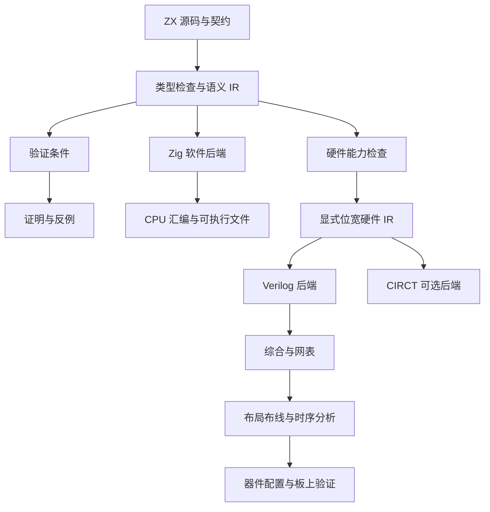
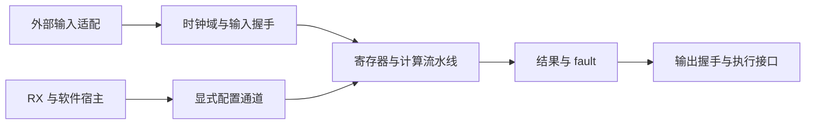

# FPGA 后端与形式化语义实施方案

## Intent：最终目标

使 zxc 能从明确的 ZX 硬件子集生成可综合电路代码，为高频量化和机器人反应系统提供计算内核，并与软件宿主、形式化规格和优化验证形成可追溯链路。

原始需求保存在 [高频量化与机器人 FPGA 方向原始对话](原始需求资料/高频量化与机器人FPGA方向原始对话.txt)。本方案不修改原文，不将其中的性能宣传视为已验证事实。

## Data：当前源码与官方依据

- zx.ir 已包含固定宽度整数、bool、有类型字段/元组、分支、match、局部绑定与无环调用信息。
- list 是动态切片；不能因没有通用 while 语句就认为 map/filter/reduce 是固定规模硬件。
- Zig lowering 明确开启 RuntimeSafety；硬件截断并不是 checked 整数运算的等价实现。
- signedRemainder 将 signed 操作数扩一位计算，MIN % -1 合法返回零；MIN / -1 仍需拒绝。
- [CIRCT HLS](https://circt.llvm.org/docs/HLS/) 描述特定 MLIR dialect 的硬件 lowering，不提供“任意 Zig/LLVM 程序自动成为生产可用 FPGA 电路”的保证。
- [CIRCT Verilog Generation](https://circt.llvm.org/docs/VerilogGeneration/) 提供硬件表示到 Verilog 的后端资料。
- [Hardcaml](https://github.com/janestreet/hardcaml) 是通过 OCaml 描述、仿真和导出硬件的库；普通 OCaml 程序不会因此自动综合。
- [Yosys 等价检查](https://yosyshq.readthedocs.io/projects/yosys/en/stable/cmd/index_passes_equiv.html) 可用于电路变换前后检查，必须确认所有要求的 equivalence cells 均被证明。

## Edges：边界与限制

- CPU 后端与硬件后端共享源语言语义，但硬件后端有独立能力检查、位布局与时序契约。
- 动态分配、字符串、动态列表、普通 FFI、动态插件、文件与网络系统调用不能未经建模直接综合；应拒绝或由软件宿主承担。
- 不预设器件、频率或端到端延迟，不推荐用户立即购买未经需求匹配的硬件。
- 组合逻辑等价、时序逻辑等价、综合成功、布线后时序收敛、板上运行是不同证据。
- 当前机器未发现 yosys/iverilog 命令；本轮未进行 RTL 仿真或综合。

## Answer：实现顺序与验收

### 一、共享语义，分别生成软件与电路

首版直接输出 Verilog，避免为少量组合节点立即引入完整 MLIR 工具链。CIRCT 可作为后续硬件 IR 消费者，不将软件 LLVM IR 当成现成电路设计。

### 二、第一批硬件语义

支持目标为 bool、固定宽度整数、静态 object/tuple 布局、常量、字段、不可变绑定、算术、比较、分支和纯 ZX 调用。每个硬件节点保留源码 span，并携带位宽与 signed 属性。

建议按职责落在 compiler/src/backends/hardware 的能力检查、降低和整数语义，以及 compiler/src/backends/verilog 的输出器；不预建无用途的通用插件框架。

先建立组合计算核心，随后增加寄存器、流水线与接口层。组合核心不包含时钟，不能为它虚构“固定几个周期”。

### 三、错误也属于语义

每个计算值同时产生 defined/fault 信息。软件的受检运算失败在硬件边界映射为 fault；fault 为真时输出值无效，此规则必须写入端口契约。

| 运算        | 硬件值       | 必须保留的条件                 |
| ----------- | ------------ | ------------------------------ |
| 加减        | N 位结果     | N+1 位扩展检查可表示性         |
| 乘法        | N 位结果     | 2N 位结果符合目标范围          |
| signed 负号 | 取负结果     | 输入不能为 MIN                 |
| 整数除法    | 向零截断商   | 除数非零，signed MIN/-1 不合法 |
| signed 余数 | 扩位求余结果 | 除数非零，MIN%-1 返回零        |
| 比较        | bool         | 保持 signed/unsigned 解释      |

`&&`、`||`、条件表达式、match 的错误传播只作用于被执行分支。提前 return 之后的语句不产生错误；未使用 const 的初始化仍可能产生错误。对象展开/覆盖按 ir.object.evaluation 检查求值，不能只保留最终字段值。

### 四、时序与软硬件协同

时序阶段需明确时钟/复位、流水线延迟、启动间隔、valid-ready 背压、停顿时寄存器更新、复位时未完成事务和状态初值。跨时钟域需要独立 CDC 协议，不能将普通信号连线视为可靠同步。

高频场景的行情 I/O、协议解码与订单输出，机器人场景的传感器、执行器与控制周期都属于具体适配层。单个计算核通过等价验证不证明完整系统的延迟、控制稳定性或交易收益。

### 五、证明与优化如何接入

使用相同位向量语义分别表达 ZX 计算、硬件 IR 和优化前后电路。验证性质应包括正确输入上的输出关系与 fault 等价；流水线版本再增加跨周期对应关系。

不能只比较同一错误生成器产生的两个电路，就宣称符合源语言。证明边界必须包含从源 IR 到硬件表达的对应关系。

形式化验证的用户契约与硬件等价检查是互补关系。前者证明计算满足规格；后者证明电路实现了该计算。综合、布局布线与板上验证进一步提供目标器件实现证据。

### 六、自我复核

当前实际软件进展是原生构建与汇编输出，硬件后端尚未实现。本方案只是具体实施基线，不能当作已经支持 FPGA 的交付。无论 CPU 还是 FPGA，都不得沿用附件中“自动全局最优”“绝对无崩溃”“一定超过 OCaml”的未经限定结论。
