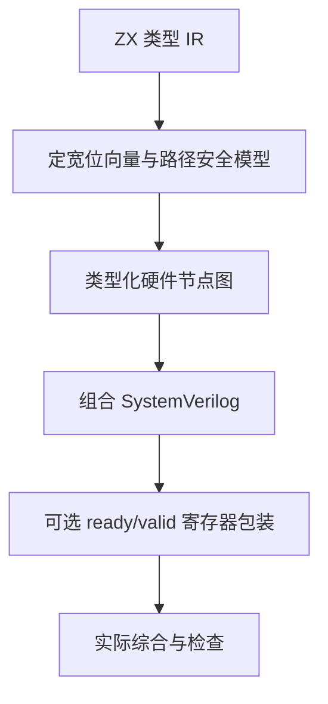

# FPGA 后端实现记录

## Intent：最终目标

将 ZX 有类型计算生成为可综合 SystemVerilog，为 FPGA 计算内核提供明确的位宽、错误和握手语义，再使用真实综合工具验证。不能用 CPU 汇编或文档代替硬件实现。

## Data：现有基础与实现路线

现有符号执行器已覆盖 bool、固定整数、静态对象/元组、分支、短路与无环纯 ZX 调用，并保留溢出和前提安全义务。本轮复用其位向量表达式模型，转换成独立、有类型的硬件节点图，再生成 SystemVerilog；输入是编译器内部表达式，不读取求解器返回文本作为电路。

硬件图只接受白名单算子，检查每个输入、位宽、布尔/位向量类型与拓扑依赖。相同表达式共享节点。组合内核输出业务端口及 fault；静态结构按字段展开，元组按位置展开，另存端口映射。

## Edges：边界与限制

- fault 表示本次输入触发算术错误、前提失败或契约义务失败；fault=1 时业务数据不可使用。软件异常与硬件错误位是公开的目标适配契约。
- 含契约的正式编译仍须实际证明通过，不通过不会生成 RTL。无契约计算保留 checked 运算的 fault 语义。
- 首版不支持动态列表、字符串、浮点、外部调用、Store 或动态插件；这些能力不能直接变成组合电路。
- clocked 包装使用单级输出寄存器、同步高有效复位与 ready/valid 背压；组合内核不含时钟。资源规模和实际可达频率需要器件与综合/布局布线证据。
- 除法等算子可能产生大型组合逻辑，不能将单寄存器接口称为自动流水线优化。
- 当前共享软件符号语义与硬件生成模型，减少语义漂移，但仍需要独立等价证据；不能用同一个错误模型的自我比较证明整个编译器正确。
- 不新增测试用例；执行现有回归、实际 RTL 生成与综合检查。

## Answer：交付与成功标准

交付硬件 IR、严格模型转换器、SystemVerilog 后端、CLI、端口/时序清单，以及工具实际执行记录。综合通过与器件时序通过分别记录；尚未完成的优化、布局布线和板级测量保持未完成。




## 自我复核

重点核查有符号除法/余数、宽化后溢出判断、未执行分支的错误屏蔽、提前返回，以及背压期间输出保持。只有工具完成且检查通过才记录综合成功；不能把安装工具、成功解析 RTL 或生成中间网表混称为 FPGA 已可上板。

## 共享符号图修正

只在 RTL 阶段合并表达式仍然太晚：原符号执行器会把每次变量引用展开为完整字符串，重复使用上一层结果时可能指数增长。本轮在符号求值阶段按类型建立命名定义，SMT 输出使用拓扑顺序的 define-fun，RTL 转换器逐项导入同一组定义。纯表达式在独立求值环境内按 ExprId 缓存；跨函数调用共享定义表，不共享局部求值缓存。函数 ID 与完整符号参数共同构成纯调用缓存键，复用同参数调用结果，调用者参数自身的 safe 仍单独合并。总符号求值限制为 1000000 步，覆盖不能通过定义去重限制的重复内联。

分支路径、逐项对象安全谓词与多出口选择同样逐步保存为定义，避免在这些循环里重新展开。定义数上限在生成阶段检查为 100000；硬件节点数同样有上限。该修正解决表达式表示的重复展开，不声称一般 SMT 求解时间有线性保证。

节点记录首次创建的源码文件和 span，共享节点只有首个来源；控制流合成节点目前使用零 span。源码文件名复制到结果拥有的 arena。清单保留全部源码，可用于人工追踪，但不声称每个优化后逻辑单元都有精确一对一的源码映射。

## 实际综合与工具边界

使用项目内 `.zxc/tools/fpga` 隔离环境安装 YoWASP Yosys 0.69。首次普通 synth 进程返回 0，但日志停在 ABC，缺少最终统计，因此未计为通过。改用 `synth -noabc` 后完成了层次检查、通用逻辑综合、`check -assert` 和最终 stat，日志包含 End of script。

这证明所生成 RTL 可进入真实通用逻辑综合；没有把跳过 ABC 写成完成器件技术映射，也没有推导 FPGA 频率。后续仍需指定器件和工具链完成技术映射、布局布线及接口验证。

### 当前执行结果

- 本轮真实构建成功；discount 与消费已导出 ZX 库的 quote 在生成前通过真实 Z3。
- 三个 RTL 与 JSON 清单保存在 [FPGA示例](FPGA示例/)；discount 为 28 个硬件节点，源码来源记录 26 个。两个输入节点没有表达式 span。
- discount 通用综合结果为 391 个单元；quote 为 662 个单元；均含 34 个带使能及同步复位的寄存器。计数包含包装与内核，未映射到目标 FPGA LUT。
- add 示例未指定求解器时生成保留溢出 fault 的组合电路；显式要求证明时，Z3 给出 u64 加三的溢出反例，CLI 退出 1，拒绝本次生成。

可复现命令：

```sh
zig-out/bin/zxc fpga docs/2026-10-03/契约验证示例/discount.zx \
  --solver .zxc/tools/verification/bin/z3 \
  --clocked --out docs/2026-10-03/FPGA示例/discount.sv

.zxc/tools/fpga/bin/yowasp-yosys -p \
  'read_verilog -sv docs/2026-10-03/FPGA示例/discount.sv; hierarchy -check -top zxc_kernel; synth -noabc -top zxc_kernel; check -assert; stat'
```

### 最终回归

在纯函数调用缓存、总求值步数限制及握手清单说明全部写入后，执行 `ZXC_TEST_SOLVER="$PWD/.zxc/tools/verification/bin/z3" zig build test --summary all`：556/556 个构建步骤、51139/51139 个测试通过，退出码 0。日志为 `/tmp/zxc-fpga-final-regression.log`。`zig build`、本轮 Zig 文件格式检查及 diff 空白检查同样通过。

本轮仅执行仓库现有测试，没有新增针对性测试用例。测试通过不作为独立 RTL 等价证明；板级运行与时序验证仍未完成。
