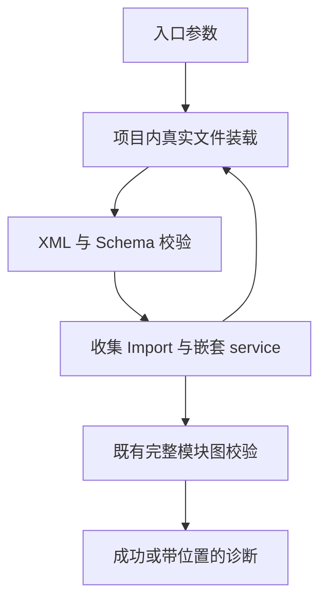
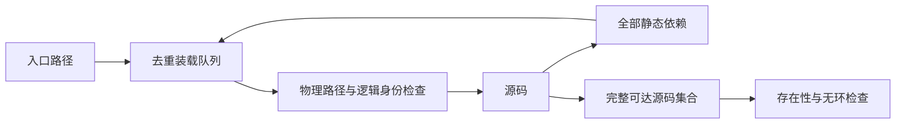
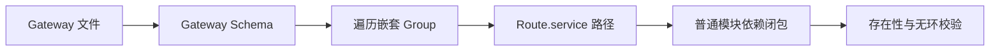

# RX 入口依赖装载实施

## Intent：最终目标

增加 `zxc check-rx --entry <module.rx|gateway.gateway.rx|state.store.rx>`，从普通模块或 Gateway 入口收集普通模块和 Store 定义文件，或单独检查 Store，作为 RX 与 ZX、宿主联结的基础。保留既有显式普通模块集合检查。

## Data：可用证据

现有 RX 已有真实 XML 解析、单文件 Schema、模块路径解析和无环检查；CLI 只读取用户枚举的文件。`Import.from` 和所有嵌套 `Call.service` 都构成依赖，未调用的 Import 也不能漏掉。

## Edges：边界与限制

- 当前工作目录为项目根，入口为普通 RX、Gateway 或 Store；普通调用目标和 Store 定义使用各自文件路径规则。
- 自动装载只覆盖入口可达闭包，不声称检查未引用文件；多个独立模块仍可使用显式集合模式检查。
- 物理文件必须在项目根内，同一物理文件的多个逻辑路径明确拒绝，避免符号链接或大小写变体绕过身份和环检查。
- 不自动猜测 app.rx、Gateway、Store 或 ZX 绑定语法，不引入执行调度器。
- 不新增测试用例；运行既有回归与真实文件示例。

## Answer：交付与验收

实现入口选项、迭代依赖装载、原始位置诊断和最终完整集合检查；实际验证共享依赖、未使用 Import、分支依赖、缺失文件和环。检查成功仅证明语法与模块图合法，不代表流程已执行。

## 实施结果

- `application/load.zig` 用队列迭代读取普通模块，单文件先解析并验证 Schema，再遍历完整 XML 子树提取依赖；路径解析复用 RX 原有规则。
- `application/check.zig` 增加 `--entry` 分支，装载临时内存由该分支的 arena 统一释放。收集后复用 `parseModules` 执行完整集合校验，原显式集合入口保持原有行为。
- CLI 帮助和 RX 文档已更新。示例位于同目录《RX依赖装载示例》，包含未直接调用的 Import、Switch 分支、两条路径共享同一个叶模块。
- 根目录 `zig build` 成功；入口模式和枚举四个文件的显式集合模式均退出 0。
- 实际临时变更示例后核对：未使用 Import 构成的环、分支目标缺失、相对路径越出根、XML 闭合错误均退出非零；符号链接别名重复和符号链接指向项目外也明确拒绝。运行后已恢复示例并移除临时链接。
- `packages/rx` 中既有 `zig build test` 通过；格式化与 `git diff --check` 通过。未新增测试用例，未使用浏览器 UI。
- 根目录 `zig build test` 最终为 837/841 步骤成功、51944/51944 测试通过，但命令退出 1：唯一失败步骤是验证 CLI 默认环境找不到 Z3（`FileNotFound`）。随后在 `packages/test` 指定 `ZXC_TEST_SOLVER=/Users/xiewendao/Documents/MatrixAges/zxc/.zxc/tools/verification/bin/z3` 运行 `zig build test-verification --summary all`，20 个场景和 4/4 步骤通过。没有将首次根命令改记为成功，也没有重复运行全部已通过项。

## 自我复核

装载成功不等于整个项目合法：它只证明入口和引用文件 Schema、可达普通模块集合通过现有校验。未引用文件、Gateway 路由匹配展开、Store 值及 setter 联结和未定义的 app.rx 仍不能记为自动应用装载完成。读取错误目前报告目标文件路径；语法、Schema、引用越界与环诊断保留源码位置。

实现会在发现依赖时解析和校验一次，再由现有文本集合入口解析和校验整个集合；这是当前复用边界带来的额外成本，没有宣称最优解析性能。后续类型联结需要保留 AST 时应统一结果生命周期，而不是在本轮提前引入缓存框架。

物理路径检查针对构建期间的普通文件状态，不是文件系统并发修改下的安全沙箱承诺。新装载分支尚无分配故障注入或 Windows 实机证据，不从既有 RX 回归推导这些性质。

## 后续：Gateway 路由目标联结

Intent：让 `check-rx --entry` 接受 `.gateway.rx` 入口，并验证每个嵌套 Route 指向的真实普通模块及其依赖。

Data：Gateway/Group/Route 的 Schema 与 Route.service 路径语法已经存在，当前缺少跨文件目标读取。普通模块装载与图校验可以复用。

Edges：Gateway 只作为入口，不允许作为 Call.service 的普通目标；路由相对 Gateway 文件目录解析，不受 Group.prefix 影响。多个 Route 可指向同一模块。当前不展开路由匹配规则、不定义缺省 method、不执行协议监听，也不推断 ZX 输入输出兼容。

Answer：复用项目根和物理身份检查，单独规范化 Gateway 文件路径，验证其 Schema，收集所有 Route.service 后继续普通模块装载，最终执行同一无环校验。通过真实 Gateway 示例验证目标缺失、类型不符、非法引用和被引用模块环。

### Gateway 实际验证

- `http.gateway.rx` 示例含两层 Group，两条路由分别指向 main 与共享叶模块；入口装载通过，包含 `./` 的等价入口也通过。
- 嵌套路由目标不存在、指向 Gateway 而非普通模块、相对路径越界、目标文件根标签错误，以及目标依赖链成环，均实际返回非零并给出对应诊断。
- 无路由的 Gateway 按现有 Schema 合法，入口检查成功；不将其虚构为服务已经启动。
- `packages/rx` 的 `zig build test --summary all` 通过 39/39 测试；`packages/test` 的 `test-rx-text test-rx-cli` 通过 11/11 构建步骤、9/9 文本测试与 11 个 CLI 场景。
- 没有新增测试用例；临时变更在运行后恢复。新增真实 Gateway 示例仅声明配置，不启动监听。

自我复核：Gateway 在装载期间按自身 Schema 校验，不混入只接受普通 Module 的依赖图集合。路由多个入口共享模块是允许的；Gateway 不是被调用的普通模块。验证没有覆盖路由匹配冲突、请求类型、多个 Gateway 合并、Store 生命周期或协议行为，这些保持未完成。

## 后续：Store 定义文件联结

Intent：检查普通模块的 Store 引用是否指向真实、合法的 Store 定义，避免文件缺失或根标签错误留到后续生成阶段。

Data：现有 Store.from 示例使用 `scheduler`、`jobs` 等无后缀名称；定义文件约定为 `*.store.rx`。Store 引用已校验别名唯一性，定义已校验版本与对象字段结构。

Edges：沿用文件身份规则，`from="scheduler"` 相对模块目录解析到 `scheduler.store.rx`，显式 `.store.rx` 后缀保持原样；不搜索按 name 注册的全局对象。引用别名及其默认值保持现有 Schema 契约。Store 定义不属于普通调用图，不代表其数据已经初始化、授权或持久化。

Answer：增加专用 Store 路径解析；入口装载读取、去重并校验这些文件，允许直接检查单个 `.store.rx` 入口。实际验证共享定义、缺失文件、错误文件类型、重复字段与越界引用。

### Store 实际验证

- 新增 `state.store.rx` 示例，由 left/right 分别通过省略和显式后缀引用。普通模块入口、Gateway 入口、单独 Store 入口均成功。
- 实际修改引用后，缺失文件、普通 `.rx` 误作 Store、相对路径越界均返回非零；Store 文件使用 Module 根标签或包含重复字段也明确拒绝。临时变更均已恢复，恢复后 Gateway 再次通过。
- 根构建通过。RX 包 39/39 测试通过；文本与 CLI 检查 11/11 步骤通过，包含 9 个文本测试与 11 个 CLI 场景。格式化与 diff 检查通过。
- 重复字段首次人工核对脚本预期文案与现有诊断不同；实际已经正确返回 `Duplicate RX declaration`。校正核对文案后重新运行成功，未为脚本改动生产诊断。

自我复核：装载器只收集并验证定义文件，尚未把 Store 字段映射成有类型状态，也未验证 setter 权限或对象生命周期；显式普通模块集合模式不会自动加载 Store。以文件路径作为身份，Store.name 作为定义属性，未引入名称搜索或全局注册表。公开路径辅助函数与装载器均保留这些边界。
