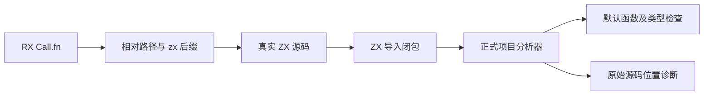
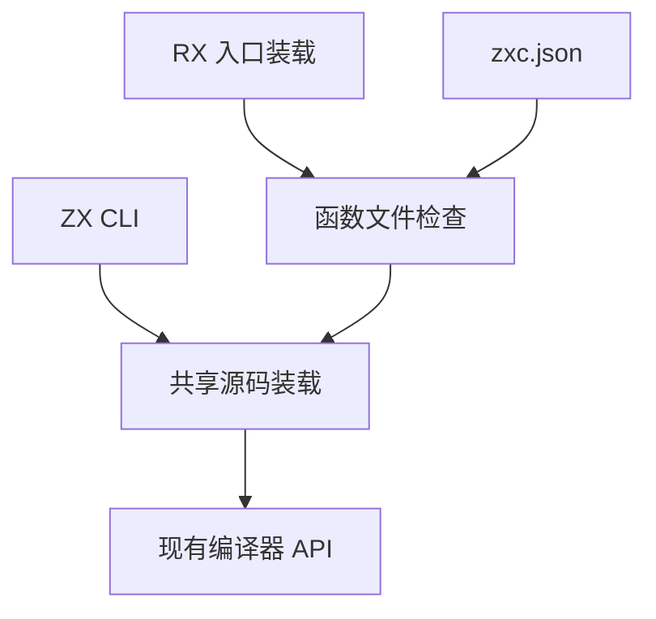

# RX 函数文件联结实施

## Intent：最终目标

将真实 RX `Call.fn` 指向 ZX 默认函数，并复用正式 ZX 项目分析器检查目标与导入依赖，为 RX 输入输出类型联结建立实际来源。

## Data：可用证据

用户已明确选择相对文件路径：`fn="load_user"` 相对当前 RX 文件目录解析成 `load_user.zx`，调用该文件的默认导出。现有编译器提供 `analyzeProject`，执行解析、风格、类型、能力和依赖图检查；CLI 已有 ZX 源码闭包读取逻辑。

## Edges：边界与限制

- 普通 RX 调用目标、Store 定义与 ZX 函数分别保持各自的文件类型，不按全局符号名搜索。
- 本阶段验证函数本身及其 ZX 依赖，不声称 RX `in/out` 表达式已与参数类型匹配。
- Store 句柄上下文尚未从 RX 生成，依赖注入上下文的 ZX 函数不能以空上下文的失败诊断冒充完整联结成功。
- 检查不生成或运行代码，不用未验证契约输出可执行产物。
- 复用 zxc.json 的原生接口与包注册；入口检查支持显式 `--project` 配置路径。

## Answer：交付与验收

接通 fn 文件装载、缺省后缀、默认导出约束、源码诊断和原有 ZX 项目分析器。将 CLI 源码闭包读取提取为同职责共享文件，避免实现两套模块解析。通过真实 RX/ZX 示例和已有回归验证，不新增测试用例。

## 实施与实际验证

- `rx.resolveFunctionPath` 按用户确认的路径规则解析 `.zx`，拒绝普通 RX/特殊 RX 文件作为函数目标及越界路径。
- RX 装载队列纳入函数文件；函数校验复用 CLI 项目配置和 `compiler.analyzeProject`，拒绝 `type_only` 目标。普通 RX 依赖图仍只接收 Module 文件。
- 将原 main.zig 的 ZX 导入闭包读取原样移到 `cli/sources.zig`，ZX CLI 与 RX 函数检查共同使用。没有另建名称注册表或第二种 ZX 包解析算法。
- `function.rx` → `calculate.zx` → `add_one.zx` 真实示例通过；省略和显式 `.zx` 后缀都通过。
- 实际核对缺失函数、RX 错作函数、缺失传递导入、纯类型目标、传递依赖类型错误，均明确拒绝。ZX 类型错误定位到原始 `add_one.zx:6:10`。
- 显式 `--project function_project.json` 可为函数提供裸包名映射，真实检查成功；运行后恢复示例的相对导入。
- 原 ZX CLI 构建 calculate.zx 成功，产物输入 41 输出 42；这证明共享源码读取未破坏该已有构建链，不代表 RX 已执行。
- 根构建通过；RX 包 39/39 测试通过；RX 文本/CLI 11/11 步骤通过，含 9 个文本测试和 11 个 CLI 场景。未新增测试用例；格式化与 diff 检查通过。

## 自我复核

当前交付将真实函数源文件及其有效类型接入检查阶段，尚未保留可供应用生成使用的调用 IR，也未解析 RX 表达式或注入 Store 上下文。函数已有 requires/ensures 时，分析不是形式化证明，不会据此输出未验证的可执行应用。后续必须在完整调用语义上继续，不能以本阶段的文件通过作为整体完成标准。

用户在本轮新增 pkg.yaml 包管理和内嵌 workspace 目标，已纳入《包管理与工作区实施计划》。当前 zxc.json 手工包映射仍只是已有机制，不能冒充新包管理的完成证据。
