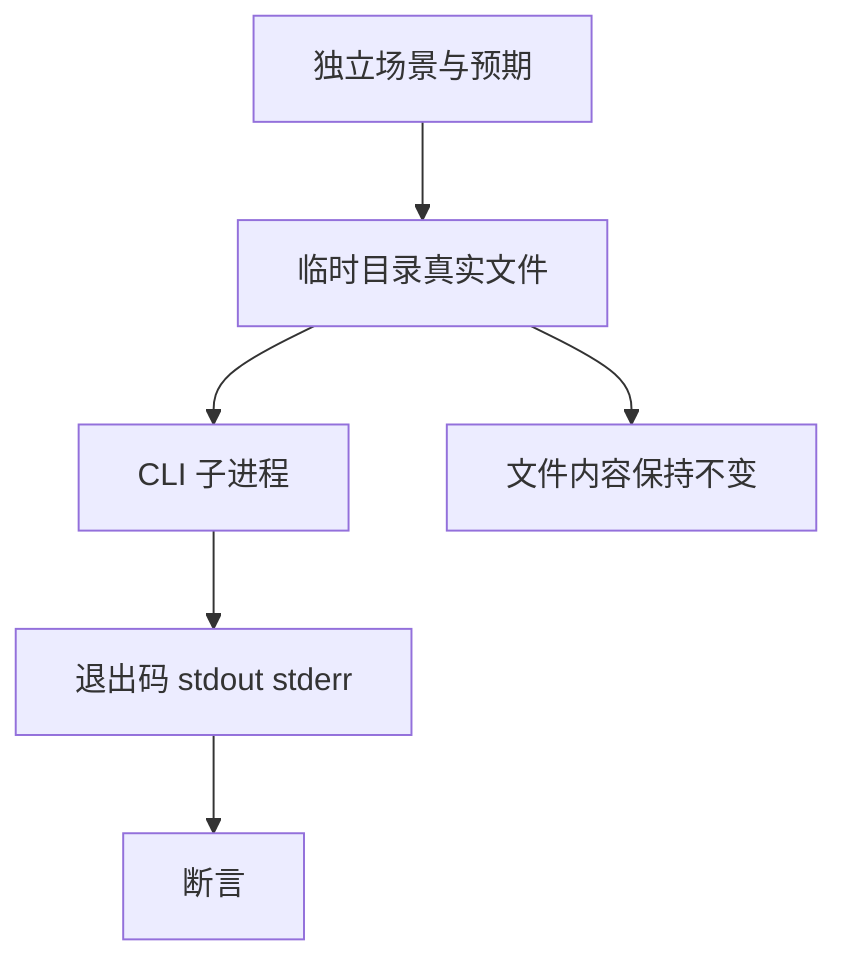

# RX 命令行装载测试记录

## Intent：最终目标

验证并行实现新增 `zxc check-rx` 的真实文件装载、错误退出和诊断输出，补足内存文本入口不能证明的 CLI 行为。

## Data：可用证据

入口位于 `packages/compiler/src/main.zig`，文件装载位于 `application/check.zig`，每文件限制 16 MiB，接入 `rx.parseModules`。成功返回零，失败应返回一并刷新 stderr。

## Edges：边界与限制

只检查显式给定的完整模块集合，不推断 CLI 自动递归收集依赖。测试在临时目录运行真实编译产物，完成后清理。命令行场景单独统计，不登记为 Test262 上游映射或 JSONL 案例。

## Answer：交付与成功标准

按成功装载、文件错误、解析错误与图错误构建场景，验证退出码、stdout、stderr 和输入文件未被更改。通过 `test-rx-cli` 接入根测试；草案位于 `docs/2026-10-03/rx_cli_tests/`。

## 执行记录与自我批判

Debug 专项 3/3 构建步骤通过，11/11 CLI 场景通过；TypeScript 严格类型检查、构建文件格式检查和本包 diff 空白检查通过。根 ReleaseSafe 回归失败：101/375 步骤成功、7 个编译步骤失败，已执行 10,494/10,494 测试通过。失败原因是并行模块实现已引用但尚未创建 `packages/compiler/src/standard/registry.zig`；本轮不修改该生产文件。日志 `/tmp/zxc-test262-rx-cli-root.log`，进程已经退出 1。待正式实现落地后重跑，不宣称全仓通过。进程级检查不能证明进程内无泄漏；资源释放由已存在的逐分配失败测试补充。

## 场景清单

单文件成功；含空格路径与相对 Import；缺少参数；缺失首文件；缺失第二文件；第二文件语法错误；根标签错误；缺失依赖；未使用 Import 的环；重复规范化输入；超过 16 MiB 文件上限。每个场景均检查 stdout 为空、正常退出或退出码 1、stderr 契约和源文件内容未更改。

## 并行实现落地后复验

标准库注册文件已创建。根 ReleaseSafe 377/377 构建步骤、34,703/34,703 Zig 测试及 11 个 CLI 场景通过，日志 `/tmp/zxc-test262-rx-resources-root.log`。此前缺失文件失败已经解除。
