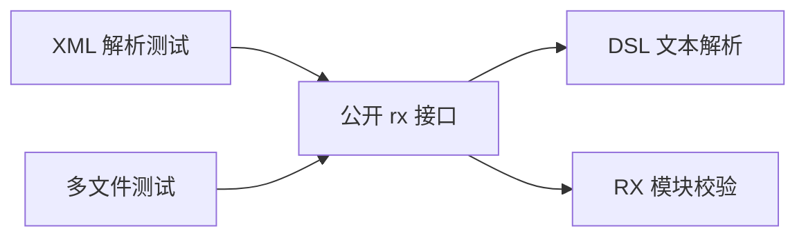
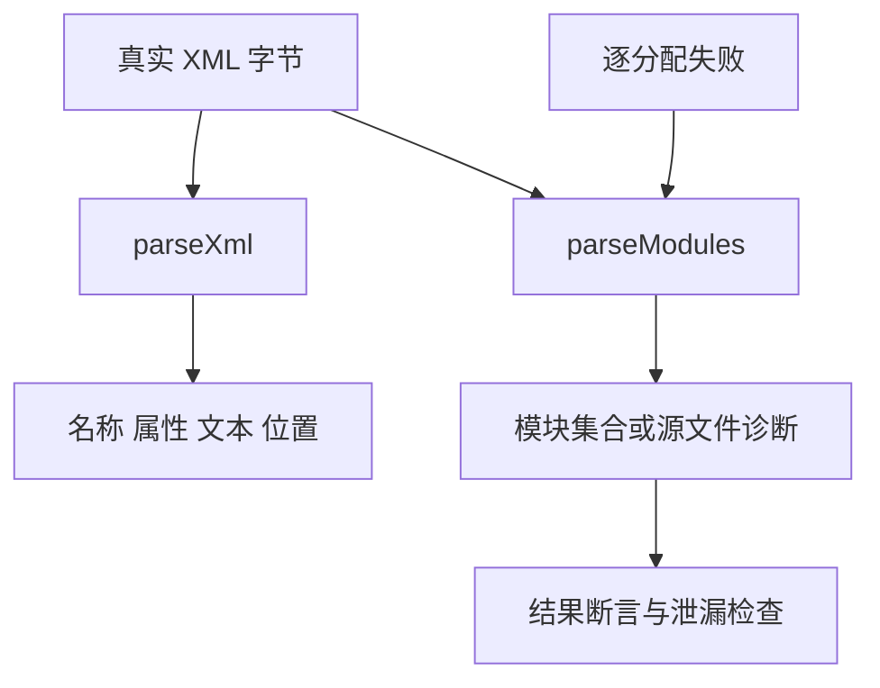

# RX 文本入口测试记录

## Intent：最终目标

为并行实现新增的 `rx.parseXml`、`rx.parseModules` 提供真实源码测试，检查解析结果、诊断定位和资源释放。

## Data：可用证据

当前 `packages/dsl/src/xml/parser.zig` 已实现 XML 子集，`packages/rx/src/text.zig` 串联文本解析与模块集合校验。之前模块目录案例使用合成 AST，不能覆盖文本入口。

## Edges：边界与限制

本轮只增加测试，不修改并行生产实现。XML 子集测试不能证明完整 XML 标准符合性；模块集合验证不能证明应用执行、类型联结或持久化。7 个具名 Zig 测试单独报告，不混入 JSONL 登记案例，也不增加 Test262 上游映射。

## Answer：交付与成功标准

`packages/test/tests/rx/text/` 按解析与模块职责分组，通过 `zig build test-rx-text --summary all` 接入根回归。源码草案位于 `docs/2026-10-03/rx_text_tests/`。

## 测试内容

- 五种命名实体、十进制和 Unicode 十六进制字符引用；属性与文本换行规则差异。
- 修改调用者缓冲区之后名称、属性和文本仍完整。
- 24 种错误输入：错配、重复属性、引用、非法字符、声明、注释与 CDATA。
- CRLF 下节点、属性和值的字节 offset 与行列。
- 规范化相对 Import；未使用 Import 的环及其文件索引和属性位置。
- 正常多文件和第二文件解析失败时逐分配失败清理。

## 执行记录与自我批判

专项 Debug 与 ReleaseSafe 均 5/5 构建步骤、7/7 测试通过。根 ReleaseSafe 回归通过：373/373 构建步骤、34,701/34,701 Zig 测试通过，隔离安全案例执行步骤通过。日志：`/tmp/zxc-test262-rx-text-root.log`。当前只覆盖固定代表案例；后续需要深度上限、多文件输入生命周期、嵌套调用和实际装载接口测试。

## 深度与宽度边界增补

新增 2 个测试：255/256 层允许，257/1024 层在第 257 个开标签报告诊断；1024 个子节点在列表扩容后保持顺序与值。文本专项现为 9 个 Zig 测试，Debug 7/7 步骤、9/9 通过。标准库文件落地后根 ReleaseSafe 377/377 步骤、34,703/34,703 Zig 测试通过，11 个 CLI 场景通过，日志 `/tmp/zxc-test262-rx-resources-root.log`。这些是有界资源检查，不能证明任意大小输入均可处理。
