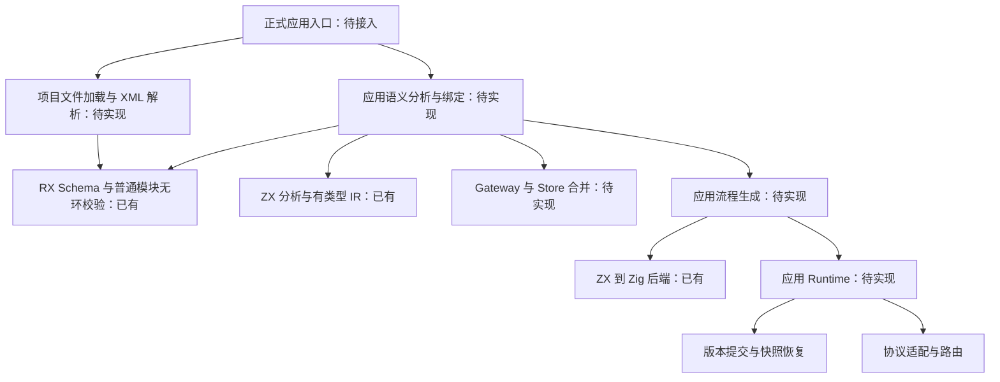

# RX 系统整合缺口分析

## Intent：最终目标

核实 RX 是否落实了设计，以及 RX、ZX、Gateway、Store 和 Runtime 是否形成实际应用链路；给出最小整合顺序。本轮分析当前工作区，不修改源码。

## Data：可用证据

| 证据位置                                               | 当前事实                                                     | 意义                                         |
| ------------------------------------------------------ | ------------------------------------------------------------ | -------------------------------------------- |
| `packages/rx/src/root.zig:16`                          | 暴露 validateModules；validate 接收 XML AST                  | 已有结构与依赖检查，但入口不是源文件文本     |
| `packages/rx/src/labels/Module.zig:13`                 | Module 直接包含 Call 等流程节点                              | 当前正式语法没有 Pipeline 层                 |
| `packages/rx/src/labels/Call.zig:5`                    | fn、in、out、setter 是字符串；检查 fn/service 二选一         | 不等于函数绑定、表达式解析或类型检查已完成   |
| `packages/rx/README.md` 的当前边界                     | 明确缺少 XML 解析、跨文件 Gateway/Store 合并、ZX 联结与执行  | 包自身没有宣称完整运行能力                   |
| `packages/compiler/src/main.zig`                       | CLI 读取源文件并调用 compileProject；依赖发现读取 ZX imports | 正式入口走 ZX 编译，没有 RX 项目装配         |
| `packages/compiler/build.zig.zon`                      | 依赖 zx、genz、lint，没有 rx                                 | 编译器与 RX 尚无直接包接入                   |
| 根 `build.zig`                                         | RX 测试与 compiler 分别接入根构建                            | 同一次构建包含两个包，不代表业务调用链已连接 |
| `packages/compiler/src/analysis/analyze.zig:16`        | Context 接收 stores / StoreBinding                           | ZX 已预留有类型的 Store 能力注入接口         |
| `packages/compiler/tests/runtime/generate_store.zig:8` | 测试宿主直接填写 StoreBinding                                | 该链路不从真实 RX Call 推导授权              |
| `packages/compiler/src/backends/zig/lower.zig:260`     | 生成 context.commit(pending) 调用                            | 已有提交接口，实际提交语义仍交给宿主         |
| `packages/compiler/README.md:25`                       | 版本检查、锁、持久化由宿主 commit 实现                       | 不能把提交调用认作生产 Store Runtime 已实现  |
| `rules/RX开发约定.md`                                  | 明确 XML 文本解析、RX 执行 CLI、事件订阅与 Runtime 未实现    | 与源码检查一致                               |

在 packages 下检索非测试 Zig 文件中的 `@import("rx")`、`rx.validate`、`validateModules`，只找到 RX 自身的 validateModules 导出。这个检索不是单独的不存在证明，需结合 CLI、包依赖与实现边界说明判断。

## Edges：边界与限制

- 当前工作区已有大量未提交修改；结论针对当前文件，不代表某个历史提交或已发布版本。
- 本轮不修改源码、旧设计或公开文档，不新增测试，也不调用浏览器。仅增加这份分析记录。
- 不以 legacy/MVP 代替正式实现，不将手工 AST 或宿主注入算作真实 RX 端到端能力。
- 未运行构建或测试；以下结论是静态调用链审查，不是运行结果。
- 未发现项目内和已检查配置目录中的 ast-grep Zig 配置，按规则回退源码检索与阅读。
- `app.rx` 尚无确定 Schema；首阶段不自行设计应用配置语言。

## Answer：交付格式与成功标准

交付缺口分析、目标链路和实施顺序。判断“整合完成”的标准是：实际文件经正式入口加载、校验、绑定后产生可执行应用，并由真实宿主承担设计规定的运行时职责。包测试成功或 ZX 成功生成 Zig 都不能独立满足此标准。

### 一、核心判断与根因

RX 不是零实现：标签 Schema、位置诊断、路径身份、依赖存在性与无环校验已经存在。

但系统整合确实没有完成。目前主要形成两条独立链路：RX AST 到结构化数据的校验链，以及 ZX 源码到 Zig 源码的编译链。缺少负责应用装配的入口，把 RX 文件、ZX 函数接口、Store 定义与 Gateway 路由组织成同一个有类型程序。

更深层的问题是完成标准停留在子系统边界：RX 的成功结果只承诺结构和模块依赖合法，ZX 的成功结果只承诺其输入与提供的上下文可编译；没有生产调用者从 RX 推导这些上下文并执行应用。继续单独补充 ZX 运算符或 RX 标签，不能自动消除这一断点。

### 二、设计版本差异

`docs/rx_design_doc.md` 仍描述 Module/Pipeline 和 Module.Pipeline 服务名；当前 RX 实现、README 与维护规则采用文件路径身份、Module 自身作为流程。

建议整合基线遵循当前正式契约，保留设计中的配置驱动、显式能力、可恢复 Store 与 Gateway 自动合并目标；不恢复 Pipeline 层。旧设计的 Store getter/setter 表述与当前 ZX handle/commit 接口也需要逐项核对，不能把它们默认视作完全等价。

### 三、架构图

以下为建议职责，不表示全部已实现，也不要求按节点创建独立包。



### 四、数据流图

```mermaid
flowchart LR
    Files[真实 RX 与 ZX 文件] --> Load[加载、路径身份与源码位置]
    Load --> Parse[XML AST 与 ZX AST]
    Parse --> Check[结构校验与完整 RX 模块图校验]
    Check --> Bind[绑定函数、模块、类型与 Store 授权]
    Bind --> Flow[有类型的流程表示]
    Flow --> Emit[生成流程代码与 ZX 函数代码]
    Emit --> Build[编译并链接宿主]
    Build --> Run[接收输入并执行]
    Run --> Output[输出、受控 effect 与 Store 提交]
```



Gateway 和 Store 文件必须进入各自的合并与联结过程；不能直接混入仅支持普通 Module 的 validateModules。

### 五、最小实施顺序

| 阶段            | 实际工作                                                                                                | 完成标准                                                                  |
| --------------- | ------------------------------------------------------------------------------------------------------- | ------------------------------------------------------------------------- |
| 0. 固定契约     | 确认当前 Module 路径模型、fn 定位规则、RX 表达式子集和入口参数                                          | 实施不会倒退到旧 Pipeline 设计，也不猜测 app.rx Schema                    |
| 1. 真实输入闭环 | XML 文本解析、位置保留、项目文件装载、普通模块集合校验                                                  | 实际 .rx 文件能经正式入口报告语法、缺失目标与环错误                       |
| 2. 纯计算闭环   | 绑定 Call.fn 与 Call.service，解析输入输出表达式，检查 ctx 的先定义后使用、分支和返回类型，生成流程调用 | 真实 RX 调用真实 ZX，实际输入得到实际输出；错误定位回 RX 属性             |
| 3. Store 闭环   | 合并定义、解码有类型初值、解析引用与授权，接入 ZX Context，实现宿主版本提交与快照恢复                   | 授权来自 RX；提交符合单 Object 边界；失败无未提交写入，重启恢复已提交状态 |
| 4. Gateway 闭环 | 合并 fragment、展开 Group、检查监听及路由冲突、绑定 service，实现首个协议适配器                         | 外部请求到达对应 RX 模块并返回响应                                        |
| 5. 补齐运行语义 | 逐步实现 Parallel、事件、数据库 effect 及资源生命周期                                                   | 已支持能力有完整语义；未实现能力明确拒绝，不静默跳过                      |

纯计算闭环是推进顺序，不是缩减最终目标。只有完成所承诺的 Gateway、Store、事件及 effect 语义后，才可声称覆盖完整设计。Parallel 在任何阶段都不能被静默串行化后宣称支持。

建议复用现有 RX 校验器、ZX 前端和 Zig 后端，在 compiler 内按职责增加应用装配流程；暂不引入通用插件机制或全套新包。是否将独立 Runtime 拆包应由实际依赖与发布边界决定。

### 六、第一处可复用的代码接口

以下是仓库现有校验接口的调用形态，用于说明接入位置，不是可直接运行的完整实现：

```zig
var result = try rx.validateModules(allocator, sources);

defer result.deinit();

switch (result.value) {
    .data => |modules| try bindModules(modules),
    .diagnostic => |issue| try reportDiagnostic(issue),
}
```

sources 必须由真实文件解析而来。bindModules 和 reportDiagnostic 仅为拟议职责名，尚不存在，不应复制后宣称完成实现。真正的绑定阶段还须持有源码与 AST 生命周期，构造函数接口与逐 Call 授权，而非继续手填 StoreBinding。

### 七、执行记录与自我批判

已检查仓库规则、RX 设计及 README、根构建、compiler 依赖和 CLI、RX Module/Call Schema、ZX Store 上下文及提交生成接口，并对照既有分层设计记录。

自我复核：

1. 初始“RX 未实现”判断过宽，现有结构校验与无环能力必须保留并复用。
2. “只差 XML 解析”也不准确：解析之后仍缺应用语义联结与生产 Runtime。
3. 不能把 compiler 内名为 runtime 的基础运行支持误认作设计中的应用调度与持久化 Runtime。
4. 不能把旧设计的全部细节直接恢复进新实现；文档与实现版本存在实质差异。
5. 分阶段方案尚非可执行补丁；表达式、入口与 fn 定位等契约未固定前，给出大量实现代码只会掩盖不确定性。
