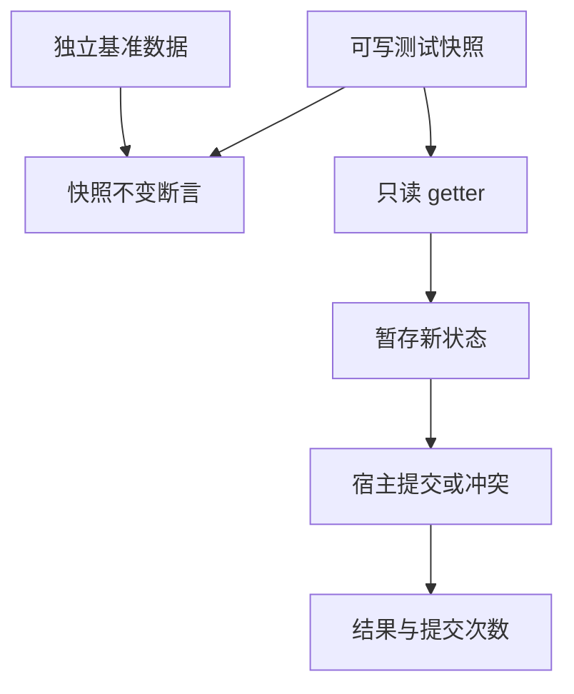
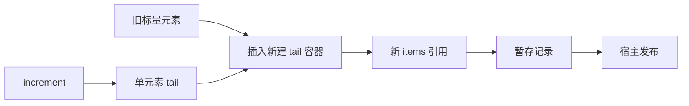

# Store 引用快照与无深拷贝回归

## Intent：最终目标

在新引用 ABI 和禁止 clone 的契约下恢复 236 个 Store 场景，保留快照不可变、原子发布、冲突、越界和分配失败断言。

## Data：可用证据

旧 action=2 对快照 items.clone() 后 push。业务预期只是旧元素后追加 increment，不要求深复制。当前 State 为对象引用，旧 host.current_a 与初始快照指向同一对象；如果仍将两者互相比较，可能漏检快照被非法修改。

## Edges：边界与限制

- 使用新建单元素列表 `[in.increment]`，在其头部 splice 插入只读快照中的 u64 元素，得到同样的追加结果。这里只搬移标量槽，没有递归复制聚合，也没有消费 Store 快照。
- 所有 JSONL ID、输入、业务预期、提交次数和错误类型必须与迁移前完全一致。
- 宿主使用可写的独立快照 fixture，参考初值保留为另一份不可变数据；不能只比较两个别名。
- fixture 准备内存由测试 allocator 管理，故障注入只针对程序调用 arena。即使准备内存时失败也不会计作预期业务错误。
- 成功、冲突、越界和 OOM 后都检查旧快照不变。标量更新必须继续共享原列表，追加结果使用新的列表存储。
- 不承诺新对象引用布局下的标量更新零分配；检查的是不深拷贝列表、正确暂存和释放。

## Answer：交付格式与成功标准

236 个原场景逐项保留；test-stores 通过，包括四个逐分配失败场景。生成一致性、目录审计、类型和格式检查通过。生产 Store 调度或持久化能力不由本测试推断。

## 执行与自我批判

test-stores 7/7 步骤、236/236 测试通过，含四个逐分配失败场景；日志 `/tmp/zxc-test262-store-reference.log`。迁移前后的 JSONL 字节完全相同，TypeScript 与生成一致性检查通过。没有生产修改。

自我批判：测试侧创建独立输入是为了观察非法修改，不是恢复生产语言深复制。指针不变只能证明该字段未复制，不能替代内容、冲突和内存清理断言。

## 编译器包既有 Store 用例

同步调整四个既有 Store 单元测试的 State/Input 指针初始化，并增加包内 test-stores 入口以单独复核。旧“标量更新零分配”断言不适用于当前需要稳定地址的新记录构造；保留并加强其本质要求：原快照 count 不变、旧列表指针不变、提交后仍共享该列表。其他暂存、失败和冲突断言保持。

完整 test-runtime 本轮执行 37,461/37,461 条通过；608/615 步骤成功，两个旧字符串 clone 程序编译失败（共 428 条尚未执行），日志 `/tmp/zxc-test262-runtime-remaining.log`。这些失败不属于 Store，不据此声称整体已通过。

编译器包 Store 专项 8/8 步骤、4/4 测试通过，日志 `/tmp/zxc-test262-compiler-store-reference.log`。相关格式、目录审计及 diff 检查通过。
