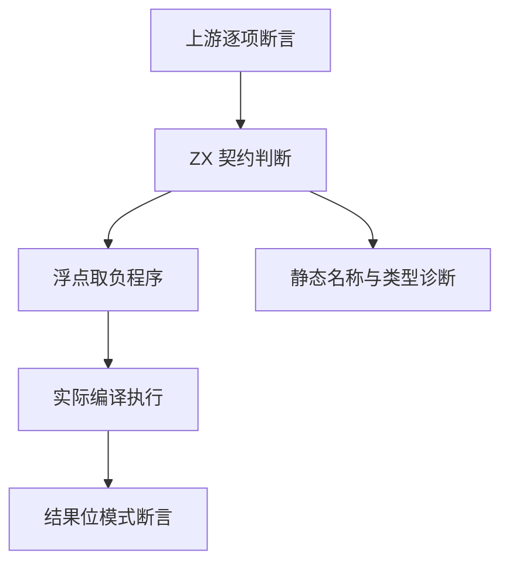
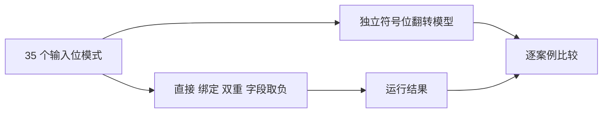

# Test262 一元取负对齐

## Intent：最终目标

补齐浮点一元取负的符号位、NaN、绑定、字段读取与嵌套求值，并将实际可验证的上游断言逐项关联。

## Data：可用证据

已读取 unary-minus 目录全部 14 个上游文件。A4.1 检查 NaN，A4.2 检查两个方向的有符号零；A2.1_T1 包含直接值、变量、嵌套和属性读取；A2.1_T2 检查未知名称。其他文件涉及动态转换、对象钩子、BigInt 或不同空白字符，不能仅凭数值通过就宣称全部对齐。

## Edges：边界与限制

保留 ZX 静态类型契约；不引入 JavaScript ToNumber 或隐式字符串转换。f32 是 ZX 扩展。输入位模式来自宿主，但运算必须通过实际 ZX 编译执行；NaN 仅检查类别，零必须检查符号位。没有复现生产缺陷前不修改编译器。

## Answer：交付与成功标准

TypeScript 生成器、分层 JSONL 与 ZX 程序、单输入浮点断言支持、具体上游审查记录。独立符号位模型和实际执行一致，负例检查分析阶段，根回归通过。

## 执行记录

已新增 304 个案例：280 个浮点位模式运行案例（2 类型 × 4 求值形态 × 35 输入），5 个源表达式运行案例，19 个静态类型与名称案例。独立预期按 IEEE 位模式分类 NaN 并翻转符号位，双重取负恢复原位模式，不按案例名决定预期。

五个源表达式为 -1、-(-1)、-x、-(-x)、-object.prop，使用实际 f64 字面量和静态记录执行。补充的类型案例涵盖全部 12 种既有基础/集合形态、5 个原始布尔或字符串字面量、未知名称及声明后的对照。

上游保存五项审查：A4.1 与 A4.2 为数值行为 equivalent；A2.1_T1 因静态记录代替动态 Object 记为 adapted；A2.1_T2 与 11.4.7-4-1 分别明确运行时名称错误与隐式字符串转换在 ZX 中改为静态拒绝。关联 13 个不同案例。已读取但未形成完整证据的其余九个上游文件继续 unreviewed。

| 检查                                            | 实际结果                                                                    |
| ----------------------------------------------- | --------------------------------------------------------------------------- |
| 280 个独立位模式预期与 Node 原生取负交叉核对    | 全部一致，交叉核对不计作 ZX 案例                                            |
| 包内 Debug 前端和运行组                         | 234/234 步骤、23,432/23,432 通过                                            |
| 根 ReleaseSafe 回归                             | 326/326 步骤、34,264/34,264 Zig test，加 408 个隔离案例通过                 |
| 故意将负零结果预期改为正零                      | 独立临时测试确切失败：expected 0, found 9223372036854775808；仓库数据未改动 |
| TypeScript 类型检查、生成一致性、格式和矩阵审计 | 通过                                                                        |

原始日志：/tmp/zxc-test262-unary-root-final.log、/tmp/zxc-test262-unary-debug.log、/tmp/zxc-test262-unary-mutation.log。

当前新包共 34,286 个案例：20,651 个普通执行、2,781 个前端、408 个隔离、10,446 个 RX 模块场景。上游已审查 140/53,597（53 equivalent、87 adapted），关联 279 个案例，53,457 个文件仍待审查。

## 自我批判

本批没有复现新的生产缺陷，故没有修改编译器。位模式矩阵验证的是数值行为，不代表 ZX 支持 JavaScript NaN 全局名、动态对象或转换钩子。针对 NaN 不要求 payload 保持，也不把四种求值形态解释为覆盖所有表达式上下文。整数最小值取负的溢出隔离，以及空白字符、动态转换适配仍需另行建立证据。
