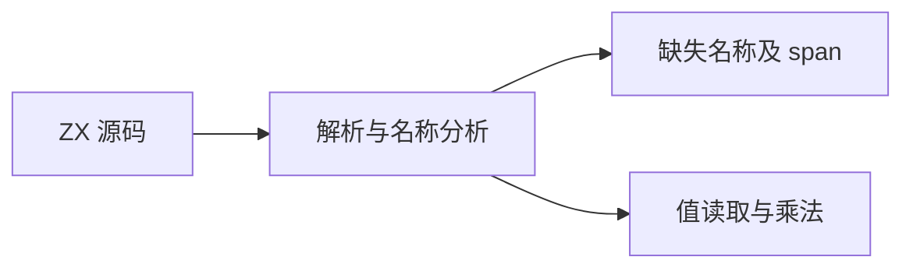
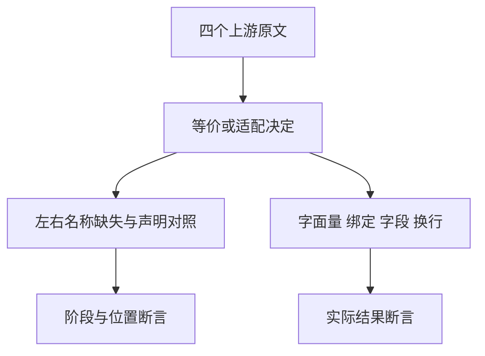

# Test262 乘法名称与换行对齐

## Intent：最终目标

对齐乘法的字面量、局部绑定和属性值读取，并验证操作符两侧换行；将未声明名称按 ZX 静态规则适配。

## Data：可用证据

已逐项读取 `S11.5.1_A2.1_T1/T2/T3.js` 与 `line-terminator.js`。T1 包含五种取值方式；T2/T3 在左右操作数缺失名称时抛运行时 ReferenceError；换行用例计算 18 × 2 × 9 = 324。

## Edges：边界与限制

ZX 使用静态局部绑定和记录字段，不实现 JS 动态对象；T1 标记 adapted。未声明名称在分析阶段拒绝，T2/T3 标记 adapted，不声称运行时异常模型等价。换行数值行为直接对应。

## Answer：交付与成功标准

真实执行覆盖五种取值方式和换行；前端负例检查 name 诊断与准确 span，并包含声明后的正例。草案位于 `docs/2026-10-03/multiplication_names/`。

## 执行记录与自我批判

6 个运行案例与 4 个前端案例通过；TypeScript、生成一致性和审计通过。根 ReleaseSafe 433/433 构建步骤、39,471/39,471 Zig 测试通过，11 个 CLI 场景与隔离安全执行步骤通过。日志 `/tmp/zxc-test262-multiplication-names-root.log`。该组不能替代动态对象的 GetValue/ToPrimitive 或求值副作用顺序测试。

Debug 前端与运行组 314/314 构建步骤、28,390/28,390 测试通过，日志 `/tmp/zxc-test262-multiplication-names-debug.log`。本轮没有生产代码修改。
