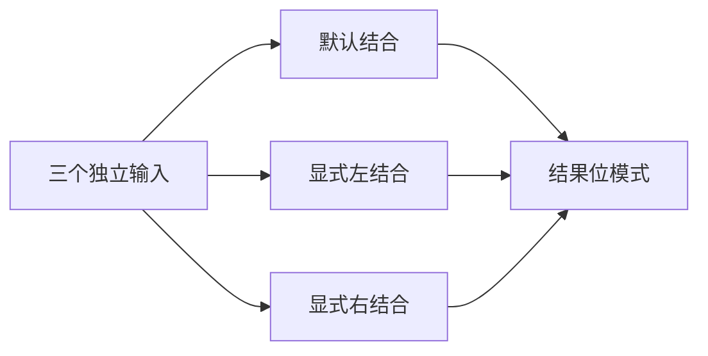
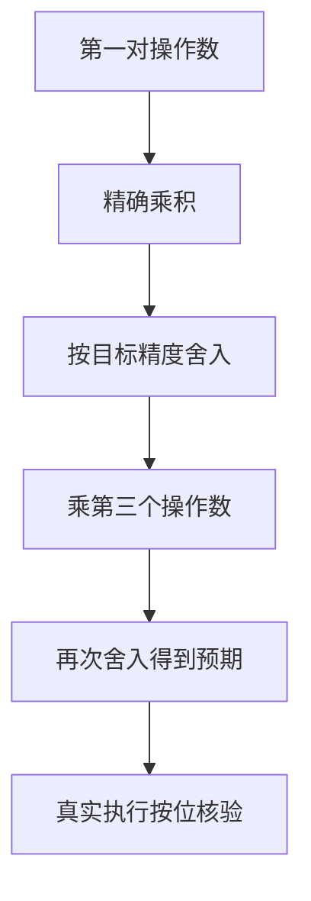

# Test262 乘法结合顺序对齐

## Intent：最终目标

验证浮点乘法默认左结合、显式左结合和显式右结合保持逐步舍入，不能当作实数乘法任意重排。

## Data：可用证据

已读取固定版本 `S11.5.1_A4_T8.js`：MAX_VALUE × 1.1 × 0.9 与左结合相等，与右结合不同。现有两输入测试不能充分证明三输入结合顺序。

## Edges：边界与限制

f64 对齐上游，f32 为扩展。三个操作数均来自运行时输入；不将第三操作数硬编码在生产实现或测试支持中。NaN 不验证 payload；只报告实际运行的优化模式。

## Answer：交付与成功标准

三个独立输入、三个源码表达式、两种浮点精度，使用精确模型对每个中间结果重新舍入，最终按位比较。草案位于 `docs/2026-10-03/multiplication_grouping/`，目录按精度与结合方式分层。

## 执行记录与自我批判

新增 1,350 个案例（每精度、每结合形式 225 个）；全部预期与 Node 逐步目标精度舍入交叉核验一致。Debug runtime 302/302 步骤、25,456/25,456 通过。新增上游 T8 的三个精确结果映射。TypeScript、构建与支持文件格式检查通过。根 ReleaseSafe 424/424 构建步骤、39,461/39,461 Zig 测试通过，11 个 CLI 场景及隔离安全执行步骤通过。日志 `/tmp/zxc-test262-multiplication-grouping-root.log`。有限矩阵不能证明所有优化和所有浮点输入不存在重排。
