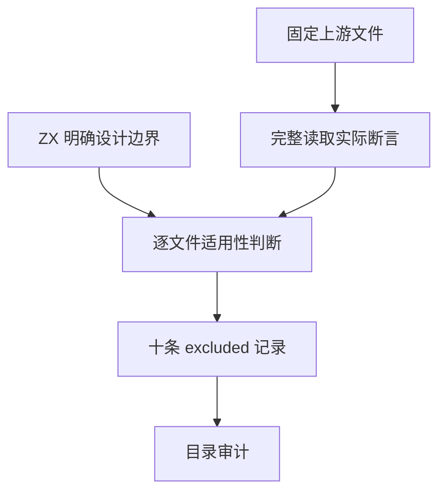
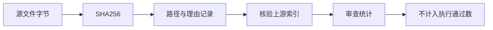

# Test262 代理对象逐项适用性审查

## Intent：最终目标

保留用户已选择的 ZX/RX 静态语言设计，逐文件区分缺失实现和明确不适用的 ECMAScript 行为。本轮审查 10 个 Proxy 文件，不扩展结论到整个目录。

## Data：可用证据

固定上游提交 `7ab7fafa0003f73fc85c1b95d88094d33f7eb8bd`。只读分析由一个辅助 agent 完成，主 agent 再完整读取全部十份源码，核对实际断言。记录保存于 `packages/test/upstream/reviews/built_ins/proxy/explicit_design_exclusions.jsonl`，逐文件绑定 SHA-256。

本地依据为 `docs/zx_design_doc.md` §14.3 对 this/new/原型链、反射和动态属性的明确禁止，§14.4 对 throw、闭包捕获及可逃逸 lambda 的限制，以及 `packages/zx/IR契约.md` 的静态字段契约。依据是既有设计选择，不是当前编译器暂时未实现。

| Proxy 下的文件                                            | 实际断言                                                                                                    | 排除理由                                                                                  |
| --------------------------------------------------------- | ----------------------------------------------------------------------------------------------------------- | ----------------------------------------------------------------------------------------- |
| `apply/call-parameters.js`                                | 调用代理后检查 trap 的 this 为 handler、target/context 身份和参数列表 [1,2]；target 不执行。                | 动态 this 与可拦截函数调用不属于静态调用契约；普通参数传递无法保留 trap 身份断言。        |
| `apply/call-result.js`                                    | p.call() 返回 trap 捕获的 result，并检查同一对象身份；target 不执行。                                       | 可调用代理与闭包捕获被排除；普通对象字段相等无法替代 trap 返回身份。                      |
| `construct/call-result.js`                                | new P(1,2) 使用 construct trap 返回对象，其 sum 为 42；target 不执行。                                      | new 与构造器对象模型被排除；单独检查静态 sum 字段不能保留构造拦截。                       |
| `construct/return-not-object-throws-number.js`            | construct trap 返回数值 0，new P() 抛出 TypeError；target 不执行。                                          | new 与运行时 throw 均被设计排除；编译期类型诊断不是该运行时异常。                         |
| `get/call-parameters.js`                                  | p.attr 触发 get，检查 this、target、属性名 attr 和 receiver 身份；p["attr"] 同样触发。                      | 动态属性拦截与 this/receiver 对象身份不适用；静态字段读取不能覆盖 trap 协议。             |
| `get/trap-is-undefined.js`                                | handler.get 为 undefined 时转发到 target；attr 为 1，缺失 foo 为 undefined。                                | 动态属性转发和缺失字段返回 undefined 不符合静态字段契约；仅迁移 attr 读取会遗漏核心机制。 |
| `defineProperty/trap-return-is-false.js`                  | defineProperty trap 返回数字 0，Reflect.defineProperty 返回 false，target 的 attr 描述符仍为 undefined。    | 反射定义属性、属性描述符与隐式 truthiness 不适用；单独返回 false 不能证明原断言。         |
| `deleteProperty/return-false-strict.js`                   | strict 文件中 deleteProperty trap 返回 false，Reflect.deleteProperty 也返回 false；未断言 delete 语法抛错。 | 反射删除与动态属性变更被排除；普通函数返回 false 无法保留被测机制。                       |
| `set/boolean-trap-result-is-false-number-return-false.js` | set trap 返回数字 0，Reflect.set(p,"attr","foo") 返回 false。                                               | 反射写入、普通对象变更与隐式 truthiness 不适用；bool 条件拒绝属于不同契约。               |
| `revocable/revoke.js`                                     | Proxy.revocable 返回对象，typeof r.revoke 为 function；没有执行 revoke 或验证撤销后行为。                   | 返回可调用成员的运行时对象与反射类型检查不属于静态对象和受限 lambda 契约。                |

## Edges：边界与限制

- 每条 excluded 的 cases 为空；不增加有效案例或通过数量。
- 普通字段投影、参数传递和返回值虽然可以单独测试，但不能替代 Proxy 拦截、对象身份和反射断言。
- `return-false-strict.js` 未测试 delete 语法异常；`revoke.js` 未测试真正撤销。不能根据文件名夸大覆盖。
- 其余 Proxy 文件仍未审查；不按 features 或目录自动批量排除。

## Answer：交付格式与成功标准

交付十条有内容摘要、哈希及本地契约的审查记录。矩阵审计必须核验固定上游摘要、无重复记录和有效状态；本阶段没有修改生产代码或测试执行器，因此无需重复数万条运行测试。

## 自我批判与验证

排除记录只能澄清范围，不能提高执行语义覆盖。本轮特意保留附带普通行为与核心代理协议之间的区别，避免通过简化测试宣称原文件通过。`pnpm --dir packages/test run audit` 通过：218 个已审查文件（102 equivalent、106 adapted、10 excluded），53,379 个未审查；52,174 个登记案例与 602 个唯一关联案例均未增加。首次误用 `pnpm audit` 调用了依赖漏洞服务，其镜像端点不支持；该失败不属于本矩阵审计结果，改用明确的 `run audit` 后通过。
