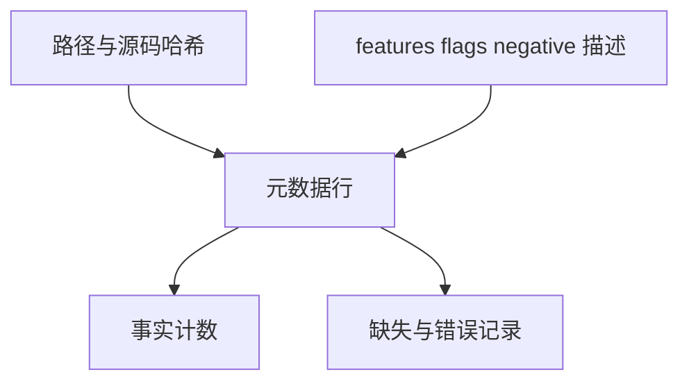

# Test262 全量审查证据索引

## Intent：最终目标

为剩余逐项审查建立可查询的全量事实索引，避免只按方便的案例持续扩张，或把目录名当作不适用证明。

## Data：可用证据

固定上游共有 53,597 个文件，目前 107 个完成语义审查。已有路径和 SHA-256 索引，但缺少可查询的 features、flags、negative 阶段和描述，不便系统安排剩余工作。

## Edges：边界与限制

- 元数据仅是上游声明，不证明源码行为、ZX 支持程度或执行通过。
- 本索引不写入 reviews，不将任何文件改为 equivalent/adapted/excluded。
- 按原归档校验和、逐文件哈希及完整路径集合核对，不能靠目录抽样冒充全量。
- YAML 使用安全加载，不执行上游 JS。缺失或异常元数据显式保留，不能静默删除。
- PyYAML 是离线证据生成工具依赖，不加入生产编译器或日常测试运行依赖。

## Answer：交付与成功标准

按既有六大分类保存元数据事实；生成全量计数与查询命令，后续按特性和错误阶段选取未审查文件，逐项读取源码并补充真实测试。

## 执行与自我批判

53,597 个文件全部安全解析成功，严格重复键与字段形状检查也通过；按原归档重建的 `--check` 结果完全一致。事实文件按六大分类保存，约 19 MiB；没有复制完整 JS 源码。

| 上游元数据声明  | 文件数 |
| --------------- | -----: |
| 未声明 negative | 48,863 |
| parse 负例      |  4,660 |
| resolution 负例 |     34 |
| runtime 负例    |     40 |

最大的若干特性标签为 Temporal 6,716、destructuring-binding 6,637、async-iteration 4,971、class 4,794、generators 4,119。标签会重叠，不能相加计算文件总数，更不能自动据此排除整个文件。

新增 query_upstream.py 自动去掉已审查文件，支持特性集合、阶段和路径前缀筛选，并同时显示匹配总数与展示数。例如数值字面量的 numeric-separator-literal parse 队列还有 28 项；普通表达式未声明 negative 的队列还有 8,998 项。这是审查候选，不是已确认适用案例。

元数据解析器的缺失、重复键、错误类型与正常输入路径均已检查。临时从 harness 元数据删除一行时，查询和审计均拒绝不完整索引且不输出部分结果；恢复后通过。

本阶段新增案例和审查决定均为零，仍是 33,937 个案例与 107 项语义审查。下一步应从具体队列逐项读取源码，不能把这份事实表当作完整对齐成果。

## 最终验证

根 `zig build test -j4 --summary all`：284/284 步骤、33,915/33,915 Zig test 加 408 个隔离案例通过，包含新增全量元数据完整性审计。离线生成 `--check`、查询筛选、异常元数据与缺行反证均通过。

原始日志为 `/tmp/zxc-test262-inventory.log`、`/tmp/zxc-test262-inventory-check.log`、`/tmp/zxc-test262-batch13-root.log`。全部工具会话已结束。离线生成器使用 PyYAML 6.0.3，查询和日常回归不依赖它。
