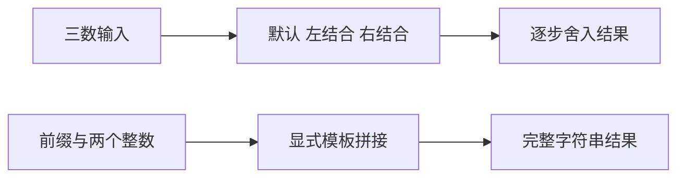
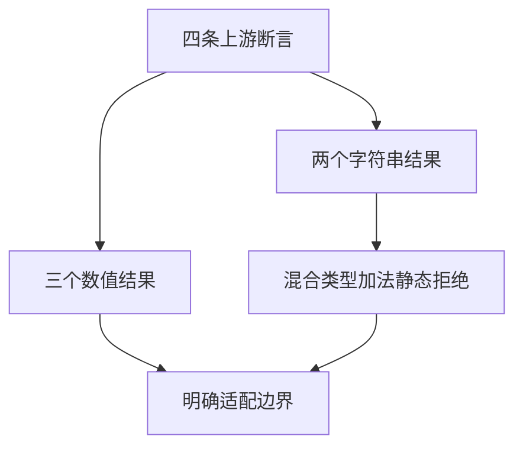

# Test262 加法结合与显式拼接

## Intent：最终目标

完整处理加法 A4_T9 的数值结合顺序和字符串结果差异，保留 ZX 静态类型设计。

## Data：可用证据

原文前两条比较 (-MAX + MAX) + MAX 与 -MAX + (MAX + MAX)；后两条比较 ("1" + 1) + 1 与 "1" + (1 + 1)，结果分别为 "111" 和 "12"。

## Edges：边界与限制

数值程序保留默认、左、右结合三种写法。字符串程序用明确模板插值表达拼接，不增加隐式 ToPrimitive/ToString；关联已有 string/u64 与 u64/string 加法静态拒绝测试。因此整个上游文件标记 adapted。

## Answer：交付与成功标准

六组三输入数值场景 × 三种结合 × 两精度，外加四个显式字符串拼接案例；对预期按位或完整字符串检查。草案位于 `docs/2026-10-03/addition_grouping/`。

## 执行记录与自我批判

40 个案例生成完成，数值预期全部与 Node 逐步舍入核对。Debug runtime 366/366 步骤、31,966/31,966 测试通过。TypeScript、目录一致性和映射审计通过，新增一条 adapted，最终根 ReleaseSafe 510/510 构建步骤、45,985/45,985 根 Zig 测试通过；20 个验证 CLI、11 个 RX CLI、app/lib 消费链路及隔离安全执行步骤通过。日志 `/tmp/zxc-test262-addition-grouping-root.log`。字符串测试不证明通用 JS 类型转换或对象副作用兼容。
