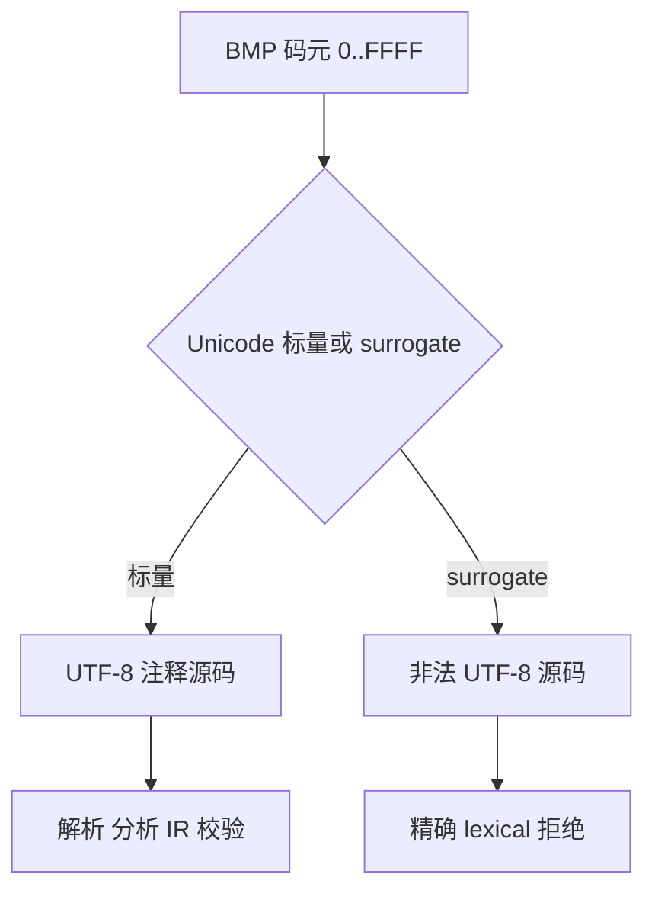
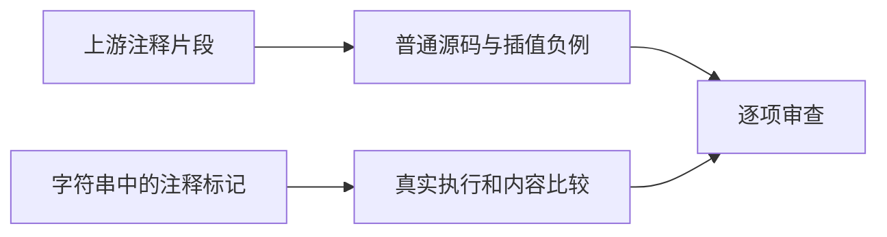

# Test262 块注释与字符遍历

## Intent：最终目标

补齐块注释非嵌套、游离结束标记、字符串内标记和完整 BMP 字符插入行为，逐项核对 Test262 comments A3、A4_T1、A4_T4、A5、A6。

## Data：可用证据

已读取上述五个上游文件。A5、A6 实际枚举全部 65,536 个 UTF-16 码元；A5 还验证四个行结束字符会暴露后续赋值，不能仅阅读其 description 后跳过这些分支。ZX 接收 UTF-8，孤立 surrogate 不是有效源码字符，必须显式记录差异。

## Edges：边界与限制

字符遍历各计一个范围案例，不把 131,072 次内部检查另算案例凑数。普通 BMP 标量用 UTF-8 源字节；surrogate 对应的非法 UTF-8 字节要求词法拒绝。ZX 单行注释只在 CR/LF 终止，LS/PS 与 JavaScript 不同。诊断和 IR 校验不冒充 JavaScript eval 或可变全局执行。

## Answer：交付与成功标准

分层 TypeScript 生成数据、范围验证支持、结构负例与实际字符串返回测试；明确上游映射，检查每个内部失败能指出码点，完成根回归。

## 执行记录

新增 15 个登记案例：6 个结构负例、2 个首个结束标记正例、2 个 BMP 范围案例、5 个字符串实际执行案例。范围的起止值、结束字符和预期阶段写在 JSONL 中，测试支持按该数据遍历；每次失败输出具体 U+ 码点。

两个范围各枚举 65,536 次，合计 131,072 次内部源码验证，但只计两个案例。块注释有 63,488 个标量通过、2,048 个 surrogate 字节序列拒绝；行注释有 63,486 个标量被忽略、2 个 CR/LF 暴露后续代码、2,048 个 surrogate 字节序列拒绝。LS/PS 在 ZX 单行注释中仍被忽略，属于与上游的明确差异。

初次验证有四个类别预期错误：三个模块前片段及范围中的 LF。检查 parser_top.zig 的顶层契约后确认，此处应为 parse/contract；插值中的对应片段仍为 parse/syntax。已明确区分而非接受任意错误，精确字节 span 保持。

| 检查                               | 实际结果                                                      |
| ---------------------------------- | ------------------------------------------------------------- |
| Debug 前端和运行组                 | 242/242 步骤、23,555/23,555 通过                              |
| 根 ReleaseSafe                     | 336/336 步骤、34,387/34,387 Zig test，加 464/464 隔离案例通过 |
| 范围期望反证                       | 临时删除行结束字符期望，在 U+000A 确切失败，仓库数据未修改    |
| TypeScript、格式、生成一致性和审计 | 通过                                                          |
| 五个上游文件                       | A3、A4_T1、A4_T4、A5、A6 均保存完整适配说明与案例关联         |

反证直接调用实际 frontend 支持与编译器接口；失败为运行断言 TestUnexpectedResult，不是编译或工具错误。两个范围都完成后才能得到通过结果，不用抽样代替遍历。

日志位于 /tmp/zxc-test262-block-debug-final.log、/tmp/zxc-test262-block-root.log、/tmp/zxc-test262-block-mutation.log；初次类别预期错误保存在 /tmp/zxc-test262-block-debug.log。

当前总数 34,465：普通运行 20,670、前端 2,885、隔离 464、模块 10,446。上游已审查 154/53,597（60 equivalent、94 adapted），关联 336 个案例，53,443 项仍待审查。

## 自我批判

本批没有发现新的生产缺陷，因此没有生产代码修改。BMP 遍历检查 UTF-8 词法、解析、分析和 IR，不能被描述成 JavaScript eval 执行；孤立 surrogate 和 LS/PS 分支都明确适配。范围验证没有覆盖全部非 BMP 标量，也不证明所有字符串、模板或正则上下文的 Unicode 行为。字符串中的注释标记已实际执行，但包含更多动态语义的 A2_T1 尚未整体审查，不能借其两项字符串检查宣称整文件完成。
