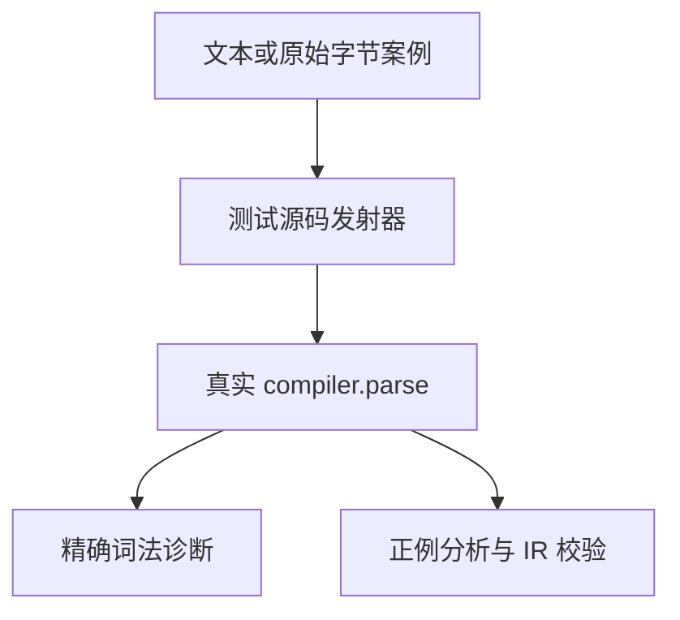
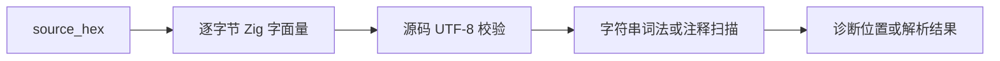

# Test262 字符串词法与字节边界

## Intent：最终目标

补足字符串负例、模板插值中的诊断位置及源码 UTF-8 校验，逐项映射 Test262 严格模式数字转义拒绝测试。

## Data：可用证据

当前普通字符串词法接受双引号及引号、反斜杠、n/r/t 转义；源码整体必须为有效 UTF-8。已阅读上游 strict 数字转义文件，其中有通过后置 use strict 指令拒绝旧式转义的情形。

## Edges：边界与限制

- ZX 不区分 JavaScript strict/non-strict 模式；拒绝结果可适配，但不宣称实现指令序言追溯检查。
- Unicode 转义在当前 ZX 中整体不支持；拒绝不合法的 Unicode 转义不能证明它实现了 Unicode 转义语法。
- 非法 UTF-8 用 source_hex 保存原始源码字节，不经过 Python UTF-8 编码修复；有效相邻边界作为正例。
- 字符串、注释和模板插值分别检查；运行字符串字节语义仍由已有运行目录验证。

## Answer：交付与成功标准

新增分层词法目录，逐案断言 parse 阶段的 lexical code 与字节 span，正例经过分析和 IR 校验。修改测试发射器以支持原始字节源码，不修改生产语义，除非复现真实缺陷。

## 执行与自我批判

新增 150 个案例：108 个字符串词法场景、42 个 UTF-8 字节场景。字符串包含 32 种原始控制字节的两个上下文、16 种拒绝转义的两个上下文、10 个合法转义正例，以及两个未终止字符串。UTF-8 包含孤立延续字节、过长编码、代理区编码、超出 U+10FFFF、截断编码和有效边界，分别放在字符串与注释中。

前端 Debug 2,728/2,728 测试通过，4/4 步骤成功。没有发现新的生产缺陷；只扩展了测试输入表达能力，source 与 source_hex 必须且只能出现一个。

15 个上游文件逐项映射为 adapted，包括数字转义 1–9 的后置 strict 指令、onlyStrict 的 8/9、08、八进制 1/052 及原始 LF。若干上游元数据写 template，但实际源码为普通单引号字符串；记录按源码而非标题判断。单引号改为 ZX 双引号，模式相关语义明确保留差异。

Unicode 不完整/带分隔符转义也加入本地拒绝案例，但没有用这些拒绝证明完整 Unicode 转义语法，更没有据此关闭相关上游条目。尚未覆盖所有字符串/模板语法、任意宿主非法字节运行值或全部 Unicode 处理。

## 最终验证

根 `zig build test -j4 --summary all`（ReleaseSafe）：270/270 步骤、31,289/31,289 Zig test 加 408 个隔离案例通过。生成一致性、审计、格式和 diff 空白检查通过。

累计 31,311 个案例；上游审查 59/53,597（11 equivalent、48 adapted），关联 153 个不同案例，53,538 项仍未审查。日志为 `/tmp/zxc-test262-batch8-frontend.log`、`/tmp/zxc-test262-batch8-root.log`；全部会话已结束。
