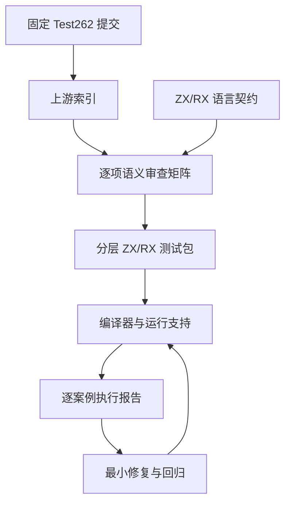
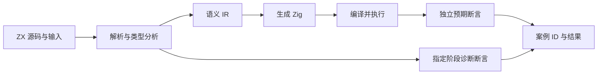

# Test262 对齐执行计划

## Intent：最终目标

保留 ZX/RX 的静态、有限语法及所有权设计，建立逐项 Test262 对齐矩阵；在 `packages/test` 建立按用途分层的测试包，完成超过 30,000 个可执行、有独立输入和预期的案例。以失败案例驱动修复，不通过改弱断言或生产特判满足测试。

用户已扩展目标：除了 Test262，还需实现 zxc 全部特性的测试用例，测试粒度与 Test262 一致。全特性入口见《zxc全特性测试覆盖清单》，两条工作线都必须完成，不能互相替代。

用户已明确选择保留 ZX/RX，而非实现完整 ECMAScript。测试数量不是生产成熟度的充分条件；编译链、资源失败、模块隔离、宿主边界和回归稳定性均须有证据。

## Data：可用证据

- 起始仓库提交：`47ed46ffc0d8f09f70a4b0f8162ee55de5b75f06`。
- Test262 固定提交：`7ab7fafa0003f73fc85c1b95d88094d33f7eb8bd`。
- Zig：0.16.0。现有执行路径：ZX → compiler CLI → Zig → runtime → 输出断言。
- 当前契约：`packages/zx/IR契约.md`、`packages/compiler/README.md`。
- 根 `zig build test --summary all` 基线失败：多份运行 fixture 不满足当前 AST 空行门禁，未进入运行断言。必须先恢复真实执行。
- 网站与既有 pnpm lock 修改不属本任务；TypeScript 迁移仅为 test 包新增 workspace 登记及固定工具依赖，保留其他修改。

## Edges：边界与限制

- 矩阵状态：unreviewed（未审查）、equivalent（同语义）、adapted（按 ZX 契约适配）、excluded（有设计依据的不适用）。状态不是通过率。
- 每条已审查记录必须有上游路径、内容摘要、决定理由、ZX 契约、案例标识；excluded 不计作有效测试。
- 上游文件、参数迭代、断言、编译模式分别计数。只有具有稳定 ID、输入、预期、实际执行结果的案例计入 30,000+；不把重复模式运行重复计数。
- 负例必须区分词法/解析/类型/所有权/链接/运行阶段。基础设施失败不能当作预期拒绝。
- 不借助 Node 执行结果冒充 ZX 执行；独立参考模型可用于预期，不能复用被测实现计算预期。
- 不为凑数自动把整个目录判为不适用，不制造 30,000 个等价重复文件。
- 本次明确要求在 packages 下实现 test 包，代码按该明确目的写入 `packages/test`；其他修复先诊断，最小修改。草稿实验放在 `docs/2026-10-03/test262/`。
- 数据库、生产 Runtime 调度与持久化尚缺，不由测试通过推断已实现。

## 测试粒度要求

每个案例对应可独立说明的语义规则、前置条件、操作和预期结果，并有稳定 ID 与可定位的失败输出。围绕规则区分合法、非法、边界、求值顺序和跨特性交互。参数矩阵保留有意义的等价类与边界；重复模式、分配失败遍历次数、同一断言的重复输入不冒充新增规则覆盖。

已有合并在 Zig 测试中的多个语义场景需审查并分别定位。全特性清单逐项映射到案例和执行证据，缺失条目持续标记缺口。这里的对齐是语义粒度与可追溯性，不要求复制 JavaScript 的文件布局或动态语言契约。

## Answer：交付格式与成功标准

| 步骤 | 交付                               | 完成证据                             | 状态                                                                                                                  |
| ---- | ---------------------------------- | ------------------------------------ | --------------------------------------------------------------------------------------------------------------------- |
| 1    | 基线、锁定上游、包结构、可恢复记录 | 版本、命令与原始结果                 | 已完成                                                                                                                |
| 2    | 全量上游索引与逐项矩阵             | 无截断、无重复、内容哈希、审查关联   | 全量源码索引与元数据事实查询完成；220/53,597 已审查                                                                   |
| 3    | 端到端运行及阶段负例 harness       | 故意错误预期能失败、稳定案例 ID      | 已接入运行、阶段诊断、独立进程与注册审计                                                                              |
| 4    | 词法/表达式/数值/控制流            | 上游行为映射、边界、真实运行         | 本部分 8,856 个案例通过；仍有大量语义缺口                                                                             |
| 5    | 字符串/对象/集合/模块              | 语义、资源、所有权交互               | 新增 15,234 个集合、字符串与所有权案例通过；模块待扩展                                                                |
| 6    | RX/Store/诊断/畸形输入与资源失败   | 生产路径回归、隔离、错误阶段         | 10,240 个图案例、36 个分配失败、16 个受限栈、154 个路径场景；已修复长链栈耗尽与 Import 空白检查，其余边界待扩展       |
| 7    | 超过 30,000 有效案例与全量矩阵审查 | 独立计数、完整报告、未解决缺陷清单   | 52,519 个登记案例；runtime 38,429 条；根级 868/868 步骤、52,493/52,493 条 Zig 测试通过；上游审查为 220/53,597，未完成 |
| 8    | 发布就绪审查                       | 构建模式、可复现、实际边界与残余风险 | 待执行                                                                                                                |

test 包脚本全部采用 TypeScript，由 Node.js 24.2+ 原生执行；独立参考模型使用 bigint 保持精度。

每轮更新《Test262对齐执行记录》。中断后先读取记录、检查 git 状态与工具会话，不将历史“通过”当作当前结果。目标全部实现前不标记完成。

## 自我批判

最容易偏离的地方是用数字代替覆盖、以不适用遮蔽实现缺口、将编译成功当作语义正确。每批应检查这些问题，并记录尚未验证的边界。生产级是多维工程结果，单纯 30,000 个通过不能证明。
