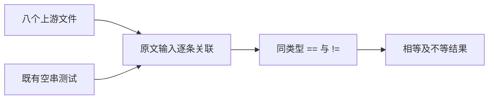
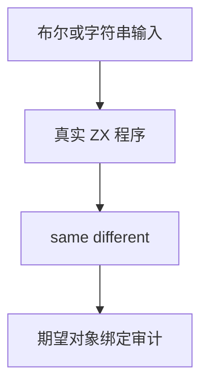

# Test262 布尔与字符串相等对齐

## Intent：最终目标

补齐同类型布尔与原始字符串相等规则的上游审查，用最少缺失输入绑定实际 ZX 比较结果。

## Data：可用证据

已读取 equals/does-not-equals 的 A3.1、A5.1，以及 strict-equals/strict-does-not-equals 的 A3、A5，共八个文件。原始字符串中的空白、相同文本和不同数字文本均为字符串内容比较，不涉及隐式数值转换。既有字符串测试已执行空串对空串，直接复用该案例。

## Edges：边界与限制

ZX 同类型 ==/!= 对应这些具体断言，包括 JS ===/!== 的结果；不因此声称支持 JS 动态类型、对象包装、eval、undefined 或引用相等。读取到的 strict A6.1、A6.2、A7 暂不增加审查记录。

## Answer：交付与成功标准

新增 bool 四种组合和字符串六种缺失组合，复用已有空串案例。审查逐条关联所有原文比较；目录审计绑定实际 expected.value 对象，结果通过真实 ZX 执行验证。

## 执行与自我复核

新增 10 个输入（bool 4、string 6）与 1 个复用的既有空串案例，完整关联八个文件中的全部断言。字符串数字文本保持字符串内容比较，不产生数值转换。新增八条 equivalent，审查累计 208（102 equivalent、106 adapted），53,389 未审查，602 个唯一关联案例。

Debug runtime 406/406 步骤、37,120/37,120 测试通过，日志 `/tmp/zxc-test262-primitive-equality-debug.log`。TypeScript、生成一致性和目录审计通过；目录累计 51,194。无需修改生产实现。最终根 ReleaseSafe 556/556 步骤、51,139/51,139 根 Zig 测试通过，额外 11 个插件 Zig 测试、真实 ZX 桥接及其他 CLI/隔离步骤通过；退出码 0。日志 `/tmp/zxc-test262-primitive-equality-root.log`。

自我批判：新增十个输入不是十种新语言特性；JSONL 审计绑定整个预期结果对象，而不是仅核对案例 ID。字符串测试只覆盖这些原文同类型输入，不证明动态类型转换或孤立 UTF-16 代理项行为。未实现的 undefined/eval 和对象身份规则仍未审查。
