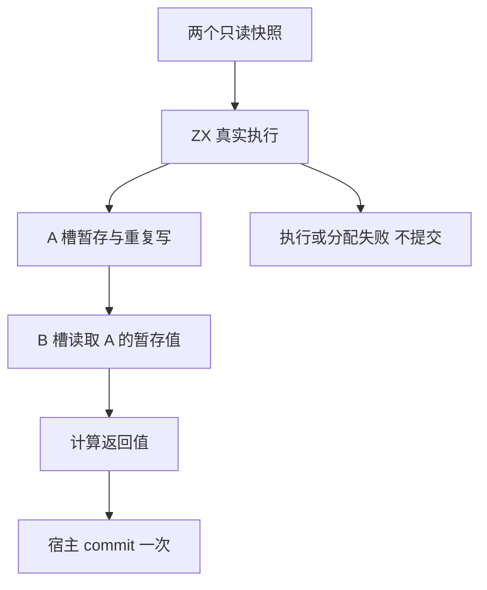
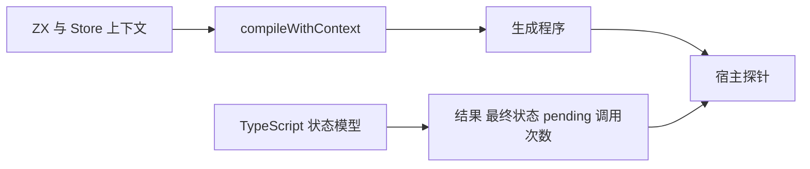

# Test262 扩展：Store 暂存与失败路径

## Intent：最终目标

验证 ZX 自有 Store 能力的两槽暂存、重复写入、读己之写、执行失败、提交冲突与分配失败。补足生产级目标所需边界，不把这些案例计作 Test262 上游映射。

## Data：可用证据

现有 compiler runtime 有四个单槽 Store 案例。IR 契约要求暂存写入、getter 优先读取暂存值、成功返回前调用宿主 commit；多槽原子发布、版本检查与长期存储由宿主负责。公开 compileWithContext 接口可绑定 Store 类型和路径。

## Edges：边界与限制

测试宿主先验证完整 pending，再模拟成功发布或返回 Conflict。只验证编译器与宿主之间的调用契约，不证明数据库事务、持久化或任意宿主实现正确。输出与提交数据仅在调用 Arena 生命周期内验证。分配失败迭代不另算案例。

## Answer：交付与成功标准

TypeScript 独立状态模型与 JSONL、真实 ZX 源码、公开上下文编译步骤、Zig 宿主断言和逐分配点失败验证；登记为独立 Store 执行组并完成根回归。

## 执行记录

已完成 236 个登记案例：232 个普通组合及 4 个分配失败场景。独立 TypeScript BigInt 状态模型、公开上下文编译、两槽宿主探针均已接入。Debug 专项 236/236 通过，ReleaseSafe Store 子项 236/236 通过；生成一致性、TypeScript 类型检查通过。

第一次根回归因并行 XML 实现编译错误失败，不能记录为全仓通过；该错误随后已由实现侧修正，根 ReleaseSafe 回归通过：373/373 构建步骤、34,701/34,701 Zig 测试通过，隔离安全案例执行步骤通过。日志：`/tmp/zxc-test262-rx-text-root.log`。

## 自我批判

逐分配失败检查针对 Arena 向底层申请内存的分配点，不等同于每一次逻辑分配。冲突宿主在发布前返回失败，不能据此证明数据库原子性。当前 Store 上下文由测试提供，尚未验证 RX 权限推导、持久化和并发恢复。
