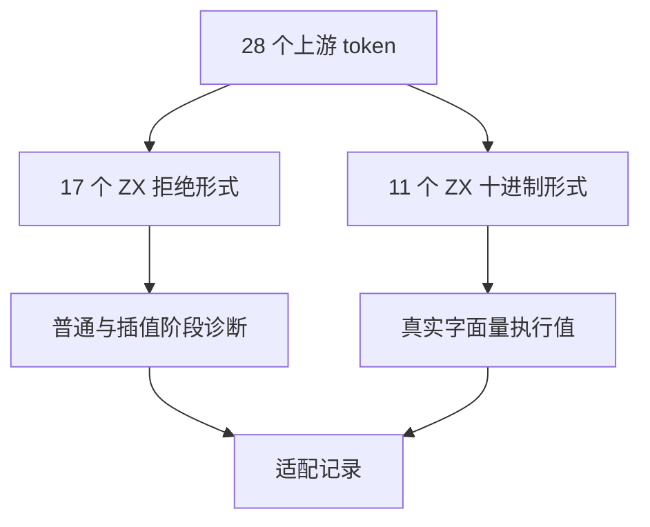
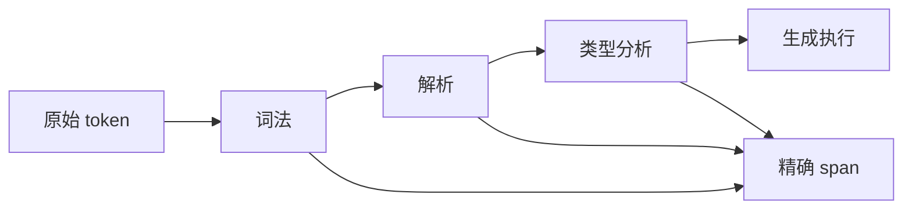

# Test262 数值分隔符剩余边界

> 2026-10-04 更正：下文保留历史执行事实，但“28 项均 adapted”的结论已由[阶段三百一十六复核](../2026-10-04/Test262数字分隔符旧记录复核.md)替代。当前为 2 adapted、26 excluded；全部 ZX 回归仍保留。

## Intent：最终目标

逐项处理数值字面量 numeric-separator-literal 的剩余 28 个 parse 负例，区分 ZX 十进制设计与 JavaScript legacy 数值规则。

## Data：可用证据

已逐项读取 28 个文件：九个 0b/0x/0o 前缀负例、六个点号附近负例、十一个前导零分隔符负例、相邻分隔符与 Unicode 转义各一个。

ZX 的既有正例允许 01，分析器明确按十进制解析，契约只要求分隔符位于两个数字之间。因此前导零组应验证 ZX 十进制值，不能为适配 JavaScript 临时改变既有语义。

## Edges：边界与限制

- 非十进制前缀尚不支持，拒绝这些输入不证明对应进制的分隔符语法已经实现。
- 点后下划线在 ZX 可解析为字段访问，数值目标随后在类型分析被拒绝；必须记录阶段差异。
- 本组采用原始 token，分别放在普通 return 与模板插值中；不通过替换非法字符让负例变成另一个测试。
- 前导零组保存运行值，与上游拒绝结果明确区分。

## Answer：交付与成功标准

34 个精确阶段与位置的拒绝场景，加 11 个前导零字面量运行场景。全部通过后逐项保存 28 个 adapted 记录，不改变生产数值设计。

## 执行记录

34 个拒绝场景和 11 个运行场景均已登记。迁移前 Debug 前端及运行组 198/198 步骤、23,128/23,128 通过；28 项上游记录均为 adapted。TypeScript 迁移后根 ReleaseSafe 289/289 步骤、33,960/33,960 Zig test 加 408/408 隔离案例通过。保留与 JavaScript 的差异，不把所有拒绝都标成同阶段等价。

## 自我批判

这些案例验证原始 token 在 ZX 中的具体结果，不证明十六进制、二进制、八进制或 JavaScript legacy 模式已经实现。字段访问形式在分析阶段拒绝，也不能记作词法等价。
