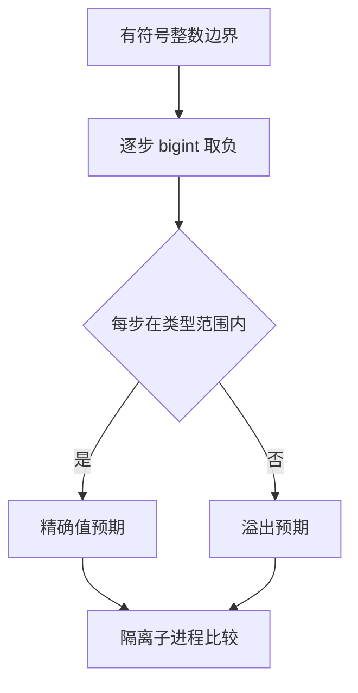

# Test262 整数取负安全边界

## Intent：最终目标

验证有符号整数取负的值域与中间结果安全检查，特别是双重取负不能消除最小负整数的中间溢出。根据固定宽度契约记录与 JavaScript BigInt 的差异。

## Data：可用证据

现有 lowering 直接生成 Zig 一元取负，并在 execute 中显式启用 runtime safety。已有隔离执行器要求执行标记、指定 panic 文本、专用退出码和空 stdout，能区分计算溢出与基础设施失败。上游 unary-minus/bigint.js 已逐项读取，含零、±1 与超过 Number 精度的整数。

## Edges：边界与限制

ZX 的 i32/i64 有有限值域，不能宣称任意精度 BigInt 支持。无符号整数拒绝取负，上一阶段已有静态负例。本轮不改语言设计，不因代数上双重取负等于原值就跳过中间溢出。不同构建模式不重复计数。

## Answer：交付与成功标准

扩展 TypeScript 整数安全生成器及原有隔离目录，先按 bigint 精确计算每步，再检查范围；运行 Debug、ReleaseSafe、ReleaseFast，保留失败或通过证据并更新逐项矩阵。

## 执行记录

新增 56 个隔离案例：i32 的 13 个输入分别做单次与双重取负，共 26 个；i64 增加两个超过 Number 精度的整数，共 15 × 2 = 30 个。每一步先用 bigint 计算，再检查目标类型范围，不能直接将双重取负的最终值作为预期。

输入覆盖最小值、最小值加一、半范围值、零、正负普通数、最大值附近，并在可表示类型中加入 ±0x1fffffffffffff01。现有运行协议保留 operation/left/right，取负操作不使用 right，固定为零仅作协议占位，不参与生产运算。

| 检查                               | 实际结果                                                                         |
| ---------------------------------- | -------------------------------------------------------------------------------- |
| Debug 安全集合                     | 26/26 步骤；464/464 隔离案例通过                                                 |
| ReleaseFast 安全集合               | 26/26 步骤；464/464 隔离案例通过                                                 |
| 根 ReleaseSafe                     | 326/326 步骤；34,264/34,264 Zig test，另 464/464 隔离案例通过                    |
| 三种模式逐报告复核                 | ID 数量、唯一性、完整性和 passed 全部正确                                        |
| i32/i64 最小值单次与双重取负       | 每种模式四个案例均为 ZX_EXECUTE、ZX_PANIC=integer overflow，退出码 86            |
| 生成器一致性与严格 TypeScript 检查 | 通过                                                                             |
| 上游 bigint.js                     | 12 条 sameValue/notSameValue 的数值见证逐项核对，关联五个 i64 案例，记为 adapted |

上游的零与括号拼写关联零取负，±1 关联相应输入，连续两次负号关联双重取负；大整数的精确负值同时证明它不等于其正值和相邻整数。审查保存每项比较值与数值见证，创建时验证全部 12 项，日常审计验证每个见证与实际案例预期绑定。没有将原 JavaScript 语法直接当作 ZX 语法执行。

原始日志为 /tmp/zxc-test262-negate-debug.log、/tmp/zxc-test262-negate-fast.log、/tmp/zxc-test262-negate-root.log。隔离案例不出现在 Zig test 数量中，因此本批根 Zig test 数量未变，但有效案例增加 56。

当前共 34,342 个新包案例：普通运行 20,651、前端 2,781、隔离运行 464、模块 10,446。已审查 141/53,597 个上游文件（53 equivalent、88 adapted），关联 284 个案例，53,456 项仍待审查。

## 自我批判

没有复现新的生产缺陷，现有显式 runtime safety 已满足所测边界，因此本轮没有生产修改。ZX 的有限整数范围、十六进制与 n 后缀语法限制仍存在；adapted 不能解释为 BigInt 兼容。测试使用运行时输入，不覆盖所有已知常量在生成 Zig 编译阶段报错的路径，也没有证明所有整数优化形式都安全。
