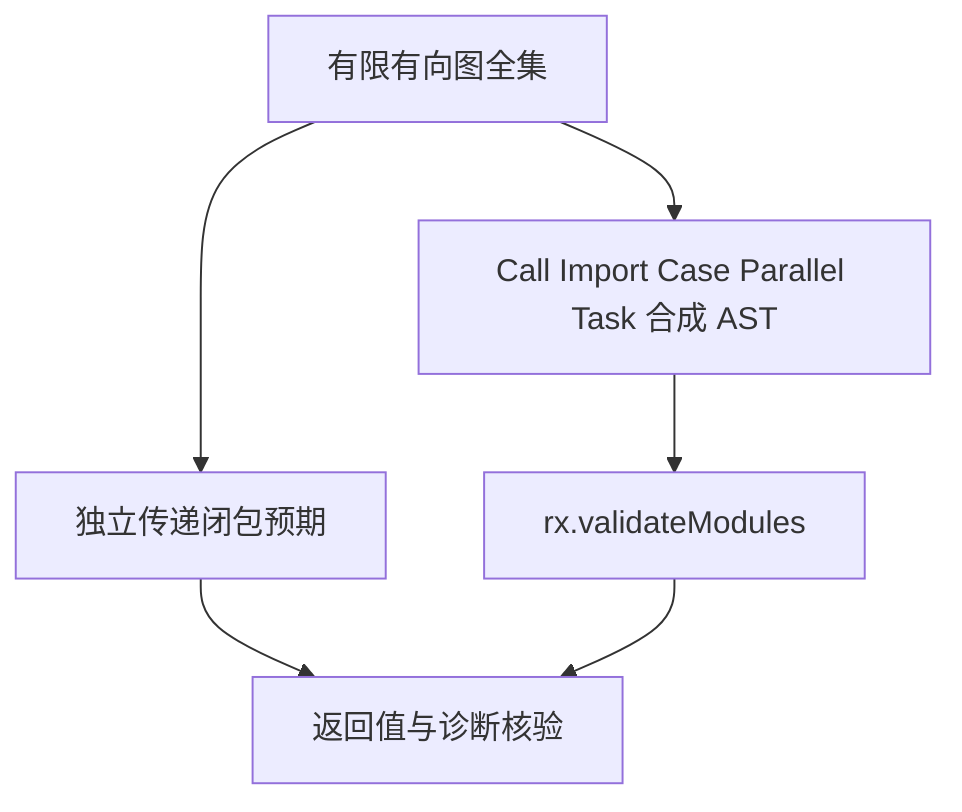

# Test262 模块图校验扩展

## Intent：最终目标

在 Test262 对齐工程中补足 RX 自有的模块无环契约。使用独立图模型检查真实公开 validateModules 入口，覆盖直接调用、未使用 Import、条件分支和 Parallel/Task 嵌套。

## Data：可用证据

RX 的正式契约禁止循环依赖，现有测试穷举三节点的 512 张有向图，但只有一个汇总测试名称，主要使用直接 Call。生产实现用 DFS；本批预期使用独立的传递闭包模型。

## Edges：边界与限制

- 这是合成 XML AST 到模块校验的测试，不是 XML 文本解析或 Runtime 执行。
- RX 无环要求是自有契约，不能作为 ECMAScript 循环模块兼容的证据，不增加已审查 Test262 文件数。
- 三节点枚举包含自环；四节点枚举全部无自环图，避免只靠自环快速失败掩盖长环和共享依赖。
- 每张图和 AST 编码拥有不同输入、稳定 ID 与明确预期。多模式重复执行不重复计数。
- 失败必须是确切循环诊断，定位到参与环的真实边；不能只判断返回 diagnostic。

## Answer：交付与成功标准

三节点 512 张图 × 四种 AST 编码，以及四节点 4,096 张无自环图 × 两种编码，共 10,240 个具名案例。注册顺序和相对路径规范化随编码覆盖。成功验证全部规范化路径和输入顺序；失败验证 code、属性、元素、位置和边确实位于环内。生成器与注册审计接入根测试。

## 执行记录与自我批判

新增 10,240 个图输入与 AST 编码案例，全部通过 Debug 的公开接口校验；包内 `zig build test-module-graphs -j4 --summary all` 为 4/4 步骤、10,240/10,240 测试通过。

三节点各编码有 25 个无环图、487 个有环图；四节点各编码有 543 个无环图、3,553 个有环图。用另一个独立的入度消除实现交叉核对全部目录，与传递闭包预期一致。

临时将三节点空图预期改为“含环”，指定 `rx/modules/graphs/3/call/0000` 正确失败：10,239 通过、1 失败。原始目录已在 finally 中恢复，生成器 `--check` 通过。错误预期没有留在交付文件中。

普通调用采用 `./nested/../nN` 引用，Import 采用 `./nN.rx` 并反转注册顺序；所有输入注册路径包含 `graph/./`。成功返回的每个规范化路径与顺序均核对。每条边的 offset、line、column 独立编码，循环失败必须指向独立模型认定处于环内的真实边，且 source_index 与其源模块一致。

本批没有发现需要修复的生产缺陷。有限图枚举不是一般规模证明；本批仍不包含超深递归和分配失败，不以达到数量目标替代未完成的逐项上游审查。XML 解析、Runtime、Gateway/Store 跨文件联结也未由本批验证。

## 最终验证与续接

- 根 `zig build test -j4 --summary all`（ReleaseSafe）：252/252 步骤、30,959/30,959 Zig test，通过另接入的 408 个隔离案例。根包含原有 386 个测试，新包合计 30,981，模式不重复计数。
- `generate_module_graphs.py --check`、注册审计、Zig 格式与 diff 空白检查通过。
- 日志：`/tmp/zxc-test262-batch5-graphs.log`、`/tmp/zxc-test262-batch5-mutation.log`、`/tmp/zxc-test262-batch5-root.log`。所有构建会话已结束。
- Test262 审查仍是 43/53,597、关联 123 个案例。本批没有新增上游映射；不能用 RX 图数量填补 ECMAScript 行为覆盖。

下一步扩展模块路径失败、遗漏依赖、重复注册与分配失败，继续逐文件审查上游适用行为。数量要求已经满足，但目标仍保持进行中。
