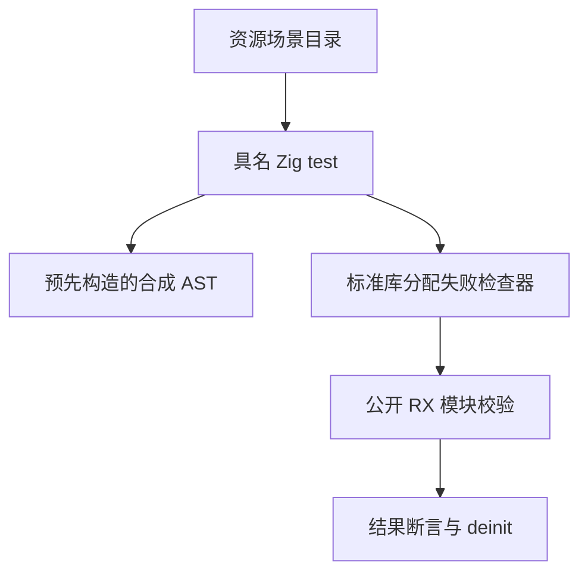

# Test262 模块资源失败验证

## Intent：最终目标

验证 RX 模块注册、嵌套 Schema 解码和依赖图校验在分配失败时能传播 OutOfMemory、释放部分结果，并保留成功与循环诊断行为。

## Data：可用证据

当前包已通过 30,981 个案例。原有 RX 分配失败回归仅涉及两个模块的合法调用；新增图测试主要使用正常分配，尚未逐分配点注入失败。

## Edges：边界与限制

- AST 测试输入预先用独立 Arena 构造，故障只注入公开 validateModules 的分配器，不将 fixture 准备失败冒充生产覆盖。
- 使用 Zig checkAllAllocationFailures 遍历本次实际分配路径，OutOfMemory 必须向上传播；诊断结果仍需要 deinit。
- 4、16、64 节点的链、闭环、扇出图，分别使用 Call、Import、Case、Parallel/Task 编码。
- 每个完整场景计作一个案例，不把每个故障注入点另算测试数量。
- 不证明堆耗尽以外的系统资源处理，不覆盖 XML 解析、Runtime 或任意深度递归。

## Answer：交付与成功标准

36 个资源失败场景接入已有模块图 runner，复用确切的返回路径与循环诊断断言。先正常运行以确定分配次数，再使用新的故障分配器逐点注入；最终执行相关和根回归。

## 执行记录与自我批判

新增 36 个场景通过 Debug：模块组共 10,276/10,276 测试、4/4 步骤通过。没有发现新的生产缺陷；本批仅扩展测试。

核对了当前 Zig 0.16 标准库的 checkAllAllocationFailures 实现：先获取正常路径的分配次数，随后逐点注入；吞掉 OutOfMemory、分配次数不稳定或失败路径分配/释放字节不一致均导致测试失败。fixture 内存由独立分配器持有，验证预期路径使用栈缓冲区，不给故障序列混入断言自身的堆分配。

资源失败覆盖增加的是失败路径证据，不增加 Test262 上游审查进度。64 节点用例只能证明该规模和形状，不代表无界深度安全；allocator 的 reallocation 等其他故障类别仍需按真实接口继续扩展。

## 最终验证

根 `zig build test -j4 --summary all`（ReleaseSafe）：252/252 步骤、30,995/30,995 Zig test 加 408 个隔离案例通过。新包累计 31,017 个案例，不重复计算分配失败迭代或构建模式。

生成一致性、注册审计、格式和 diff 空白检查通过。日志为 `/tmp/zxc-test262-batch6-graphs.log`、`/tmp/zxc-test262-batch6-root.log`；全部构建会话已结束。上游审查仍为 43/53,597，总目标未完成。
