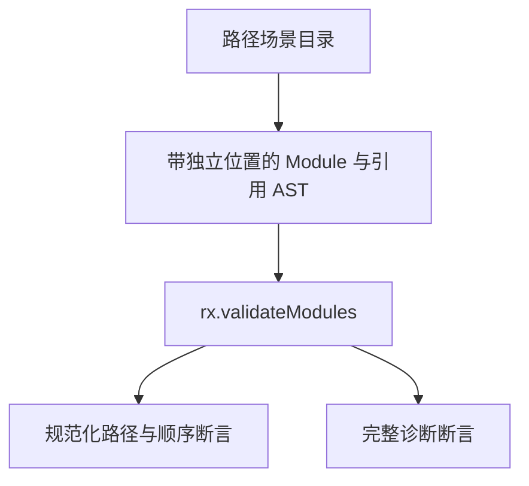
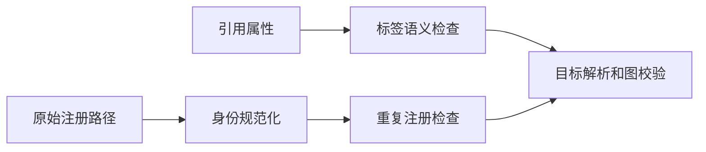

# Test262 模块路径身份与诊断

## Intent：最终目标

验证 RX 路径规范化、重复身份、缺失依赖、越界引用和保留文件名的确切结果，补足项目级失败路径。

## Data：可用证据

RX README 要求显式属性不得为空白，Call 已调用 nonEmpty，Import 当前仅检查模块引用路径。isModuleReference 接受非空路径字符，不能单独替代属性非空白检查；需要用实际校验入口确认差异。

## Edges：边界与限制

- 输入为合成 AST，不声明 XML 解析覆盖。
- 区分注册路径诊断与引用属性诊断，检查 source_index、元素、属性、位置和完整消息。
- 正常结果必须保留注册顺序并返回规范化路径。
- 相同 basename 不同目录、大小写不同路径允许独立身份；不访问文件系统或处理符号链接。
- 每个路径场景独立登记，不把规范化等价路径当作新的业务模块语义。

## Answer：交付与成功标准

接入分层模块路径目录，保留合法正例和失败原因；若证实 Import 空白属性被接受，仅修复该标签的缺失校验，再运行模块组和根回归。

## 执行记录

### 缺陷复现

最初 155 个路径场景中，有 10 个失败；模块组为 10,437/10,447 通过。8 个空白 Import 引用（空格、TAB、LF、CRLF，各两种注册顺序）在注册对应文件后被错误接受；2 个空字符串 Import 的消息与统一空白属性契约不一致。Call 对照组全部符合预期。

关键区别是路径语法与属性非空白是两个约束：空格本身可以成为路径字符，但整个 from 属性只有空白时仍违反 RX Schema 契约。仅检查 isModuleReference 不足以实施属性规则。

### 最小修复与用例整理

只在 `packages/rx/src/labels/Import.zig` 的 checkImport 开始调用现有 checks.nonEmpty，再执行原路径检查。没有改变注册路径规范化、文件命名或图算法。

自查发现将两个完全相同的重复注册路径反转后仍是同一输入，移除了这一重复场景。最终保留 154 个不同路径场景；剔除 ID 后序列化比较确认无重复，不以该重复增加有效案例数。

修复后模块组 Debug 10,446/10,446 测试通过，4/4 步骤成功。新增测试逐项比较规范化路径、顺序或完整诊断字段，未用泛化的“任意错误都算通过”。

## 自我批判

本批修复的是 Import 漏做属性非空白检查，不能声称实现了文件系统身份、安全沙箱或符号链接处理。路径中的空白字符不被统一禁止；只有全空白属性被拒绝。大小写身份仍按当前逻辑路径契约区分。

## 最终验证

根 `zig build test -j4 --summary all`（ReleaseSafe）：284/284 步骤、33,915/33,915 Zig test 加 408 个隔离案例通过。根构建 5/5 步骤通过。新包累计 33,937 个案例；上游审查保持 107 项。

生成一致性、注册审计、格式、输入去重和 diff 空白检查通过。日志为 `/tmp/zxc-test262-batch12-before.log`、`/tmp/zxc-test262-batch12-graphs.log`、`/tmp/zxc-test262-batch12-root.log`、`/tmp/zxc-test262-batch12-build.log`。所有构建会话已结束。
