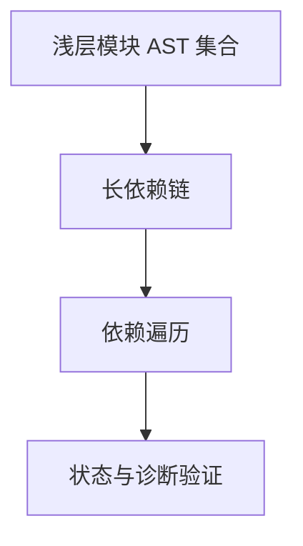

# Test262 模块长链栈边界

## Intent：最终目标

验证合法 RX 长依赖链不会因为图遍历递归而耗尽线程栈；先隔离复现，再决定最小修复。

## Data：可用证据

当前模块图检查在 visit → walk → visit 之间递归，每条依赖都会保留上一模块的调用栈。已有正常与分配失败案例最多 64 个节点，不能证明长链可靠。

## Edges：边界与限制

- 探针只调用公开 validateModules，模块 AST 保持浅层，隔离图深度与 AST 深度。
- 使用独立子进程和明确线程栈大小，进程崩溃不拖垮测试会话。
- 不通过增大线程栈或加入任意节点上限使测试通过。
- 若修复，必须保留输入顺序、嵌套扫描、首个循环边定位和 OutOfMemory 传播。
- 本批不验证 XML 解析与任意深度 Schema 解码。

## Answer：交付与成功标准

在 `docs` 保存隔离探针，记录修复前后的退出状态。复现后加入可重复的长期回归，运行已有图全集、故障注入和根测试。




## 执行记录

### 复现与原因

Debug 隔离探针在 256 KiB 线程栈中：64 节点合法链通过；256 节点合法链报 Bus error，最终退出 -6。完整回溯包含 430 个 module_graph.zig 帧。保持相同 256 节点输入，只把线程栈换成 1 MiB，则正常返回 RX_VALID=256。浅层 AST 不变，该对照支持依赖递归造成栈耗尽的判断。

修复前证据：`/tmp/zxc-test262-batch11-stack-before.log`、`/tmp/zxc-test262-batch11-stack-before.json`、`/tmp/zxc-test262-batch11-stack-control.json`。

### 最小修复

`packages/rx/src/module_graph.zig` 改用堆上的 Frame 列表记录 owner、当前 AST 节点、下一个子节点位置及模块完成标记。模块引用仍先遍历目标，再按原顺序遍历子节点；模块全部处理后才转为 done。检测 visiting 状态仍立即返回同一位置的循环诊断。

追加 Frame 可能重分配缓冲区，因此追加后立即回到循环重新获取 frame 指针，不继续使用旧指针。工作栈的分配错误通过既有 OutOfMemory 路径释放，不增加节点硬上限，不修改路径身份或循环契约。

### 修复后验证

同一 Debug 探针、同一 256 KiB 栈下，64、256、1,024、4,096 节点链均正常返回；记录在 `/tmp/zxc-test262-batch11-stack-after.json`。

新增 16 个长期回归：256/1,024 节点的链与环 × Call/Import/Case/Parallel-Task 四种编码，在固定 256 KiB 线程栈上执行公开入口。每个场景只计一个案例。已有图全集和 36 个逐分配点故障场景全部保留；模块组 Debug 10,292/10,292 测试通过。

## 自我批判与限制

这是受限线程栈中的实际稳定性缺陷，不能描述为所有默认线程在 256 节点都会崩溃。显式工作栈消除了图遍历的递归深度依赖，但 Schema 解码、XML 解析和其他算法不由本修复自动保障。

路径查找和重复注册目前仍有线性扫描；本批没有顺手改成哈希表，也没有以 4,096 节点通过宣称无限规模性能。测试中的固定栈大小是验证条件，不是生产新增限制。

## 最终回归与重现

根 `zig build test -j4 --summary all`（ReleaseSafe）：283/283 步骤、33,761/33,761 Zig test 加 408 个隔离案例通过。根 `zig build --summary all` 为 5/5 步骤通过。原有 RX 回归、10,292 个新包模块场景、词法和执行回归全部包含在根结果中。

生成一致性、注册审计、Zig 格式及本次 diff 空白检查通过。日志为 `/tmp/zxc-test262-batch11-graphs.log`、`/tmp/zxc-test262-batch11-root.log`、`/tmp/zxc-test262-batch11-build.log`；所有构建进程已结束。

在仓库根目录重建探针：

```sh
zig build-exe -ODebug --dep rx --dep fixtures \
  -Mroot=docs/2026-10-03/test262/graph_stack/probe.zig \
  --dep rx -Mfixtures=packages/test/tests/support/module_graphs/fixtures.zig \
  --dep dsl -Mrx=packages/rx/src/root.zig \
  -Mdsl=packages/dsl/src/root.zig \
  -femit-bin=/tmp/zxc-graph-stack-probe

/tmp/zxc-graph-stack-probe 4096 262144
```

当前源码应返回 RX_VALID=4096。修复前的退出信息已保留；不要用当前通过结果冒充修复前曾运行成功。本批不增加 Test262 上游审查数，总目标仍未完成。
