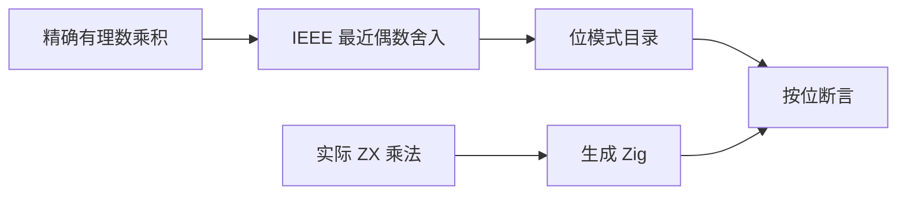
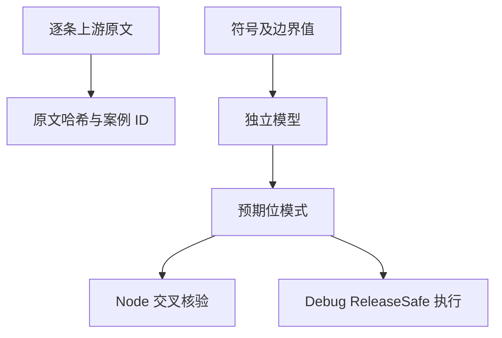

# Test262 浮点乘法对齐

## Intent：最终目标

逐项对齐 Test262 乘法数值语义，并补足 f32 扩展的 IEEE 边界验证。

## Data：可用证据

已完整读取固定版本 `S11.5.1_A4_T1.1`、`T1.2`、`T2` 至 `T8`。前八个文件覆盖 NaN、符号、零与无穷、上溢和下溢；T8 涉及结合顺序，需要独立三操作数程序，暂不登记其完成。

## Edges：边界与限制

保留 ZX 静态类型，不将乘法的数值对齐解释成 JavaScript 对象转换、eval 或异常模型兼容。f64 对齐上游；f32 为 ZX 扩展。非 NaN 输出按位比较，NaN 不要求 payload。边界矩阵不是全浮点空间穷举。

## Answer：交付与成功标准

使用 BigInt 有理数乘积和既有 IEEE 最近偶数舍入模型生成独立预期；真实 ZX 两操作数乘法执行。按上游每条操作数建立映射，审计原文 SHA-256。模型同时与 Node 二进制浮点运算交叉核验。

## 执行记录与自我批判

完成 3,042 个边界案例（每精度 1,521）。全部独立预期与 Node 交叉核验通过。Debug runtime 278/278 步骤、24,106/24,106 测试通过。根 ReleaseSafe 399/399 构建步骤、38,111/38,111 Zig 测试通过，11 个 CLI 场景与隔离安全执行步骤通过，日志 `/tmp/zxc-test262-multiplication-root.log`。 新增 8 条 equivalent 映射、55 个唯一关联案例；审查累计 171/53,597。结合顺序、动态转换与其余乘法上游案例仍未完成。

## 结合顺序后续完成记录

原先暂缓的 T8 已由《Test262乘法结合顺序对齐》接续，三个独立输入程序分别验证默认、左结合、右结合。其余动态转换等乘法案例仍未审查。
