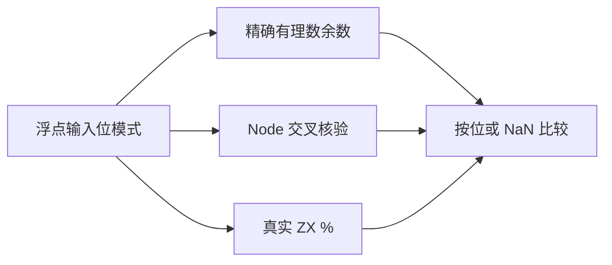
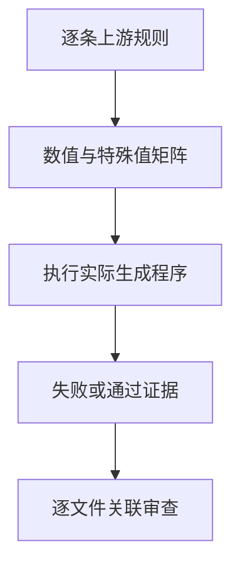

# Test262 浮点余数对齐

## Intent：最终目标

对齐浮点余数的特殊值、结果符号与有限数值行为，用独立精确模型发现后端语义差异。

## Data：可用证据

已逐条读取固定上游 modulus/S11.5.3_A4_T1.1、T1.2、T2—T7。现有后端浮点余数直接使用 Zig @rem。模型以二进制浮点精确有理数计算向零截断的整数商，再求精确余数，符号取被除数；所有预期另与 Node % 交叉核验。

## Edges：边界与限制

f64 对应 ECMAScript Number；f32 为 ZX 扩展。NaN 不比较载荷，零必须按位区分符号。T7 还包含除法、截断、乘法及减法重构表达式，单独余数值不能证明该文件的全部断言。

## Answer：交付与成功标准

两个真实 ZX 程序调用输入的 %，每条目录记录独立执行并按位核验。生成器与精确模型草案在 `docs/2026-10-03/remainder_tests/`。先保存现状执行证据，再决定是否修改后端。

## 执行与自我复核

41 个输入值按两侧组合，每种位宽 1,681 个独立案例，共新增 3,362 个。输入包含原有 35 个边界值和正负 1.3、51、101；1.1 已在原边界中，未重复登记。精确有理数模型与 Node % 对所有结果交叉核验一致。

现状 Debug runtime 398/398 步骤、37,110/37,110 测试通过，日志 `/tmp/zxc-test262-remainder-before.log`。特殊值与负除数均正确，不需要修改生产实现。新增 7 条 equivalent 审查（T1.1、T1.2、T2—T6），绑定 75 个唯一 f64 案例；总审查 200（94 equivalent、106 adapted），53,397 个未审查，591 个唯一关联案例。目录累计 51,184。TypeScript、生成一致性、目录审计与 diff 空白检查通过。

自我批判：本轮证明所选输入矩阵和七个文件的数值断言，不证明所有浮点输入。T7 的四种余数数值已包含在矩阵，但它还执行 truncate(x/y) 及重构表达式；当前测试没有执行该完整表达式，因此该文件保持未审查，不用部分断言替代整文件对齐。最终根 ReleaseSafe 547/547 步骤、51,129/51,129 根 Zig 测试通过；额外 11 个插件 Zig 测试、真实 ZX 插件桥接和其他 CLI/隔离测试步骤通过，退出码 0。日志 `/tmp/zxc-test262-remainder-root.log`。
