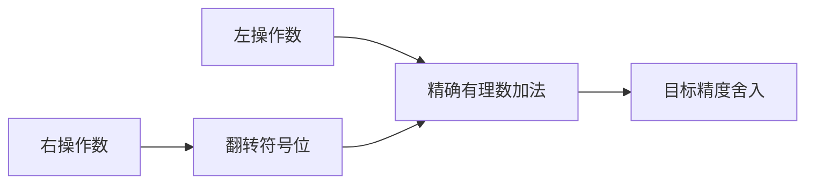
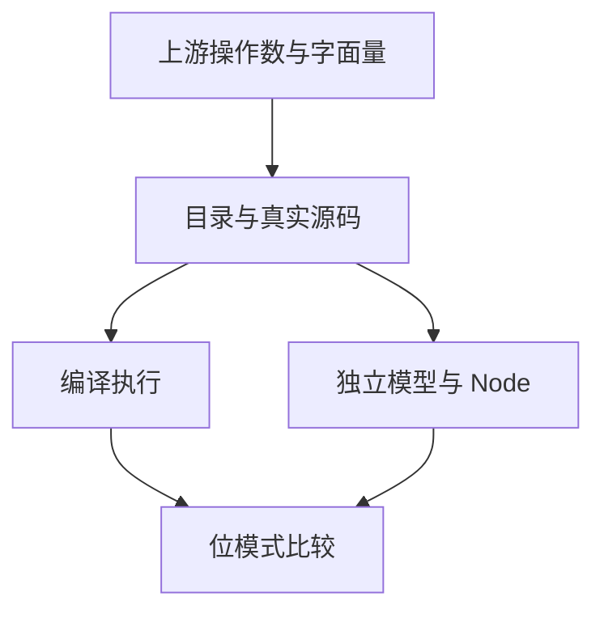

# Test262 浮点减法与溢出对齐

## Intent：最终目标

对齐减法 IEEE 数值规则，并补齐加法上游溢出文件中的减法与大十进制字面量表达式。

## Data：可用证据

已逐项读取 S11.6.2_A4_T1—T8，及此前加法 A4_T8。两者包含最大有限数、1e308 与 8.99e307 的正负溢出。

## Edges：边界与限制

减法参考模型使用精确带符号加法和右操作数符号翻转，不调用 Zig 被测实现。特殊字面量另由真实源码执行，不仅依赖宿主位模式。f32 为扩展，映射使用 f64。

## Answer：交付与成功标准

生成 f32/f64 减法边界目录，模型预期与 Node 独立交叉核验；两个字面量溢出分支实际执行。逐条关联九个上游文件。草案位于 `docs/2026-10-03/subtraction_tests/`。

## 执行记录与自我批判

3,370 个矩阵与 2 个字面量案例完成验证；新增 9 条 equivalent，上游累计 192/53,597。Debug runtime 338/338 步骤、31,926/31,926 测试通过。最终根 ReleaseSafe 481/481 构建步骤、45,945/45,945 根 Zig 测试通过，20 个验证 CLI、11 个 RX CLI、app/lib 消费链路与隔离安全执行步骤通过。日志 `/tmp/zxc-test262-subtraction-debug.log`、`/tmp/zxc-test262-subtraction-root.log`。字符串转换和其他动态语义仍不在本轮证据中。
