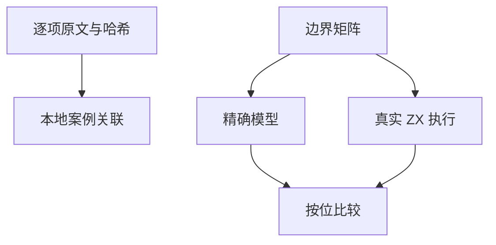

# Test262 浮点加法对齐

## Intent：最终目标

对齐 Test262 IEEE 加法数值行为，特别是异号抵消与零的符号。

## Data：可用证据

已读取固定版本 S11.6.1_A4_T1—T9 原文。T1—T7 覆盖 NaN、无穷、零和等幅异号抵消。T8 包含减法，T9 混合数值结合顺序与字符串转换，本轮不将其整体登记完成。

## Edges：边界与限制

f64 对应上游，f32 为扩展；不将数值加法推断为 JS 字符串拼接兼容。NaN 不约束 payload，其他结果按位比较。T7 的倒数输入由独立除法模型提供，并关联已有真实除法案例。

## Answer：交付与成功标准

BigInt 有理数进行带符号精确加法，再执行最近偶数舍入；正负零单独处理。全部预期与 Node 逐位交叉核验后交由真实 ZX 执行。草案位于 `docs/2026-10-03/addition_tests/`。

## 执行记录与自我批判

新增 f32/f64 各 1,521 个案例，共 3,042 个，全部独立预期与 Node 交叉核验一致。Debug runtime 326/326 步骤、28,554/28,554 通过。TypeScript 和目录审计通过。新增七条 equivalent，上游审查累计 183/53,597。最终根 ReleaseSafe 468/468 构建步骤、42,573/42,573 根 Zig 测试通过；20 个验证 CLI、11 个 RX CLI、app/lib 消费链路与隔离安全执行步骤通过。日志 `/tmp/zxc-test262-addition-root.log`。有限边界矩阵不代表穷举所有浮点输入；混合类型和动态转换保持未完成。

## 溢出原文后续覆盖

加法 A4_T8 中的减法和大十进制字面量由《Test262浮点减法与溢出对齐》接续，四条断言均已有相应真实程序；A4_T9 仍包含未处理的字符串语义，不登记整体完成。

## 结合顺序与拼接后续适配

A4_T9 已由《Test262加法结合与显式拼接》接续。数值三种结合实际执行；字符串语义显式改写为模板插值并保留混合加法拒绝证据，因此整体属于 adapted，不宣称 JavaScript 隐式转换兼容。
