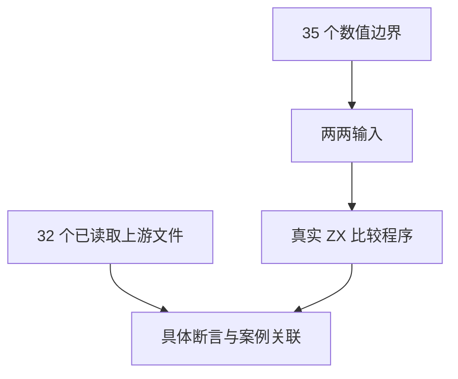
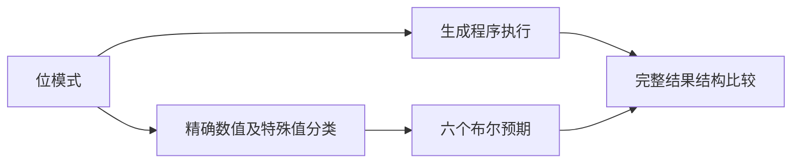

# Test262 浮点比较对齐

## Intent：最终目标

验证 f32/f64 的六种比较实际结果，逐项关闭 Test262 四种关系运算的 NaN、零和无穷边界测试。

## Data：可用证据

已逐项读取 less-than、greater-than、less-than-or-equal、greater-than-or-equal 的 A4.1–A4.8，共 32 个文件；全部操作数为数值原始值。现有前端矩阵只检查类型，尚无完整浮点比较运行矩阵。

## Edges：边界与限制

- 每个输入案例返回六个布尔结果，但只计作一个案例，不将断言数量乘六。
- f64 对应上游 Number，f32 是 ZX 扩展；不覆盖 JavaScript 隐式转换或包装对象。
- 预期使用精确有理数排序和显式 NaN/无穷分类，不使用生产比较代码。
- NaN 与任何数比较时四种顺序关系和相等均为 false，不等为 true；正负零相等。

## Answer：交付与成功标准

两份 ZX 源程序分别接受 f32/f64 位模式；每类型 35×35 个边界输入，总计 2,450 个案例。逐字段验证全部六个布尔输出，逐个关联上游实际操作数与预期。

## 执行与自我批判

新增 2,450 个输入案例，六个输出字段全部通过真实 ZX 生成执行。运行组 Debug 为 186/186 步骤、20,349/20,349 测试通过。全部 2,450 组独立预期与 Node 的六种比较交叉核对一致；交叉检查不计入 ZX 案例数。

32 个上游文件的 204 项断言全部逐项关联，保存原表达式、案例 ID、对应字段和预期。四种运算共享相同输入时仍只计一个输入案例。审计器新增字段级预期检查，防止仅有案例 ID、实际预期却漂移。

NaN、正负零、同号无穷和不同有限数的顺序均符合预期；本批没有生产修复。输入覆盖不等于所有优化、平台和类型转换语义都已验证。字符串、对象及混合类型的上游关系比较没有因本批通过而标记已覆盖。

## 最终验证

根 `zig build test -j4 --summary all`（ReleaseSafe）：279/279 步骤、33,739/33,739 Zig test 加 408 个隔离案例通过。新包累计 33,761 个案例。

字段级审计反证：临时反转一个上游断言预期，审计器准确拒绝；finally 恢复后审计通过。生成一致性、格式和 diff 空白检查通过。

上游审查累计 91 项（43 equivalent、48 adapted）、关联 201 个不同案例，53,506 项仍未审查。日志为 `/tmp/zxc-test262-batch9-runtime.log`、`/tmp/zxc-test262-batch9-root.log`；所有构建会话已结束。
